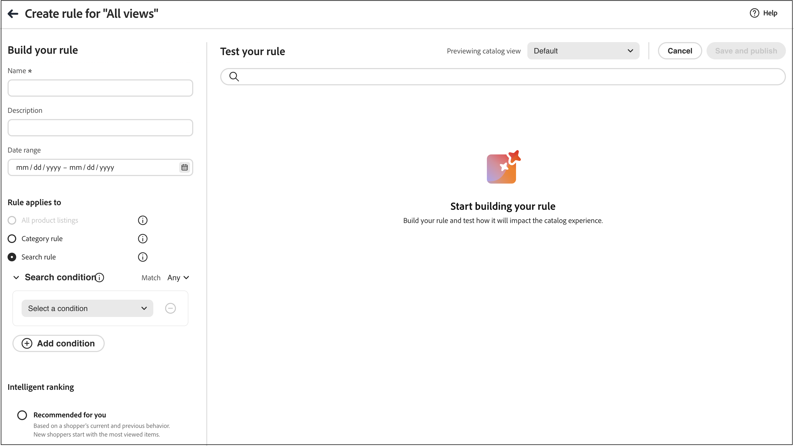
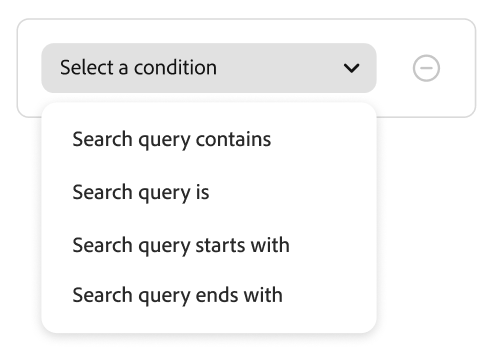
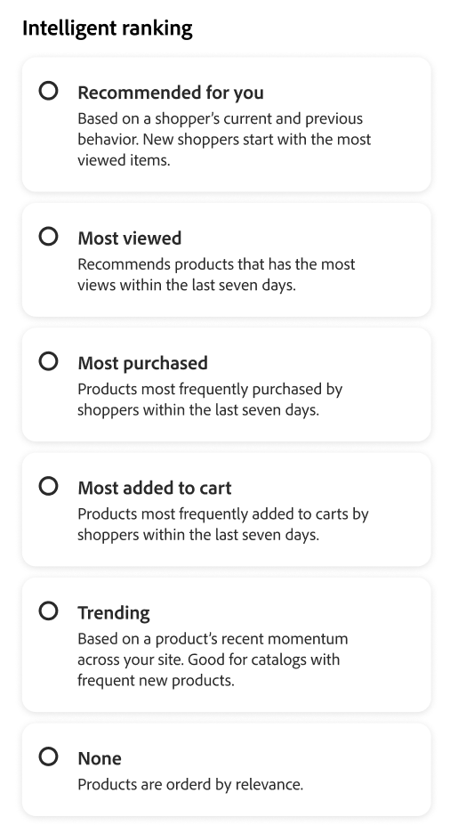

# 建立和管理規則

若要建立規則，第一步是使用規則編輯器，定義購物者查詢文字中會觸發相關事件的條件。 接著，完成規則詳細資料、測試結果並發佈規則。

## 建立規則

1. 在左側邊欄中，移至&#x200B;_銷售_ > **銷售規則**。
1. 按一下&#x200B;**建立規則**&#x200B;以啟動規則編輯器。

在&#x200B;**建置您的規則**&#x200B;區段中，您可以定義特定的搜尋條件、條件和排名型別。

1. 在&#x200B;**[!UICONTROL Name]**&#x200B;欄位中，輸入規則的名稱。 所有規則名稱必須是唯一的。
1. 在&#x200B;**[!UICONTROL Description]**&#x200B;欄位中，輸入規則的說明。
1. 在&#x200B;**[!UICONTROL Date range]**&#x200B;欄位中，指定您要讓規則生效的日期或日期範圍。
1. 在&#x200B;**[!UICONTROL Rule applies to]**&#x200B;區段中，您有兩個選項： **[!UICONTROL All product listings]**&#x200B;或&#x200B;**[!UICONTROL Specific conditions]**。

   - **所有產品清單** — 這基本上是您的預設規則，且會套用至所有搜尋查詢，除非已定義更具體的搜尋查詢。 您只能建立一個預設規則，而且不能包含任何條件。 選擇「智慧型排名」型別，以及您要套用至所有預設搜尋的任何手動排名。
   - **特定條件** — 請參閱下一節以瞭解您可以為規則設定的條件型別。

### 條件

條件為觸發事件的需求。 一個規則最多可以有10個條件和25個事件。 預設規則不能有任何條件。

#### 單一條件

1. 在&#x200B;*建置您的規則*&#x200B;下，選取要符合的&#x200B;**條件**，然後依照指示完成陳述式。

   - 搜尋查詢包含 — 輸入必須在購物者查詢中的文字字串。 「符合」設定會決定購物者的查詢與目錄相符的程度。 選項： 任何 — 購物者的查詢文字的任何部分都可以符合條件。 全部 — 所有購物者的查詢必須符合條件。
   - 搜尋查詢為 — 輸入與購物者的查詢完全相符的文字字串。 例如：「瑜伽褲」。 具有`Search query is`且符合`All`的規則只能有一個條件。
   - 搜尋查詢開頭為 — 輸入必須在購物者查詢開頭的字元或文字字串。
   - 搜尋查詢結尾為 — 輸入必須在購物者查詢結尾的字元或文字字串。

   結果會立即顯示在&#x200B;*測試您的規則*&#x200B;窗格中，並依優先順序編號。 您可以使用右上角的&#x200B;*每列結果*&#x200B;滑桿來變更每列的產品數目。

1. 若要測試其他查詢，請在&#x200B;*測試您的規則*&#x200B;搜尋方塊中變更查詢文字，然後按&#x200B;**Return**。
最初，測試窗格會從「條件」搜尋方塊轉譯查詢。 但是現在它正在從測試查詢方塊轉譯查詢。 測試窗格一次只轉譯一個查詢。
1. 如果您想要結果，請更新&#x200B;*條件*&#x200B;搜尋方塊中的文字。 然後，按一下頁面上的任何位置，以更新測試窗格中的結果。

#### 多個條件

1. 若要建置包含多個條件的規則，請按一下[新增條件]。****
一個規則最多可以有十個條件。 結合兩個條件的邏輯運運算元是以目前的*Match*&#x200B;設定為基礎。 依預設，*符合*&#x200B;為`All`，邏輯運運算元為`AND`。

1. 選取第二個條件並輸入必要的查詢文字。

1. 若要變更規則的邏輯，請變更&#x200B;**符合**&#x200B;設定，以決定購物者的搜尋條件必須符合查詢條件的程度。 將&#x200B;**Match**&#x200B;設定為下列其中一項：

   - 任何 — （預設）規則中的所有邏輯運運算元都設為`OR`，結果會顯示在測試窗格中。
   - 全部 — 規則中的所有邏輯運運算元都設為`AND`，結果會顯示在測試窗格中。

   *Match*&#x200B;值決定用來聯結多個條件的邏輯運運算元。 變更&#x200B;*Match*&#x200B;設定會變更規則中的所有邏輯運運算元。 無法將`AND`與`OR`合併到同一個規則中。

   在此範例中，不是搜尋「yoga pants」，而是有兩個不同的查詢可搜尋「yoga」或「pants」。 此規則較少具體，且在店面觸發的頻率遠高於其他規則。

1. 若要新增其他條件，請按一下[新增條件] ****&#x200B;並重複此程式。

### 智慧型排名

智慧型排名結合使用者行為和網站統計資料，以判斷產品排名。
商店擁有者可設定下列型別的排名策略：

- 最多購買：這會根據過去7天內每個SKU的總購買量來排名產品。
- 加入購物車次數最多 — 依過去7天內全部「加入購物車」活動排名。
- 檢視次數最多：排名前7天每個SKU的總檢視次數。
- 為您推薦 — 使用`viewed-viewed`資料點 — 檢視此SKU的購物者也會檢視這些其他SKU。
- 趨勢：針對背景事件回顧過去72小時的頁面檢視事件，而針對前景事件則回顧24小時。
- 無：產品會依關聯性排序。

選取規則的策略型別。 **測試您的規則**&#x200B;視窗會顯示預期的結果。

#### 智慧型排名計分的運作方式

智慧型排名會藉由結合兩個關鍵因素來決定最終產品順序： **文字關聯性**&#x200B;和&#x200B;**行為訊號**。 瞭解這些因素如何互動，有助於您為搜尋結果設定切合實際的期望。

**評分元件：**

- **文字關聯性**：評分中的主導因素。 這會測量產品名稱、說明和屬性與搜尋查詢的符合程度。 文字關聯性分數沒有限制（沒有特定的上限），且會受下列因素的影響：

   - 相符字詞的發生頻率。
   - 產品名稱/說明的長度（字數）。

- **行為訊號**：在文字關聯性分數之上套用的限制提升。 當您選取「檢視次數最多」或「購買次數最多」等智慧型排名策略時，行為訊號較高的產品會獲得固定的分數提升。 不過，此提升具有已定義的限制。

**為什麼檢視次數最多的產品可能不會先出現：**

文字關聯性通常會主導排名，因為其分數不受限制，而行為提升則是固定的。 因此，文字相符性強的產品，參與訊號高的產品往往比一般產品強。 行為提升本身可能無法彌補文字關聯性的巨大差距。 智慧型排名將比對品質和購物者互動都納入考量，改善整體關聯性，從而解決此問題。 不過，文字比對品質仍然是排名的主要驅動因素。

**範例：**

商家使用「檢視次數最多」的智慧型排名策略，並搜尋「蠟燭」。 他們預計產品SKU YAN-K-E-512會出現在結果的最上方，因為它有最高的檢視計數。 不過，其他產品的排名較高：

- **Texas Candle** （第1個位置）：產品名稱較短，且較乾淨，因此會建立非常高的文字關聯分數。 即使它的檢視次數少於YAN-K-E-512，其優異的文字比對仍勝過行為提升。

- **YAN-K-E-512** （較低位置）：儘管在「檢視次數最多」的行為資料中擁有最高的檢視百分位數，但其複雜的SKU型名稱會產生較低的文字相關分數。 固定行為提升並不足以克服此文字關聯性差距。

請參閱[搜尋規則](./best-practice.md#tips-to-optimize-search-rules)，瞭解如何使用規則來改善產品尋找功能。

#### 警告

- 查詢中的撇號和引號可能會導致某些語言中的排名和相關性出現一些小問題。
- 若要確保智慧型排名正常運作，請確定用於搜尋或篩選(Facet)之任何屬性的&#x200B;**搜尋權數**&#x200B;為`5`或更少。

如需設定搜尋權重的詳細資訊，請參閱[中繼資料API](https://developer.adobe.com/commerce/services/reference/rest/)。

### 手動排名

**手動排名**&#x200B;是在符合定義的條件時修改搜尋結果的動作。 單一規則最多可包含25個事件。

- 提升 — 將產品在搜尋結果中移到較高的位置。
- Bury — 將SKU在搜尋結果中下移。
- 釘選產品 — 產品會顯示在頁面上選取的「位置」中。
- 隱藏產品 — 從搜尋結果中排除SKU。

釘選產品最簡單的方式是拖放。

1. 按一下並拖曳測試窗格中的產品。 將其拖放到所需位置。 產品及位置欄位會自動填入事件窗格中。

您也可以按一下圖示將產品釘選至其目前位置。 使用省略符號快顯選單來「釘選至頂端」或「釘選至底部」。

>[!NOTE]
>
>您只能釘選查詢中傳回的產品。

或可手動設定事件：

1. 在&#x200B;*事件*&#x200B;底下，選擇當符合相關條件時要發生的&#x200B;**事件**。

   例如，選擇`Hide a product`。 然後，輸入您要隱藏的產品名稱。 建議您在輸入產品時一併輸入。

1. 對於多個事件，選擇符合條件時要觸發的任何其他事件。

### 正在完成規則

1. 在測試窗格中檢查規則的結果。
1. 如果規則有多個查詢，請測試每個可能受規則影響的查詢。
1. 完成時，按一下&#x200B;**儲存並發佈**。

   規則已新增至&#x200B;*規則*&#x200B;工作區中的清單。

1. 雖然使用中的規則會立即生效，但您可能需要等候最多15分鐘，才能重新整理店面中的快取查詢結果。

>[!NOTE]
>
>選取預設排序順序「排序依據：最相關」時，規則和手動排名產品會套用至搜尋結果。 如果購物者將排序順序變更為類似依名稱或價格排序，規則和手動排名將不再有效。

## 編輯、檢視和刪除規則

請依照這些指示更新現有規則的屬性。

### 編輯規則

1. 在&#x200B;*銷售規則*&#x200B;工作區中，在格線中找到您要編輯的規則，然後按一下&#x200B;**更多** (...)選項。
1. 按一下&#x200B;**編輯**&#x200B;以存取規則編輯器。
1. 視需要更新條件、運運算元和事件。
1. 視需要更新名稱、開始和結束日期以及說明欄位。 所有規則名稱必須是唯一的。
1. 測試規則。
1. 發佈變更。
規則已新增至*規則*&#x200B;工作區中的清單。 雖然使用中的規則會立即生效，但重新整理店面中的快取查詢結果最多可能需要15分鐘。

### 檢視詳細資料

此選項提供在&#x200B;*規則*&#x200B;表格中時快速檢視所有規則引數的方法。

1. 在&#x200B;*銷售規則*&#x200B;工作區中，在您要編輯的格線中找到規則，然後按一下&#x200B;**更多** (...)選項。
1. 按一下&#x200B;**檢視詳細資料**&#x200B;以檢視規則引數。
1. 選擇&#x200B;**編輯**&#x200B;或&#x200B;**刪除**，或按一下X關閉面板。

### 刪除規則

1. 在&#x200B;*規則*&#x200B;工作區上，在格線中尋找要編輯的規則，然後按一下&#x200B;**更多** (...)選項。
1. 按一下&#x200B;**刪除**。

## 欄位說明

### 條件(if)

| 條件 | 說明 |
|--- |--- |
| 搜尋查詢包含 | 購物者的查詢中包含的字元或文字字串。 購物者的查詢只需要符合單一字元即可符合此條件。 |
| 搜尋查詢為 | 完全符合購物者查詢的字元或文字字串。 使用此條件時，無法構成具有多個條件的複雜查詢。 |
| 搜尋查詢開頭為 | 購物者的查詢以此字元或文字字串開頭。 |
| 搜尋查詢結尾為 | 購物者的查詢以這個字元或文字字串結束。 |

### 邏輯運運算元

| 運算子 | 說明 |
|--- |--- |
| 或 | （預設）邏輯運運算元`OR`會比較兩個條件並符合觸發事件的要求（如果至少一個條件為true）。 |
| 和 | 邏輯運運算元`AND`比較兩個條件並符合觸發事件的需求（如果兩個條件皆為true）。 |

### 比對運運算元

| 運算子 | 說明 |
|--- |--- |
| 任何 | 將規則中的所有邏輯運運算元變更為`OR`，並傳回符合的產品集。 |
| 全部 | 將規則中的所有邏輯運運算元變更為`AND`，並傳回符合的產品集。 |

### 手動排名

| 事件 | 說明 |
|--- |--- |
| 提升 | 在搜尋結果中將SKU或SKU範圍移到較高的位置。 每個報表在測試搜尋結果中都會標示「已提升」預覽徽章。 |
| Bury | 將搜尋結果中的SKU或SKU範圍移到較低的位置。 在測試搜尋結果中，每個都標有「已掩埋」的預覽徽章。 |
| 釘選產品 | 將單一SKU附加至搜尋結果中的特定位置。 產品在測試搜尋結果中標有「已釘選」預覽徽章。 |
| 隱藏產品 | 從搜尋結果中排除SKU或SKU範圍。 |

### 詳細資料

| 欄位 | 說明 |
|--- |--- |
| 名稱 | 規則的名稱。 規則名稱必須是唯一的。 |
| 規則型別 | 預設或查詢。 預設適用於所有規則，除非已定義更具體的查詢規則。 |
| 開始日期 | 規則的開始日期（如果已排程）。 |
| 結束日期 | 規則的結束日期（如果已排程）。 |
| 說明 | 規則的簡短說明。 |
