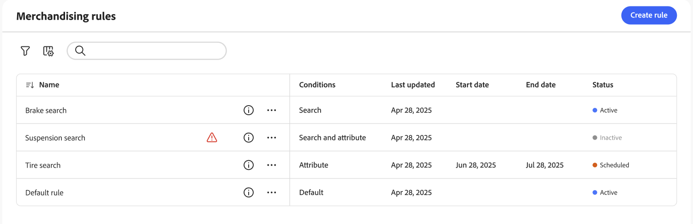

# 銷售規則Workspace

*銷售規則*&#x200B;工作區會列出目前選擇的規則及其狀態，並提供您建立和管理規則所需工具的存取權。 您可以從工作區中執行下列作業：

- 搜尋規則
- 檢視規則詳細資料
- 啟用/停用規則
- 刪除規則
- 存取規則編輯器

## 顯示/隱藏欄

1. 在右上角，按一下&#x200B;**顯示/隱藏** 欄。

1. 在功能表中，執行下列任一項作業：

   - 若要顯示隱藏的欄，請按一下任何沒有核取記號的欄名稱。
   - 若要隱藏可見欄，請按一下帶有核取記號的欄名稱。

## 依狀態篩選規則

1. 如果您的存放區有許多規則，您可以依狀態篩選規則以縮短清單。 依預設，「規則」清單會顯示所有規則。

1. 若要只列出具有特定狀態設定的規則，請將&#x200B;**狀態**&#x200B;設定為下列其中一項：

   - 全部
   - 作用中
   - 非使用中
   - 已排程
   - 草稿

   您也可以依&#x200B;**條件**、**開始日期**、**結束日期**&#x200B;和&#x200B;**上次更新日期**&#x200B;篩選。

## 檢視詳細資料

詳細資訊面板會顯示規則名稱、狀態、條件和事件、開始和結束日期、說明以及上次編輯日期。 您可以從詳細資料面板啟用、編輯和刪除規則。

1. 在&#x200B;*銷售規則*&#x200B;工作區上，在格線中找到您要檢視的規則，然後按一下（）圖示。

   您可以從功能表執行下列任一項作業：

   - 編輯規則
   - 刪除規則
   - 啟用/停用規則

## 欄說明

| 欄 | 說明 |
|--- |--- |
| 名稱 | 規則的名稱。 |
| 上次更新時間 | 上次更新規則的日期。 |
| 開始日期 | 排程規則的開始日期。 |
| 結束日期 | 排程規則的結束日期。 |
| 狀態 | 以色彩標示的狀態表示規則的目前狀態。 使用格線上方的「狀態」控制項，依狀態篩選規則。 值： 所有狀態 — 顯示所有規則，無論狀態為何。 作用中（藍色） — 僅顯示作用中的規則。 已排程（橘色） — 僅顯示已排程的規則。 非使用中（灰色） — 僅顯示非使用中的規則。 |

## 控制項

| 控制 | 說明 |
|--- |--- |
| 新增規則 | 開啟[規則編輯器](add.md)。 |
| 狀態 | 依狀態篩選規則清單。 選項：全部、作用中、非作用中、已排程 |
|  | 指定網格中可見的欄。 選項：上次更新、開始日期、結束日期、狀態 |
| 搜尋 | 依完整名稱或部份相符專案搜尋規則。 |
|  | 顯示可套用至所選規則的更多動作功能表。 選項：編輯、檢視詳細資訊、刪除 |

## 規則詳細資料

| 欄位 | 說明 |
|--- |--- |
| 狀態 | 規則的目前狀態。 |
| 條件 | 描述與規則關聯條件的搜尋查詢。 |
| 開始日期 | 規則生效的日期（如果已排程）。 |
| 結束日期 | 規則到期的日期（如果已排程）。 |
| 說明 | 規則的簡短說明。 |
| 上次更新時間 | 上次更新規則的日期和時間。 |
| 已啟用 | 變更規則狀態的控制項。 選項：啟用/停用 |
