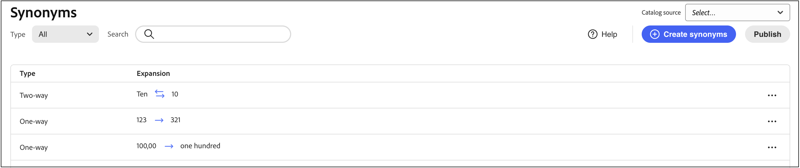
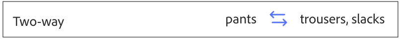
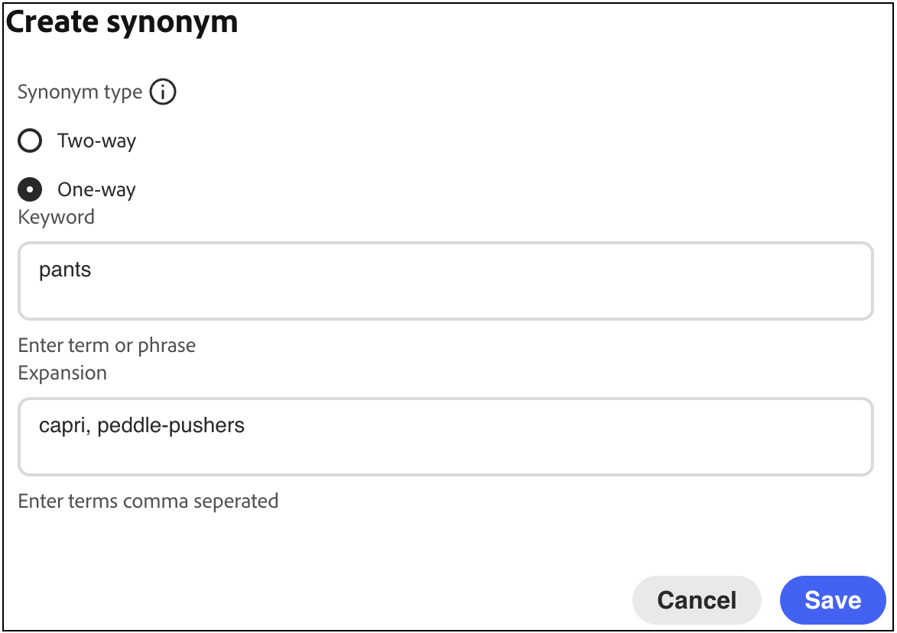
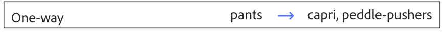

# 建立同義字

新增您自己的[!DNL Adobe Commerce Optimizer]同義字組織清單，以提高客戶參與度。 您最多可以在每個存放區新增200個同義字。

## 步驟1：新增同義字

1. 從左側邊欄移至&#x200B;_銷售_ > **同義字**。
1. 按一下&#x200B;**[!UICONTROL Add synonyms]**&#x200B;按鈕。

## 步驟2：依型別定義同義字

請依照您要建立的[同義字](type.md)型別的指示操作。

### 雙向同義字

1. 接受預設的&#x200B;**雙向**&#x200B;選項。

   

1. 輸入要比對的&#x200B;**關鍵字**&#x200B;詞語或片語。
1. 輸入您想要新增為關鍵字同義字的&#x200B;**擴增**&#x200B;字詞。 請使用逗號分隔多個詞語。
在此範例中，要比對的關鍵字是「pants」，而擴充辭彙集是「trousers， slacks」。

   

1. 完成時，按一下&#x200B;**儲存**。

   同義字集合會顯示在清單中，每個辭彙之間會有一個雙向箭頭，表示辭彙可以互換。

   

### 單向同義字

1. 按一下&#x200B;**單向**&#x200B;同義字型別。

   

1. 輸入&#x200B;**關鍵字**&#x200B;和&#x200B;**擴充**&#x200B;辭彙。 請使用逗號分隔多個詞語。

   

   在此範例中，關鍵字是「pants」，而單向擴充辭彙「capris， pedle-pushers」是「pants」的子集，但具有特定含義。

1. 完成時，按一下&#x200B;**儲存**。

   同義字集合出現在清單中，有一個從展開詞指向關鍵字的單向箭頭，指示該詞是關鍵字的子集。 每個擴充詞以加號分隔。

   

## 步驟3：發佈變更

1. 當您的同義字完成時，請按一下&#x200B;**發佈**。
1. 等候最多2小時，讓您的更新在店面中出現。

## 欄位說明

| 欄位 | 說明 |
|--- |--- |
| [型別](type.md) | 判斷同義字與關鍵字的意義相同，或是關鍵字的子集。 選項： 雙向（預設） — 與關鍵字具有相同含義並傳回相同搜尋結果的字詞 單向 — 關鍵字的子集的字詞。 單向同義字會傳回特定產品的較窄清單。 |
| 關鍵字 | 通常與目錄中的一系列產品相關聯的字詞。 |
| 擴充 | 與關鍵字具有相同或類似含義的其他詞語。 |

## 管理同義字

請依照這些指示管理現有的[!DNL Adobe Commerce Optimizer] [同義字](overview.md)。

## 尋找同義字

若要輕鬆找到同義字，您可以依型別篩選清單，並依關鍵字或展開詞搜尋。 這些方法可個別或搭配使用。

1. 若要篩選清單，請將&#x200B;**Type**&#x200B;設定為下列其中一項：

   - 全部
   - 單向
   - 雙向

1. 若要搜尋關鍵字或展開字詞，請在&#x200B;**[!UICONTROL Search]**&#x200B;方塊中輸入至少三個字元。

## 編輯同義字

1. 尋找您要編輯的同義字，然後按一下&#x200B;**更多** (...)選項。

1. 按一下&#x200B;**編輯**。
關鍵字是清單中的第一個詞語，每個詞語以逗號分隔。 關鍵字和展開詞可以更新，但同義字的型別無法變更。
1. 按一下您要編輯的專案。 然後，視需要更新文字。

1. 完成時，按一下&#x200B;**儲存**。

## 刪除同義字

1. 在清單中尋找您要刪除的同義字，然後按一下&#x200B;**更多** (...)選項。
1. 按一下&#x200B;**刪除**。
1. 出現提示時，按一下&#x200B;**刪除同義字**&#x200B;以進行確認。

## 發佈變更

若要完成程式，您儲存的變更必須發佈到店面。 更新可能需要長達兩個小時的時間才會生效。

1. 按一下&#x200B;**發佈**。
1. 檢視頁面頂端的訊息，確認您已發佈變更。
