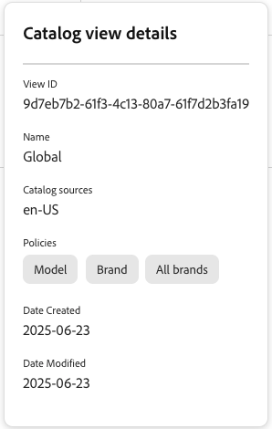

# 銷售服務的目錄檢視

目錄檢視是Adobe Commerce Optimizer銷售服務的基礎，可讓您依業務結構、原則和定價組織產品目錄。 此彈性資料模型支援多品牌、多業務單位及多語言案例，同時維持營運效率。

## 什麼是目錄檢視？

目錄檢視會定義產品目錄的組織和顯示方式。 它們作為篩選條件來判斷：

- 根據業務結構（品牌、地區、經銷商）**可看見哪些產品**
- **透過連結的價格手冊顯示哪些價格**
- **如何使用原則（品牌、模型、類別等屬性）篩選產品**
- **使用的目錄來源**&#x200B;根據地區設定等屬性

將目錄檢視視為不同的「鏡頭」，客戶可透過這些鏡頭檢視您的目錄。 例如：

- 經銷商目錄檢視可能只會顯示該特定經銷商可用的產品
- 區域目錄檢視可能會顯示特定地理區域的產品和定價
- 品牌目錄檢視可能只會顯示特定品牌的產品

## 建立目錄檢視

在此區段中，您建立目錄檢視、選取[原則](policies.md)以及[價格手冊](pricebooks.md)。

在建立目錄檢視之前，請確定您擁有：

- [已建立原則](policies.md)以定義產品篩選器

- [擷取的價格手冊](pricebooks.md)用於定價

1. 從左側功能表，移至&#x200B;_商店設定_，然後按一下&#x200B;**[!UICONTROL Catalog views]**。

1. 按一下&#x200B;**[!UICONTROL Create catalog view]**&#x200B;。

1. 設定目錄檢視詳細資料：

   - **名稱** — 輸入目錄檢視的名稱，例如`Celport`&#x200B;。
   - **目錄來源** — 選取目錄來源（地區設定），例如`en-US`。
   - **原則** — 使用下拉式功能表選取相關原則。 例如，「品牌」、「型號」。&#x200B;URL確定您已[建立原則](policies.md)。

1. 選取要連結至型錄檢視表的價格簿。

   - **使用所有可用的價格簿** — 此選項會從所有可用的價格簿提取價格資料。
   - **僅允許選取的價格簿** — 此選項會顯示&#x200B;**新增允許的價格簿**&#x200B;對話方塊，您可以在其中選取要用於目錄檢視的特定價格簿。
   - **停用訂價** — 目前無法使用此選項。

1. 按一下&#x200B;**[!UICONTROL Add]**&#x200B;以建立包含連結價格手冊和原則的目錄檢視。

目錄檢視頁面會更新以顯示新的目錄檢視&#x200B;。

完成這些步驟後，目錄檢視現在會設定為根據您選取的來源和原則顯示產品和定價。

## 管理目錄檢視

按照這些指示更新或檢視現有目錄檢視的屬性。

### 編輯目錄檢視

1. 在&#x200B;*目錄檢視*&#x200B;工作區上，在您要編輯的格線中找到目錄檢視，然後按一下&#x200B;**...**&#x200B;以開啟動作功能表。
1. 按一下&#x200B;**編輯**&#x200B;以存取目錄檢視編輯器。
1. 視需要更新名稱、型錄來源、政策及價格簿資訊。
1. 儲存變更。

### 刪除目錄檢視

1. 在&#x200B;*目錄檢視*&#x200B;工作區中，在您要編輯的格線中找到目錄檢視，然後按一下&#x200B;**...**&#x200B;以開啟動作功能表。
1. 按一下&#x200B;**刪除**。

   當確認對話方塊出現時，按一下&#x200B;**[!UICONTROL Delete]**。

### 檢視詳細資料

此選項提供在&#x200B;*目錄檢視*&#x200B;表格中時快速檢視所有目錄檢視引數的方法。

在&#x200B;*目錄檢視*&#x200B;工作區上，在您要編輯的格線中找到目錄檢視，然後按一下。

您可以在此處檢視目錄檢視設定詳細資料，例如：

- 檢視ID
- 名稱
- 目錄來源
- 原則
- 建立日期
- 資料已修改

當您設定店面或使用資料擷取API時，需要用到其中的一些組態設定。

## 架構概述

目錄檢視是Merchandising Services架構的一部分，其使用更彈性的模型取代Adobe Commerce基礎中使用的網站、商店、商店評論架構：

![[!DNL Merchandising Services]架構](../assets/merchandising-svcs-architecture.png)

### 運作方式

**1. 資料擷取**
來自PIM、ERP和其他系統的目錄資料會擷取至「銷售服務」架構。 每個SKU都包含對應至目錄檢視、原則及區域設定的區域設定資訊與產品屬性。 如需資料擷取的詳細資訊，請參閱[開發人員檔案](https://developer.adobe.com/commerce/services/optimizer/)。

**2。 統一基底目錄**
內嵌的資料會在目錄服務資料管道中建立統一的基本目錄。 此單一來源可消除業務單位間的資料重複。

**3。 目錄檢視**
多個目錄檢視代表不同的業務單位（例如，「Texas Retail」、「Texas Retail Secondural」）。 您可以跨目錄檢視共用地區、原則和價格簿，以取得彈性。

**4。 多頻道傳遞**
經篩選的目錄資料會傳遞至各種目的地，包括Edge Delivery Services店面、市集、廣告平台和自訂微型店面。 如需目錄資料傳遞的詳細資訊，請參閱[開發人員檔案](https://developer.adobe.com/commerce/services/optimizer/)。

### 主要元件

| 元件 | 用途 | 範例 |
|---|---|---|
| **目錄檢視** | 業務單位或分銷管道 | 經銷商網路、地區商店 |
| **原則** | 根據屬性的產品篩選器 | 品牌、型號、類別 |
| **地區設定** | 語言/地區設定 | en-US、fr-CA、es-MX |
| **價格簿** | 定價結構 | 零售、批發、員工 |

### 資料流程

1. **擷取** — 來自PIM/ERP系統的產品資料
2. **處理序** — 套用目錄檢視、原則和定價
3. **傳遞** — 將篩選的目錄提供給店面、市場等。

## 主要功能

| 功能 | 優點 |
|---|---|
| **單一基底目錄** | 消除業務單位之間的資料重複 |
| **彈性定價** | 針對不同客戶區段，每個SKU有多個價格簿 |
| **可擴充** | 有效管理200M以上的SKU |
| **多頻道** | 將目錄提供給店面、市集和廣告平台 |
| **即時更新** | 快速更新促銷活動和行銷活動的目錄資料 |

## 使用案例

### 多品牌企業集團

**挑戰**：管理多個品牌、國家/地區和語言 
**解決方案**：每個品牌/地區組合的單一目錄包含目錄檢視

### 汽車零件經銷商

**挑戰**： 3,000個產品相同但價格不同的經銷商 
**解決方案**：一個目錄，包含經銷商特定的目錄檢視和價格簿

### 多位置Retailer

**挑戰**：每個地點的不同定價和詳細目錄 
**解決方案**：以位置為基礎的目錄檢視具有區域特定原則

>[!INFO]
>
>如需目錄資料擷取與傳遞的詳細資訊，請參閱[開發人員檔案](https://developer.adobe.com/commerce/services/optimizer/)。
