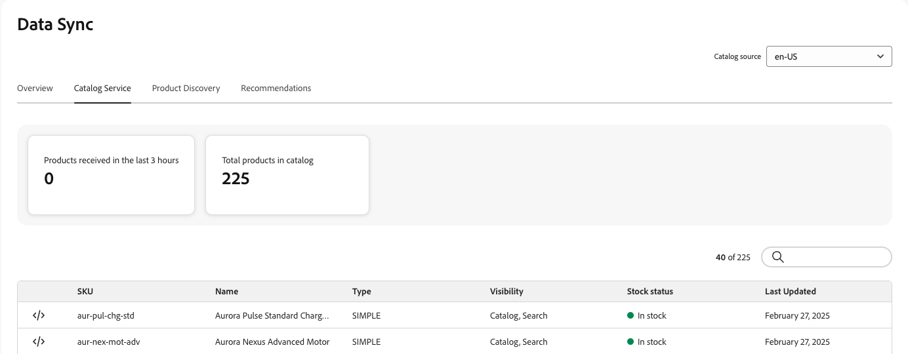
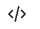
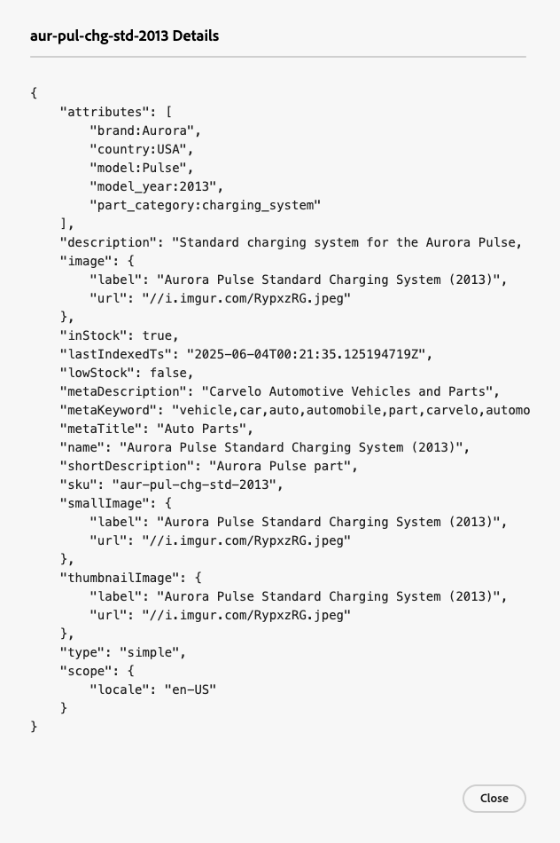

# 資料同步

「**資料同步**」頁面會顯示從您的資料來源(您現有的Commerce目錄、產品資訊管理(PIM)系統、企業資源規劃(ERP)系統等)傳輸到[!DNL Adobe Commerce Optimizer]的產品資料之同步化狀態概觀。

**資料同步**&#x200B;頁面提供您店面產品資料可用性的寶貴見解，以確保可立即顯示給您的購物者。

**資料同步**&#x200B;頁面位於&#x200B;*安裝程式* > **資料同步**。

**資料同步**&#x200B;頁面包含下列欄位：

| 欄位 | 說明 |
|--- |--- |
| 目錄來源 | 同步資料的特定地區設定。 |
| [!DNL Catalog Service] | 顯示[!DNL Catalog Service]的最新同步更新、收到的產品總數、搜尋欄位及同步產品的表格。 |
| 產品探索 | 顯示最新同步更新、收到的產品總數、搜尋欄位，以及要搜尋的同步產品表格。 |
| Recommendations | 顯示最新的同步更新、收到的產品總數、搜尋欄位，以及Recommendations同步產品的表格。 |
| 過去3小時內收到的產品 | 顯示過去三小時內已從目錄來源轉移到Adobe Commerce Optimizer的產品數量。 如果您不經常更新目錄，此值通常為零。 |
| 目錄中的產品總數 | 反映Adobe Commerce Optimizer可用的目錄產品總數。 |
| 同步的產品 | 提供有關同步至Adobe Commerce Optimizer的產品的詳細資訊。 根據預設，此表格會依「上次更新」排序。 若要尋找特定產品，請使用&#x200B;**[!UICONTROL Search by Name or SKU]**&#x200B;欄位。 |

## 同步的產品清單

若要檢視JSON格式的同步產品詳細資料，請在同步產品表格中產品的列上按一下代碼圖示。

## 重新同步目錄資料

如果您在&#x200B;**Data Sync**&#x200B;頁面上沒有看到特定產品，您必須從上游系統啟動重新同步。 不過，請記住，重新同步可能會增加硬體資源的負載。 不過，在下列情況下可能有必要重新同步您的目錄：

- 對產品目錄進行重大變更時，例如新增產品、更新產品詳細資料或修改類別

- 如果您發現商店正面顯示產品資料時發生任何差異或效能問題

>[!IMPORTANT]
>
>完成同步所需的時間會依您的目錄大小和更新的資料量而有所不同。

## 監視資料同步狀態

對於使用Adobe Commerce作為上游資料來源的專案，您可以監視資料匯出程式，並從Commerce管理員的[資料摘要同步狀態頁面](../../data-export/data-synchronization.md)啟動重新同步作業。

