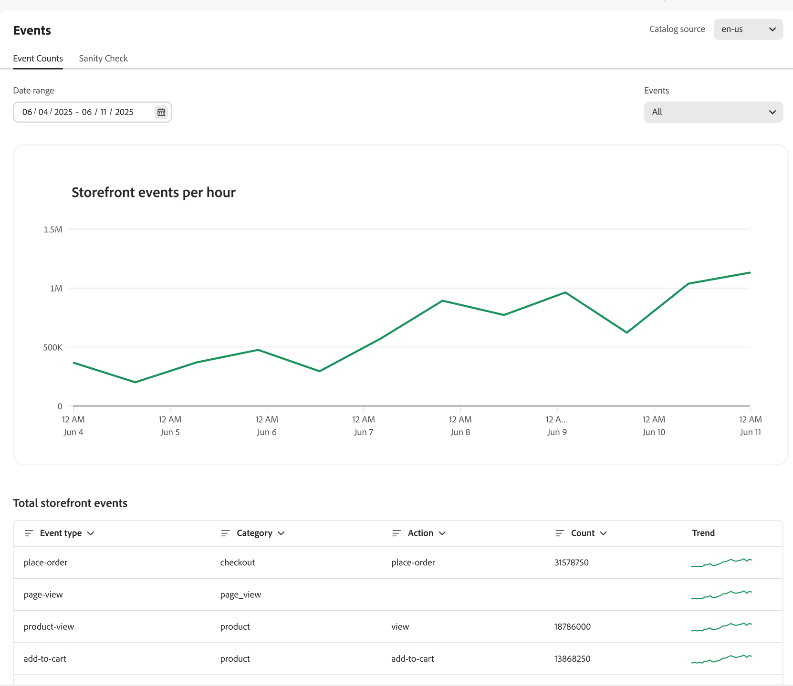
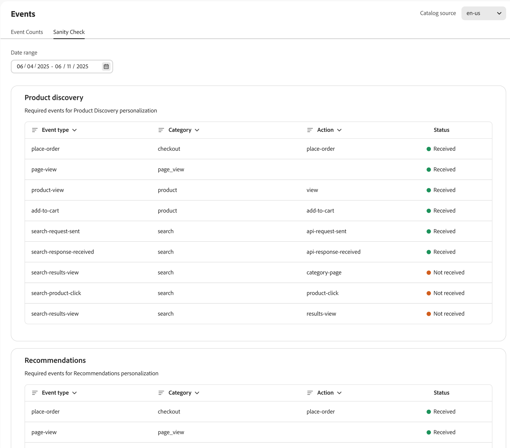

# 活動

事件是運用即時資料深入分析來增強購物體驗及促進轉換的重要工具。

[!DNL Adobe Commerce Optimizer]自動將店面活動部署至您的網站。 這些事件會從購物者在您網站上的互動中擷取資料。 此匿名資料可支援[建議](../../manage-results/recommendation-performance.md)、[產品探索](../../manage-results/search-performance.md)和[成功量度](../../manage-results/success-metrics.md)。

>[!NOTE]
>
>資料彙集不包含個人識別資訊(PII)。 所有使用者識別碼（例如Cookie ID和IP位址）都需嚴格匿名處理。 [了解更多](https://www.adobe.com/privacy/experience-cloud.html)。

**事件**&#x200B;頁面可讓您觀察正在收集的店面事件資料。 檢視事件資料收集可讓商家驗證他們是否已正確實作店面事件，以及是否成功擷取事件。 商戶可以使用此頁面來識別潛在問題，並採取措施來解決任何事件問題。

## 事件計數

**事件計數**&#x200B;索引標籤會追蹤購物者互動，例如搜尋、點按和購買，協助您分析趨勢並改善購物體驗。

{zoomable="yes"}

| 欄位 | 說明 |
|---|---|
| **日期範圍** | 您可以指定日期範圍來檢視特定的資料子集。 |
| 每小時&#x200B;**店面活動** | 顯示店面所觸發事件數的圖形。 |
| **店面活動總數** | 可篩選的表格，顯示店面所觸發之所有事件的詳細資訊。 |

## 健全性檢查

**健全狀態檢查**&#x200B;索引標籤提供每個行為事件健全狀態的深入分析，以確保精確的資料收集和功能。&#x200B;URL

{zoomable="yes"}

| 欄位 | 說明 |
|---|---|
| **日期範圍** | 您可以指定日期範圍來檢視特定的資料子集。 |
| **產品探索** | 顯示個人化產品搜尋結果所需的事件。 **Status**&#x200B;欄指出是否已收到事件。 |
| **建議** | 顯示個人化產品推薦所需的事件。 **Status**&#x200B;欄指出是否已收到事件。 |

下列章節說明[產品探索](#product-discovery)和[建議](#recommendations)的事件詳細資料。

### 產品探索

產品探索會使用事件來增強搜尋演演算法，例如「檢視次數最多」和「已檢視這個專案，已檢視那個專案」。

此表格說明產品探索[排名策略](../../merchandising/rules/add.md#intelligent-ranking)所使用的事件。

| 排名策略 | 活動 | 頁面 |
| --- | --- | --- |
| 檢視次數最多 | `page-view` `product-view` | 產品詳細資料頁面 |
| 購買最多 | `page-view` `place-order` | 購物車/結帳 |
| 加入購物車次數最多 | `page-view` `add-to-cart` | 產品詳細資料頁面 產品清單頁面 購物車 願望清單 |
| 已檢視這個專案，已檢視那個專案 | `page-view` `product-view` | 產品詳細資料頁面 |

#### 必要的儀表板事件

需要一些事件才能填入[搜尋效能儀表板](../../manage-results/search-performance.md)

| 儀表板區域 | 活動 | 加入欄位 |
| ------------------- | ------------- | ---------- |
| 不重複搜尋 | `page-view`，`search-request-sent`，`search-response-received` | `searchRequestId` |
| 零結果搜尋 | `page-view`，`search-request-sent`，`search-response-received` | `searchRequestId` |

### Recommendations

建議中使用兩種型別的資料：

- **行為** — 購物者在您網站上的參與度資料，例如產品檢視、加入購物車的商品和購買。
- **目錄** — 產品中繼資料，例如名稱、價格、可用性等。

Adobe AI會彙總行為和目錄資料，為每個建議型別建立Recommendations。 Recommendations服務接著會以包含建議產品&#x200B;_專案_&#x200B;的Widget形式，將這些建議部署至您的店面。

有些建議型別會使用購物者的行為資料來訓練機器學習模型，以建立個人化建議。 其他建議型別僅使用目錄資料，不使用任何行為資料。 如果您想要在您的網站上快速開始使用Recommendations，可以使用`More like this`建議型別。

#### 冷啟動

您何時可以開始使用使用使用行為資料的建議型別？ 視情況而定。 這稱為&#x200B;_冷啟動_&#x200B;問題。

_Cold Start_&#x200B;問題是指模型訓練及生效所需的時間。 針對建議，這表示等候Adobe AI收集足夠的資料來訓練其機器學習模型，然後再將建議單位部署在您的網站上。 模型擁有的資料越多，建議就越準確和有用。 由於資料收集會在即時網站上進行，因此最好及早開始此程式。

下錶針對收集每種建議型別的足夠資料所需時間提供一些一般指引：

| 建議型別 | 訓練時間 | 附註 |
|---|---|---|
| 以人氣為基礎(`Most viewed`， `Most purchased`， `Most added to cart`) | 因情況而異 | 視事件數量而定 — 檢視是最常見的檢視，因此學習速度更快；然後新增購物車，然後購買 |
| `Viewed this, viewed that` | 需要更多訓練 | 產品檢視數量相當大 |
| `Viewed this, bought that`，`Bought this, bought that` | 需要最多訓練 | 購買事件是商業網站上最罕見的事件，尤其是與產品檢視次數相比 |
| `Trending` | 需要三天的資料來建立人氣基線 | 趨勢是衡量產品受歡迎程度與其自身受歡迎基線相比的最新動量。 產品的趨勢分數是使用前景集（過去24小時的最近人氣）和背景集（72小時的最近人氣基線）計算。 如果專案的人氣在24小時內比其基準人氣明顯增加，則會獲得高趨勢分數。 每個產品都有此分數，而分數最高的專案會隨時包含最熱門的產品集。 |

其他可能影響訓練所需時間的變數：

- 較高的流量有助於加快學習速度
- 有些建議型別的訓練速度比其他建議型別快
- [!DNL Adobe Commerce Optimizer]每四小時重新計算一次行為資料。 在您的網站上使用建議的時間越長，建議就越準確。

為了協助您視覺化每個建議型別的訓練進度，[建立建議](../../merchandising/recommendations/create.md#readiness-indicators)頁面會顯示準備程度指標。

當您的即時網站上正在收集資料且機器學習模型正在進行訓練時，您可以完成設定建議所需的其他測試和設定工作。 當您完成此工作時，模型將擁有足夠的資料來建立有用的建議，可讓您將其部署到店面。

如果您的網站未針對大部分產品SKU取得足夠的流量（檢視、購買、趨勢），則可能沒有足夠的資料來完成學習程式。 這可能會讓Recommendations工作區上的整備程度指標看起來卡住。 整備程度指標旨在為商家提供另一個資料點，以便選擇哪種推薦型別更適合他們的商店。 數字是參考指標，可能永遠無法達到100%。 [進一步瞭解](../../merchandising/recommendations/create.md#readiness-indicators)整備指標。

#### 備份建議

如果輸入資料不足以提供單位中所有要求的建議專案，[!DNL Adobe Commerce Optimizer]會提供備份建議以填入建議單位。 例如，如果您將`Recommended for you`建議型別部署至首頁，則您網站上的首次購物者未產生足夠的行為資料，因此無法精確建議個人化產品。 在此情況下，[!DNL Adobe Commerce Optimizer]會根據`Most viewed`推薦型別向此購物者顯示專案。

在輸入資料收集不足的情況下，下列建議型別會遞補為`Most viewed`建議型別：

- `Recommended for you`
- `Viewed this, viewed that`
- `Viewed this, bought that`
- `Bought this, bought that`
- `Trending`
- `Conversion (view to purchase)`
- `Conversion (view to cart)`

#### 建議專屬事件

下表列出當購物者與店面的推薦單位互動時所觸發的事件。 所收集的事件資料可支援[量度](../../manage-results/recommendation-performance.md)分析建議的執行狀況。

| 事件 | 說明 |
| --- | --- |
| `impression-render` | 在頁面上轉譯建議單位時傳送。 如果頁面有兩個建議單位（已購買、已檢視），則會傳送兩個`impression-render`事件。 此事件用於追蹤曝光次數的量度。 |
| `rec-add-to-cart-click` | 購物者按一下建議單位中專案的&#x200B;**加入購物車**&#x200B;按鈕。 |
| `rec-click` | 購物者按一下建議單位中的產品。 |
| `view` | 當建議單位變成至少50%可檢視（例如向下捲動頁面）時傳送。 例如，如果建議單位有兩行，當購物者看到一行加上第二行一個畫素時，便會傳送`view`事件。 如果購物者上下捲動頁面數次，則傳送`view`事件的次數會與購物者再次在頁面上看到整個建議單位相同。 |

#### 必要的儀表板事件

需要下列事件才能填入[Recommendations效能儀表板](../../manage-results/recommendation-performance.md)

| 儀表板欄 | 活動 | 加入欄位 |
| ---------------- | --------- | ----------- |
| 曝光數 | `page-view`，`recs-request-sent`，`recs-response-received`，`recs-unit-render` | `unitId` |
| 檢視 | `page-view`，`recs-request-sent`，`recs-response-received`，`recs-unit-render`，`recs-unit-view` | `unitId` |
| 點按次數 | `page-view`，`recs-request-sent`，`recs-response-received`，`recs-item-click`，`recs-add-to-cart-click` | `unitId` |
| 收入 | `page-view`，`recs-request-sent`，`recs-response-received`，`recs-item-click`，`recs-add-to-cart-click`，`place-order` | `unitId`，`sku`，`parentSku` |
| LT收入 | `page-view`，`recs-request-sent`，`recs-response-received`，`recs-item-click`，`recs-add-to-cart-click`，`place-order` | `unitId`，`sku`，`parentSku` |
| CTR | `page-view`，`recs-request-sent`，`recs-response-received`，`recs-unit-render`，`recs-item-click`，`recs-add-to-cart-click` | `unitId`，`sku`，`parentSku` |
| vCTR | `page-view`，`recs-request-sent`，`recs-response-received`，`recs-unit-render`，`recs-unit-view`，`recs-item-click`，`recs-add-to-cart-click` | `unitId`，`sku`，`parentSku` |

以下事件並非建議所特有，但Adobe AI必須具備，才能正確解讀購物者資料：

- `view`
- `add-to-cart`
- `place-order`

#### 建議型別

此表格說明每種建議型別所使用的事件。

| 建議型別 | 活動 | 頁面 |
| --- | --- | --- |
| 檢視次數最多 | `page-view` `product-view` | 產品詳細資料頁面 |
| 購買最多 | `page-view` `place-order` | 購物車/結帳 |
| 加入購物車次數最多 | `page-view` `add-to-cart` | 產品詳細資料頁面 產品清單頁面 購物車 願望清單 |
| 已檢視這個專案，已檢視那個專案 | `page-view` `product-view` | 產品詳細資料頁面 |
| 已檢視此專案，但購買了其他專案 | `page-view` `product-view` | 產品詳細資料頁面 購物車/結帳 |
| 已購買此專案，已購買該專案 | `page-view` `product-view` | 產品詳細資料頁面 |
| 趨勢 | `page-view` `product-view` | 產品詳細資料頁面 |
| 轉換：檢視以購買 | `page-view` `product-view` | 產品詳細資料頁面 |
| 轉換：檢視以購買 | `page-view` `place-order` | 購物車/結帳 |
| 轉換：檢視到購物車 | `page-view` `product-view` | 產品詳細資料頁面 |
| 轉換：檢視到購物車 | `page-view` `add-to-cart` | 產品詳細資料頁面 產品清單頁面 購物車 願望清單 |

## 支援

如果您發現任何資料差異，或如果建議和搜尋結果未如預期運作，[請提交支援票證](https://experienceleague.adobe.com/en/docs/commerce-knowledge-base/kb/help-center-guide/magento-help-center-user-guide)。
