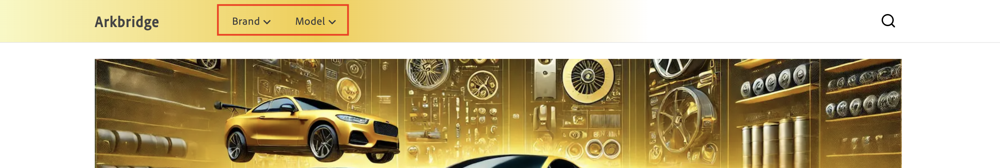

# 原則

原則是目錄檢視中所包含的資料存取篩選器，可進一步調整傳送至每個目錄檢視的資料。 原則可確保將正確的內容傳送至正確的目的地。 例如，銷售點實體商店、市集、廣告管道(Google、Facebook、Instagram)。

原則是根據產品屬性（例如品牌、模型或零件類別），並用來量身打造目錄資料以符合特定業務需求。&#x200B;URL

## 篩選器

篩選器是強制目錄細分原則內的機制。 篩選器可讓企業根據營運需求量身打造適合特定產品集的店面和目錄檢視。 您可以使用產品屬性、運運算元和值等條件來定義規則或條件，以指示在目錄檢視或店面中包含或排除哪些產品。

### 篩選器的部分

篩選器由下列部分組成：

| 部分 | 說明 | 範例 |
|---|---|---|
| **屬性** | 用於篩選的產品屬性。 | `part_category` |
| **運運算元** | 套用至屬性的條件。 | `IN`，`EQUALS`，`CONTAINS` |
| **值來源** | 指定值是`STATIC`或`TRIGGER`。 | `STATIC` [進一步瞭解](#value-source-types) |
| **值** | 符合條件的特定值。 | `brakes, suspension` |

### 範例

具有屬性`part_category`、運運算元`IN`和值`brakes, suspension`的篩選器可確保原則只會篩選並顯示具有屬性`part_category`且值為`brake`或`suspension`的產品。

### 值來源型別

值來源有兩種型別： **STATIC**&#x200B;和&#x200B;**TRIGGER**。

**值來源**&#x200B;為&#x200B;**STATIC**&#x200B;的原則被視為通用原則。 通用原則會定義網站的整體體驗。 這表示目錄檢視將一律執行該原則。 換言之，該原則的執行不以店面上的任何使用者互動為基礎。

**值來源**&#x200B;為&#x200B;**TRIGGER**&#x200B;的原則稱為獨佔原則。 這表示目錄檢視只會在API呼叫的標頭中指定觸發程式時執行該原則。 在店面，這表示資訊會根據購物者選取的內容而顯示。 例如，在下圖中，有兩個下拉式功能表： **品牌**&#x200B;和&#x200B;**模型**。

**品牌**&#x200B;和&#x200B;**模型**&#x200B;是已定義的觸發器：

- `AC-Policy-Brand`
- `AC-Policy-Model`

如果購物者按一下&#x200B;**品牌**&#x200B;下拉式清單，則API呼叫的標頭會包含`AC-Policy-Brand`，其設定為只顯示`AC-Policy-Brand`原則的特定產品。

## 建立原則

您可以在此段落中建立新原則。 原則可以是&#x200B;**靜態**&#x200B;或&#x200B;**觸發器**。

### 建立STATIC原則

1. 在左側功能表中，開啟&#x200B;**[!UICONTROL Catalog]**&#x200B;區段並按一下&#x200B;**[!UICONTROL Policies]**。

1. 按一下&#x200B;**[!UICONTROL Add Policy]**&#x200B;按鈕。

   新頁面隨即開啟，供您填寫原則詳細資訊。&#x200B;URL

1. 輸入原則的名稱，例如「Celport零件類別」。

1. 按一下&#x200B;**[!UICONTROL Add Filter]**&#x200B;按鈕。

   隨即開啟對話方塊，供您新增篩選器詳細資訊。

1. 新增篩選器詳細資訊。 例如：

   1. **屬性** — 輸入目錄中的屬性。 例如，「part_category」。 此名稱必須與目錄中屬性的名稱完全相符。
   1. **運運算元** — 選擇運運算元。 例如，**IN**。&#x200B;
   1. **值Source** — 選取&#x200B;**STATIC**。&#x200B;
   1. **值** — 輸入您先前指定之屬性定義的值。 例如，輸入「制動器」來建立制動零件的篩選器。&#x200B;URL值必須與屬性名稱完全相符。
   1. 若要儲存值，請按&#x200B;**Enter**。

      如果原則的設計是要依多個值篩選，請分別輸入每個值。

1. 按一下篩選器詳細資料對話方塊中的&#x200B;**[!UICONTROL Save]**&#x200B;按鈕。&#x200B;URL

1. 按一下您建立的篩選器旁的動作點(...)，然後選取&#x200B;**啟用**。 從這裡，您也可以&#x200B;**編輯**、**停用**&#x200B;或&#x200B;**刪除**&#x200B;篩選器。

   **狀態**&#x200B;欄會顯示綠色圖示和「已啟用」一字。

1. 按一下&#x200B;**[!UICONTROL Save]**&#x200B;按鈕以儲存新原則&#x200B;。 如果按鈕未啟用，請按一下&#x200B;**新增原則**&#x200B;旁的鉛筆圖示，確定已新增原則名稱。

1. 若要驗證您的新原則，請按一下「上一步」箭頭，返回原則清單。&#x200B;URL您將會看到列出您的新原則。

### 建立TRIGGER原則

1. 在左側功能表中，開啟&#x200B;**[!UICONTROL Catalog]**&#x200B;區段並按一下&#x200B;**[!UICONTROL Policies]**。

1. 按一下&#x200B;**[!UICONTROL Add Policy]**&#x200B;按鈕。

   新頁面隨即開啟，供您填寫原則詳細資訊。&#x200B;URL

1. 輸入原則的名稱，例如「Celport零件類別」。

1. 按一下&#x200B;**[!UICONTROL Add Trigger]**&#x200B;按鈕。

   **觸發器詳細資料**&#x200B;對話方塊就會顯示。

1. 輸入觸發器的名稱，例如&#x200B;**AC-Policy-Brand**。

1. 選取&#x200B;**傳輸型別**。 **HTTP_HEADER**&#x200B;是目前唯一支援的型別。

1. 按一下&#x200B;**[!UICONTROL Save]**&#x200B;按鈕以儲存觸發器。

1. 按一下&#x200B;**[!UICONTROL Add Filter]**&#x200B;按鈕。

   隨即開啟對話方塊，供您新增篩選器詳細資訊。

1. 新增篩選器詳細資訊。 例如：

   1. **屬性** — 輸入目錄中的屬性。 例如，「part_category」。 此名稱必須與目錄中屬性的名稱完全相符。
   1. **運運算元** — 選擇運運算元。 例如，**IN**。&#x200B;
   1. **值Source** — 選取&#x200B;**TRIGGER**&#x200B;。
   1. **值** — 輸入您先前建立的觸發程式名稱(**AC-Policy-Brand**)。

1. 按一下篩選器詳細資料對話方塊中的&#x200B;**[!UICONTROL Save]**&#x200B;按鈕。&#x200B;URL

1. 按一下您建立的篩選器旁的動作點(...)，然後選取&#x200B;**啟用**。 從這裡，您也可以&#x200B;**編輯**、**停用**&#x200B;或&#x200B;**刪除**&#x200B;篩選器。

   **狀態**&#x200B;欄會顯示綠色圖示和「已啟用」一字。

1. 按一下&#x200B;**[!UICONTROL Save]**&#x200B;按鈕以儲存新原則&#x200B;。 如果按鈕未啟用，請按一下&#x200B;**新增原則**&#x200B;旁的鉛筆圖示，確定已新增原則名稱。

1. 若要驗證您的新原則，請按一下「上一步」箭頭，返回原則清單。&#x200B;URL您將會看到列出您的新原則。

依照這些步驟，將建立原則並準備好連結至目錄檢視以控制產品可見度。
