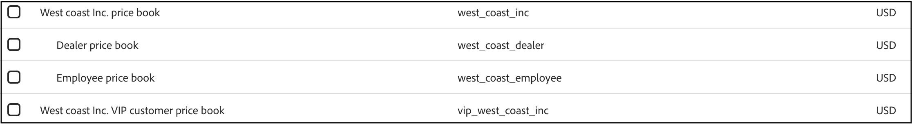
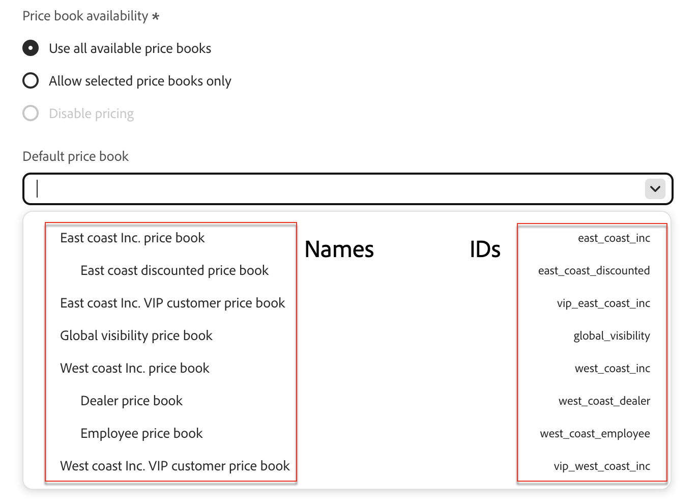

# 價格手冊

價格手冊可讓您針對不同客戶層級和市場的目錄來源，定義產品價格。 價格簿支援階層式模型，允許每個基本價格簿下最多三個層級的巢狀子價格簿。 每個價格簿都可以參考上階價格簿，以構成訂價型錄來源的樹狀結構。

基準價格簿會定義其本身及其所有子價格簿的幣別。 子價格簿會繼承此幣別，且無法覆寫它。

## 將價格簿新增至Commerce Optimizer

您可使用價格簿API將價格簿新增至Commerce Optimizer。 請參閱[開發人員檔案](https://developer.adobe.com/commerce/services/reference/rest/)，瞭解如何建立、更新及刪除[!DNL Adobe Commerce Optimizer]的價格簿。

## 在Commerce Optimizer中檢視價格簿

將價格簿擷取至Commerce Optimizer後，您可以在&#x200B;**目錄檢視**&#x200B;頁面上看到價格簿清單及其對應的ID。

1. 移至&#x200B;_存放區設定_，然後按一下&#x200B;**[!UICONTROL Catalog views]**。

1. 按一下&#x200B;**[!UICONTROL Create catalog view]**&#x200B;。

   在設定型錄檢視詳細資訊中，選取其中一個可用的價格簿。

   

## 重要概念

| 詞語 | 說明 |
|------|-------------|
| **價格簿** | 邏輯群組，定義型錄來源的價格；例如，特定區域或客戶階層，用來管理產品價格。 |
| **遞補價格手冊** | 階層中最上層的價格簿。 它沒有父代，而且是&#x200B;*僅*&#x200B;價格簿，定義其本身及其所有子系價格簿的貨幣。  如果在建立價格簿期間（透過API）未定義上階，則會建立新的備援價格簿。 |
| **父價格簿** | 較高層級的價格簿，若未明確設定子項價格，則子項價格簿可從中繼承價格。 |
| **階層深度** | 最多3個層級（備援 — >子項 — >子項）  在內嵌時未強制執行。 |
| **貨幣** | 僅針對遞補價格簿定義。 由所有下階價格簿繼承。  如果在建立備援價格簿期間未指定貨幣（透過API），則貨幣預設為USD。 |
| **產品價格** | 指定給特定價格簿中之產品(SKU)的特定價格。 |
| **折扣** | 折扣以產品價格定義。 未繼承。 |
