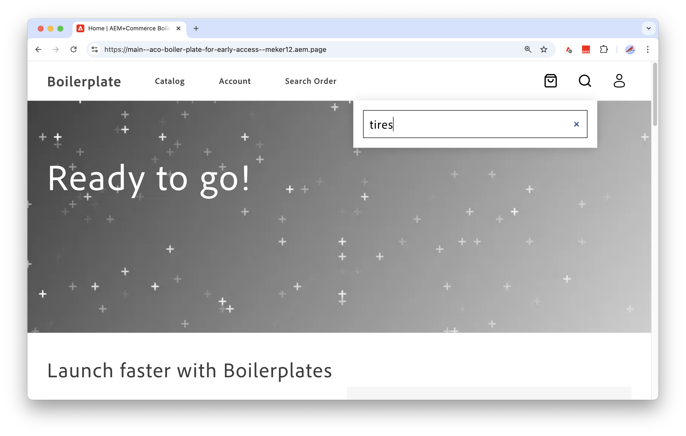

# 設定您的店面

>[!NOTE]
>
>本檔案說明提早存取開發中的產品，並未反映所有可供一般使用的功能。

本教學課程示範如何設定及使用[Adobe Commerce Storefront (由Edge Delivery Services提供技術支援)](https://experienceleague.adobe.com/developer/commerce/storefront/get-started/)，以建立效能、可擴充且安全的Commerce Storefront （由您[!DNL Adobe Commerce Optimizer]執行個體的資料提供技術支援）。


## 先決條件

* 確保您有可建立存放庫並設定為本機開發的GitHub帳戶(github.com)。

* 檢閱Adobe Edge Delivery Services店面檔案中的[概觀](https://experienceleague.adobe.com/developer/commerce/storefront/get-started)，瞭解在Adobe Commerce Edge Delivery Services上開發Commerce店面的概念和工作流程。
* 設定您的開發環境


### 設定您的開發環境

安裝Node.js以及在Edge Delivery Services上開發和測試您的[!DNL Adobe Commerce Optimizer]店面所需的Sidekick瀏覽器擴充功能。

#### 安裝節點.js

安裝Node Version Manager (NVM)和必要的Node.js版本(22.13.1 LTS)。

1. 安裝節點版本管理員(NVM)。

   ```bash
   curl -o- https://raw.githubusercontent.com/nvm-sh/nvm/v0.40.1/install.sh | bash
   ```

1. 安裝Node.js和NPM。 如需詳細資訊，請參閱[Node.js](https://nodejs.org/en/)。

   ```bash
   nvm install 22
   ```

   ```bash
   npm install -g npm
   ```

1. 驗證安裝。

   ```bash
   npm -v
   ```

>[!TIP]
>
>此店面設定程式是搭配Adobe Commerce Edge Delivery服務店面使用[!DNL Adobe Commerce Optimizer]。 適用於Adobe Commerce ](https://experienceleague.adobe.com/en/docs/commerce-learn/tutorials/adobe-developer-app-builder/introduction-to-app-builder)的[App Builder和適用於Adobe Developer App Builder](https://experienceleague.adobe.com/en/docs/commerce-learn/tutorials/adobe-developer-app-builder/api-mesh/getting-started-api-mesh)的[API Mesh可提供擴充和自訂[!DNL Adobe Commerce Optimizer]解決方案的其他資源。 如需存取和使用資訊，請聯絡您的Adobe客戶代表。

#### 安裝Sidekick

安裝Sidekick瀏覽器擴充功能，以編輯、預覽和發佈內容至店面。 請參閱[Sidekick安裝指示](https://www.aem.live/docs/sidekick#installation)。


## 建立您的店面

您為[!DNL Adobe Commerce Optimizer]專案建立的店面使用Edge Delivery Services店面樣板上的自訂版Adobe Commerce。 樣板是一組檔案和資料夾，提供店面開發的起點。 此設定程式不同於Edge Delivery Services店面](https://experienceleague.adobe.com/developer/commerce/storefront/get-started/)上[Adobe Commerce的標準設定程式。

>[!NOTE]
>
>本教學課程使用macOS、Chrome和Visual Studio Code作為開發環境。 畫面會擷取該設定，並提供相關指示。 您可以使用不同的作業系統、瀏覽器和程式碼編輯器，但您看到的UI和您採取的步驟會因此而有所不同。

### 工作流程概觀

請依照下列步驟設定與[!DNL Adobe Commerce Optimizer]搭配使用的店面。

1. **[建立內容資料夾](#step-1-create-a-content-folder)** — 在Google Drive或Sharepoint中建立共用內容資料夾。 此資料夾包含店面的範例內容和資產。

1. **[建立程式碼存放庫](#step-2-create-a-code-repository)** — 從Adobe Commerce + Edge Delivery Services範本建立GitHub存放庫。 包含來源存放庫中的所有分支。
1. **[更新店面樣板](#step-3-update-the-storefront-boilerplate)** — 更新`aco`分支上的自訂樣板範本，以將您的內容資料夾連線到店面。
1. **[上傳更新的店面樣板程式碼](#step-4-upload-the-updated-boilerplate-code)** — 以`aco`分支的更新程式碼覆寫`main`分支上的程式碼。
1. **[新增CodeSync應用程式](#step-5-add-the-aem-code-sync-app)** — 將您的存放庫連線至Edge Delivery服務。 在完成原始程式碼自訂並準備將程式碼推送到`main`分支之前，請勿連執行緒式碼同步應用程式。
1. **[預覽並發佈您的內容](#step-6-preview-and-publish-your-content)** — 使用Sidekick擴充功能，從內容資料夾預覽併發佈網站內容至店面。
1. **[預覽您的網站並檢視範例資料](#step-7-preview-your-site)** — 連線到您的店面網站以檢視[!DNL Adobe Commerce Optimizer]示範執行個體的範例內容和資料。
1. **[在本機環境中開發店面](#step-8-develop-the-storefront-in-your-local-environment)** — 安裝必要的相依性。 啟動本機開發伺服器，並更新店面設定，以連線至Adobe為您布建的[!DNL Adobe Commerce Optimizer]執行個體。
1. **[後續步驟](#next-steps)** — 進一步瞭解如何在店面管理和顯示內容和資料。

### 步驟1：建立內容資料夾

依照Adobe Commerce Storefront檔案中的指示，在Google Drive或Sharepoint中新增共用內容資料夾，並新增範例內容。 範例內容包含影像、文字和組成網站的其他資產。

* [建立和共用Google磁碟機或Sharepoint資料夾](https://experienceleague.adobe.com/developer/commerce/storefront/get-started/#create-and-share-folder)
* [將範例內容](https://experienceleague.adobe.com/developer/commerce/storefront/get-started/#add-sample-content)載入您的資料夾。

### 步驟2：建立程式碼存放庫

使用Edge Delivery Services + Adobe Commerce範本在GitHub中建立店面範本程式碼存放庫。

1. 登入您的GitHub帳戶。

1. 導覽至[aem-boilerplate-commerce](https://github.com/hlxsites/aem-boilerplate-commerce) GitHub存放庫。

1. 選取「**使用此範本**」，然後從下拉式功能表中選取「**建立新的存放庫**」。

   ![[!DNL Create github repo from storefront boilerplate template]](./assets/storefront-create-github-repo.png){width="700" zoomable="yes"}

   儲存區域組態頁面隨即顯示。

   ![[!DNL Configure github repo to pull all branches from boilerplate repo]](./assets/storefront-configure-github-repo.png){width="700" zoomable="yes"}

1. 使用下列詳細資料完成設定表單：

   * **存放庫範本**—`hlxsites/aem-boilerplate-commerce` （預設）。
   * **包含所有分支** — 選取包含所有分支的選項。
   * **所有者** — 您的組織或帳戶（必要）。
   * **存放庫名稱** — 您的新存放庫的唯一名稱（必填）。
   * **描述** — 存放庫的簡短描述（選擇性）。
   * **Public或Private**—Adobe建議使用public （預設）。

1. 選取&#x200B;**建立存放庫**。

   幾分鐘後，您的新存放庫會開啟。

   忽略GitHub使用者介面中顯示的任何提取請求通知。

### 步驟3：更新店面樣板

您需要下列資訊來更新店面樣板程式碼：

* 步驟2 **中的** GitHub存放庫URL— `github.com/{ORG}/{SITE}`

   * `{ORG}`是存放庫的組織名稱或使用者名稱

   * `{SITE}`是您的存放庫名稱

* 步驟1 **中的**&#x200B;內容資料夾URL— `https://drive.google.com/drive/folders/{YOUR_FOLDER_ID}`

  `{YOUR_FOLDER_ID}`是您使用範例內容資料建立的資料夾識別碼。

#### 更新範本程式碼以連線至您的內容資料夾

1. 將存放庫複製到本機電腦。

   ```bash
   git clone https://github.com/{ORG}/{SITE}.git
   ```

   如果您在複製存放庫時遇到錯誤，請參閱GitHub檔案中的[疑難排解複製錯誤](https://docs.github.com/en/repositories/creating-and-managing-repositories/troubleshooting-cloning-errors)。

1. 在終端機或IDE中開啟存放庫。

1. 檢視`aco`分支

   ```bash
   git checkout aco
   ```

1. 將`default-fstab.yaml`檔案複製到`fstab.yaml`以建立您的設定檔。

   ```bash
   cp default-fstab.yaml fstab.yaml
   ```

1. 更新店面設定檔案中的掛接點，以指向您的內容URL。

   1. 開啟[fstab.yaml](https://experienceleague.adobe.com/developer/commerce/storefront/get-started/#vocabulary)設定檔。

      ```json
      mountpoints:
       /: {YOUR_MOUNTPOINT_URL}
      
      folders:
       /products/: /products/default
      ```

   1. 將`{YOUR_MOUNTPOINT_URL}`取代為您內容資料夾的URL。

      例如，如果您使用Google Drive，更新後的程式碼應如下所示。

      ```json
       mountpoints:
        /: https://drive.google.com/drive/folders/1HXPWdQT-EK09IxVQV5HBSHN4QCA1a56Y
      ```

   1. 儲存檔案。

#### 檢閱資料連線設定

資料連線設定會建立店面和指定的[!DNL Adobe Commerce Optimizer]執行個體之間的通訊。 此連線可讓目錄資料流入店面，並填入各種店面介面，包括搜尋元件、產品清單和產品詳細資訊頁面。

對於您的初始店面設定，您使用範例資料連線到預設的[!DNL Adobe Commerce Optimizer]執行個體。

```json
{
  "public": {
    "default": {
      "commerce-core-endpoint": "https://www.aemshop.net/graphql",
      "commerce-endpoint": "https://na1-sandbox.api.commerce.adobe.com/Fwus6kdpvYCmeEdcCX7PZg/graphql",
      "headers": {
        "cs": {
          "ac-channel-id": "9ced53d7-35a6-40c5-830e-8288c00985ad",
          "ac-environment-id": "Fwus6kdpvYCmeEdcCX7PZg",
          "ac-price-book-id": "west_coast_inc",
          "ac-scope-locale": "en-US"
        }
      },
      "analytics": {
        "base-currency-code": "USD",
        "environment": "Production",
        "store-id": 1,
        "store-name": "ACO Demo",
        "store-url": "https://www.aemshop.net",
        "store-view-id": 1,
        "store-view-name": "Default Store View",
        "website-id": 1,
        "website-name": "Main Website"
      }
    }
  }
}
```

在此檔案中，下列索引鍵值指定要連線的[!DNL Adobe Commerce Optimizer]執行個體，並決定流向店面的資料：

* `commerce-endpoint`指定要連線的執行個體。 已設定為使用預設的[!DNL Adobe Commerce Optimizer]執行個體。 此端點用於擷取目錄資料。
* `ac-environment-id`是[!DNL Adobe Commerce Optimizer]執行個體的租使用者識別碼。
* `headers`決定從執行個體流向店面的資料。
   * `ac-channel-id`已設定為`west_coast_inc`
   * `ac-price-book-id`已設定為`west_coast_inc`
   * `ac-scope-locale`已設定為`en-US`
   * `ac-price-book-id`已設定為`west_coast_inc`

這些值會設定管道ID、地區設定及價格簿ID，以將目錄資料傳送至特定的銷售管道，並根據指定的地區設定及價格簿值篩選該資料。 稍後，您更新端點以連線至Adobe為您布建的[!DNL Adobe Commerce Optimizer]執行個體，並取代標題值以從該執行個體擷取資料。

#### 設定Sidekick擴充功能

新增Sidekick擴充功能的專案設定。 此設定可確保Sidekick可用於管理店面專案的內容。

>[!NOTE]
>
>請確定您已在瀏覽器中安裝[Sidekick擴充功能](https://www.aem.live/docs/sidekick#installation)。

1. 開啟`tools/sidekick/config.json`檔案。

   +++Sidekick設定檔

   ```json
   {
     "project": "Boilerplate",
     "plugins": [
       {
         "id": "cif",
         "title": "Commerce",
         "environments": [
           "edit"
         ],
         "url": "https://main--{SITE}--{ORG}.aem.live/tools/picker/dist/index.html",
         "isPalette": true,
         "paletteRect": "top: 54px; left: 5px; bottom: 5px; width: 300px; height: calc(100% - 59px); border-radius: var(--hlx-sk-button-border-radius); overflow: hidden; resize: horizontal;"
       },
       {
         "id": "personalisation",
         "title": "Personalisation",
         "environments": [
           "edit"
         ],
         "url": "https://main--{SITE}--{ORG}.aem.live/tools/segments/dist/index.html",
         "isPalette": true,
         "paletteRect": "top: 54px; left: 5px; bottom: 5px; width: 300px; height: calc(100% - 59px); border-radius: var(--hlx-sk-button-border-radius); overflow: hidden; resize: horizontal;"
       }
     ]
   }
   ```

   如需詳細資訊，請參閱[Sidekick資料庫檔案](https://www.aem.live/docs/sidekick-library)。

+++

1. 以您GitHub存放庫的值更新`url`機碼值。

   * 將`{ORG}`字串取代為您的存放庫的組織或使用者名稱。

   * 以存放庫名稱取代`{SITE}`字串

   +++更新組態檔的範例

   如果您的GitHub存放庫名稱為`aco-storefront`，而您的組織為`early-adopter`，則更新的URL應如下所示：

   ```json
   {
     "project": "Boilerplate",
     "plugins": [
       {
         "id": "cif",
         "title": "Commerce",
         "environments": [
           "edit"
         ],
         "url": "https://main--aco-storefront--early-adopter.aem.live/tools/picker/dist/index.html",
         "isPalette": true,
         "paletteRect": "top: 54px; left: 5px; bottom: 5px; width: 300px; height: calc(100% - 59px); border-radius: var(--hlx-sk-button-border-radius); overflow: hidden; resize: horizontal;"
       },
       {
         "id": "personalisation",
         "title": "Personalisation",
         "environments": [
           "edit"
         ],
         "url": "https://main--aco-storefront--early-adopter.aem.live/tools/segments/dist/index.html",
         "isPalette": true,
         "paletteRect": "top: 54px; left: 5px; bottom: 5px; width: 300px; height: calc(100% - 59px); border-radius: var(--hlx-sk-button-border-radius); overflow: hidden; resize: horizontal;"
       }
     ]
   }
   ```

+++

1. 儲存檔案。

### 步驟4：上傳更新的範本程式碼

若要使用自訂的店面樣板程式碼，請以您的更新覆寫`main`分支上的程式碼。

1. 在編輯器或IDE中，提交並儲存您更新的檔案。

   ```bash
   git add .
   ```

1. 確認您認可兩個更新的檔案。

   ```bash
   git status
   On branch aco
   Your branch is up to date with 'origin/aco'.
   
   Changes to be committed:
    (use "git restore --staged <file>..." to unstage)
        new file:   fstab1.yaml
        modified:   tools/sidekick/config.json
   ```

1. 認可對`aco`分支的變更。

   ```bash
   git commit -m "Update storefront boilerplate for Adobe Commerce Optimizer"
   ```

1. 以`aco`分支上的變更覆寫`main`分支上的樣版。

   ```bash
   git push origin aco:main -f
   ```

### 步驟5：新增AEM程式碼同步應用程式

將Edge Delivery程式碼同步GitHub應用程式新增至您的存放庫，以將存放庫連線到AEM Service。

>[!IMPORTANT]
>
>您必須先將更新後的程式碼上傳至GitHub存放庫的主要分支，才能連執行緒式碼同步應用程式。

1. 開啟[AEM程式碼同步應用程式](https://github.com/apps/aem-code-sync)設定頁面。

1. 選取&#x200B;**設定**，然後使用包含您建立之存放庫的&#x200B;**組織**&#x200B;或&#x200B;**帳戶**&#x200B;進行驗證。

1. 從表單中選擇&#x200B;**僅選取存放庫**，然後選取您建立的存放庫。

1. 選取&#x200B;**安裝**，將AEM程式碼同步應用程式新增至您的存放庫。

   您應該會看到應用程式已成功安裝的訊息。

### 步驟6：預覽和發佈您的內容

若要新增內容至店面，請使用Sidekick擴充功能預覽及發佈店面內容。

1. 在Google Drive或Sharepoint中，開啟您的內容資料夾。

1. 按一下瀏覽器工具列中的Sidekick圖示，開啟Sidekick 。

   ![[!DNL Turn on Sidekick from browser toolbar]](./assets/storefront-enable-sidekick-toolbar.png){width="700" zoomable="yes"}

   如果您沒有看到Sidekick圖示，請確認GitHub存放庫`main`分支上的Sidekick設定檔`tools/Sidekick/config.json`已正確設定[](#configure-the-sidekick-extension)。

1. 使用Sidekick工具列來預覽和發佈您的內容。

   ![[選取要預覽和發佈的檔案]](./assets/storefront-content-preview-publish.png){width="700" zoomable="yes"}

   分別選取每個資料夾中的檔案，並使用Sidekick工具列來預覽和發佈所有檔案。

   * **預覽** — 將內容上傳到中繼環境。 Storefront暫存URL結尾為`.aem.page`。

   * **發佈** — 將內容上傳到生產環境。 生產URL結尾為`aem.live`。

如需詳細資訊，請參閱Adobe Experience Manager [Sidekick](https://www.aem.live/docs/sidekick)檔案。

### 步驟7：預覽您的網站

確認範例內容和Adobe Commerce Optimizer示範執行個體的資料皆正確顯示。

* **範例內容**&#x200B;是從您的共用內容資料夾提供。 其中包含您使用Sidekick發佈的頁面配置、橫幅和其他內容。
* 從[!DNL Adobe Commerce Optimizer]示範執行個體提供&#x200B;**範例資料**。 資料包含產品資料，其中產品屬性、影像、產品說明，以及根據店面組態檔`config.json`中指定的標題值填入的價格。


#### 連線至您的網站以檢視範例內容和資料

1. 瀏覽至`https://main--{SITE}--{ORG}.aem.live`以連線至您的網站。

   將`{ORG}`和`{SITE}`取代為您樣版存放庫的組織和名稱。

   ![[!DNL ACO storefront site with boilerplate]](./assets/aco-storefront-site-boilerplate.png){width="700" zoomable="yes"}

   如果頁面傳回404錯誤，請確定您已使用Sidekick擴充功能發佈內容。 此外，再次檢查更新的`fstab.yaml`檔案中的掛接點是否指向您建立的內容資料夾。

1. 檢視來自Commerce Optimizer預設執行個體的範例目錄資料。

   1. 搜尋`tires`以檢視可用輪胎產品的下拉式清單。

   ![[!DNL Discover Adobe Commerce Optimizer products]](./assets/storefront-site-with-aco-data.png){width="700" zoomable="yes"}

   搜尋元件是店面樣板程式碼的一部分。 搜尋結果資料是根據`config.json`中的店面組態填入。

   1. 按下&#x200B;**Enter**&#x200B;以檢視產品清單頁面。

      ![[!DNL View product details page]](./assets/storefront-with-aco-pdp-page.png){width="675" zoomable="yes"}

   1. 選取頁面上的任何輪胎產品，以檢視產品詳細資訊頁面。

      如果您探索店面，請注意有些元件無法運作。 例如，將產品新增至購物車會傳回錯誤，而帳戶管理元件無法運作。 發生這些問題是因為這些元件尚未設定為可從Commerce後端接收資料。 來自[!DNL Adobe Commerce Optimizer]執行個體的資料只會填入搜尋元件、產品清單和產品詳細資料頁面。

   1. 探索店面後，請繼續進行教學課程。


### 步驟8：在本機環境中開發店面

在本節中，您將從本機開發環境更新店面設定。

* 更新Storefront設定，以連線至Adobe為您布建的[!DNL Adobe Commerce Optimizer]執行個體的GraphQL端點。
* 更新標頭值以從執行個體擷取資料。

#### 開始本機開發

1. 在IDE中，檢視GitHub程式碼存放庫的主要分支。

   ```bash
   git checkout main
   ```

1. 安裝必要的相依性。

   ```bash
   npm install
   ```

1. 啟動本機開發伺服器。

   ```bash
   npm start
   ```

   您的樣板店面的第一頁應該會在`http://localhost:3000`的瀏覽器中顯示。

![[!DNL Configure github repo to pull all branches from boilerplate repo]](./assets/aco-storefront-local-dev-env.png){width="700" zoomable="yes"}


#### 更新店面設定

更新店面設定檔案，並在您的本機開發環境中預覽變更。


1. 在您的IDE中，更新店面設定以連線至Adobe已為您布建的[!DNL Adobe Commerce Optimizer]執行個體。

   1. 開啟`config.json`檔案。

   1. 使用您[!DNL Adobe Commerce Optimizer]執行個體的端點更新下列值：

      * **`commerce-endpoint`** — 以您的端點URL取代現有值。

        ```json
        "commerce-endpoint": "https://na1-sandbox.api.commerce.adobe.com/{tenantId}/graphql"
        ```

      * **`ac-environment-id`** — 以您端點URL中的租使用者ID取代現有值。

        ```json
        "ac-environment-id": "{tenantId}"
        ```

   1. 儲存檔案。

      如果您的本機預覽正常運作，則更新會套用至您的本機店面。

1. 檢查網站以檢視組態變更的結果。

   1. 在瀏覽器中，瀏覽至`http://localhost:3000`並重新整理頁面。

   1. 在店面標題中，按一下放大鏡以搜尋`tires`。

      {width="675" zoomable="yes"}

      請注意，下拉式清單不會填入。

   1. 按&#x200B;**Enter**&#x200B;以顯示產品清單頁面。

      {width="675" zoomable="yes"}

      搜尋不會傳回任何結果，因為您的店面組態檔案中的標頭值是以預設例項為基礎。 現在設定已指向為您布建的[!DNL Adobe Commerce Optimizer]執行個體，這些值無效。

### 後續步驟

請參閱[店面和目錄管理員端對端使用案例](./use-case/admin-use-case.md)，進一步瞭解如何在店面中管理和顯示內容和資料。

>[!MORELIKETHIS]
>
>* [Adobe Experience Manager storefront檔案](https://experienceleague.adobe.com/developer/commerce/storefront/)，以進一步瞭解如何更新網站內容，以及如何與Commerce前端元件和後端資料整合。
></br></br>
>* [Adobe Commerce Storefront檔案](https://experienceleague.adobe.com/developer/commerce/storefront/)，以進一步瞭解更新網站內容以及與Adobe Commerce前端元件和後端資料整合的相關資訊。
