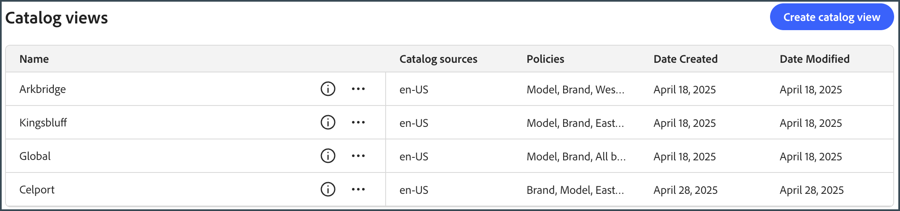

# 店面和目錄管理員端對端使用案例

此使用案例是根據名為Carvelo Automobile的虛構汽車企業集團，其運作設定複雜。 它示範如何使用[!DNL Adobe Commerce Optimizer]來管理支援多個品牌、經銷商和價格手冊的目錄，同時提供自訂的店面體驗。

## 先決條件

此使用案例是專為想要瞭解如何使用[!DNL Adobe Commerce Optimizer]設定店面及管理目錄的管理員與開發人員所設計。 它假設您對[!DNL Adobe Commerce Optimizer]及其功能有基本的瞭解。

**預計完成時間：** 45-60分鐘

### 必要設定

開始進行本教學課程之前，請確定您已具備下列必要條件：

- **Adobe Commerce Optimizer執行個體**
   - 存取Cloud Manager中的測試執行個體
   - 如需安裝指示，請參閱[開始使用](../get-started.md)

- **使用者許可權**
   - 管理員存取Adobe Admin Console
   - 如需帳戶設定，請參閱[使用者管理](../user-management.md)
   - 如果您沒有存取權，請聯絡您的Adobe客戶代表。

- **範例資料**
   - Carvelo汽車目錄資料已載入您的執行個體
   - 遵循[範例目錄資料擷取存放庫](https://github.com/adobe-commerce/aco-sample-catalog-data-ingestion)中的指示
   - 您可以使用包含的`reset.js`指令碼在完成之後刪除範例資料

- **店面環境**
   - 使用Node.js的本機開發環境
   - 複製並設定店面樣板專案
   - 如需詳細指示，請參閱[店面設定](../storefront.md)

## 讓我們開始吧

在此使用案例中，您正在使用下列專案：

1. [!DNL Adobe Commerce Optimizer] UI — 設定目錄檢視和原則，以管理Carvelo使用案例的複雜目錄作業設定。

1. Commerce店面 — 使用載入到您[!DNL Adobe Commerce Optimizer]執行個體和Commerce店面組態檔`fstab.yaml`和`config.json`的範例目錄資料來轉譯店面。

>[!NOTE]
>
> 檢閱Adobe Commerce店面檔案中的[探索樣板](https://experienceleague.adobe.com/developer/commerce/storefront/get-started/boilerplate-project/)主題，瞭解店面設定檔案。

### 關‌鍵要點

本文結束時，您將瞭解：

- 瞭解[!DNL Adobe Commerce Optimizer]的基礎及其效能和可擴充的目錄資料模型。
- 瞭解目錄資料模型如何與Adobe建立的平台無關店面元件整合。
- 瞭解如何使用Adobe Commerce Optimizer目錄檢視和原則來建立自訂目錄檢視和資料存取篩選器，並將資料傳送到Edge Delivery支援的Adobe Commerce店面。

## 商業案例 — Carvelo Automobile

Carvelo Automobile是一個虛擬的汽車企業集團，擁有複雜的營運設定。


在此圖表中，您會看到Carvelo銷售三個品牌的汽車產品。 每個品牌都是不同的子公司：

- Aurora （電動汽車）
- Bolt (SUV)
- Cruz （混合）

該公司透過三家經銷商銷售這些品牌：

- Arkbridge
- Kingsbluff
- Celport

這些經銷商屬於兩家不同的母公司經銷公司：

- 西海岸公司(Arkbridge)
- 東海岸公司(Kingsbluff， Celport)

每間公司都有兩個價格簿，用於以特定價格向不同購物者(基礎客戶、VIP)銷售產品。

- `west_coast_inc`和`vip_west_coast_inc`
- `east_coast_inc`和`vip_east_coast_inc`

如您所見，這是一個非常複雜的業務使用案例。 透過[!DNL Adobe Commerce Optimizer]，商家可以使用單一基本目錄支援複雜的業務結構，以聯合處理資料而不需要目錄重複、調整價格簿（30k以上價格簿），並將所有這些資料傳送到Edge Delivery Services店面。

現在您已大致瞭解業務使用案例，以下是您在本教學課程中的目標：

>[!BEGINSHADEBOX]

Carvelo想要透過不同的經銷商（Arkbridge、Kingsbluff和Celport），在三個品牌（Aurora、Bolt和Cruz）之間銷售零件。 Carvelo希望確保經銷商在各自的授權合約中，只能取得正確的零件與價格。

最後，Carvelo有兩個主要目標：

1. 維護「全球」網站，該網站具有涵蓋所有三個品牌的所有SKU。
1. 為經銷商提供路徑，根據各經銷商的獨特SKU可見度和每份SKU價格，設定自己的店面。 同時使用單一基本型錄，可消除型錄重複。

>[!ENDSHADEBOX]

## 1.存取[!DNL Adobe Commerce Optimizer]例項

導覽至已預先設定範例資料的Commerce Optimizer應用程式URL。 您可以從Commerce Cloud專案的執行個體詳細資料中，在Commerce Optimizer管理員中找到URL，或從系統管理員取得。 （請參閱[存取執行個體](../get-started.md#access-an-instance)。）

當您啟動[!DNL Adobe Commerce Optimizer]時，您會看到下列內容：

![[!DNL Adobe Commerce Optimizer] UI](../assets/user-interface.png)

>[!NOTE]
>
>請參閱[總覽](../overview.md)文章以瞭解[!DNL Adobe Commerce Optimizer] UI的關鍵元件。

在左側導覽列中，展開&#x200B;_存放區設定_&#x200B;區段，然後按一下&#x200B;**[!UICONTROL Catalog views]**。 請注意，Arkbridge和Kingsbluff經銷商已建立目錄檢視：


>[!NOTE]
>
>您可以暫時忽略&#x200B;**全域**&#x200B;目錄檢視。

按一下資訊圖示可檢閱目錄檢視詳細資料。

Arkbridge有以下原則：

- 品牌
- 模型
- 西海岸公司品牌
- Arkbridge零件類別

Kingsbluff有以下原則：

- 品牌
- 模型
- East Coast公司品牌
- Kingsbluff零件類別

在下一節中，您將建立Celport經銷的目錄檢視與原則。

## 2.建立原則和目錄檢視

Carvelo的商務經理需要為隸屬於&#x200B;*East Coast Inc*&#x200B;公司的經銷商設定新店面，該經銷商名為&#x200B;*Celport*。 Celport將為Bolt和Cruz品牌銷售剎車和懸架產品。


使用[!DNL Adobe Commerce Optimizer]時，Commerce管理員將：

1. 為Celport建立名為&#x200B;*Celport零件類別*&#x200B;的新原則，以只銷售剎車與懸架零件。
1. 為Celport店面建立新的目錄檢視。

   此目錄檢視使用您新建立的原則&#x200B;*Celport零件類別*&#x200B;和現有的&#x200B;*East Coast Inc品牌*，以確保Celport在與East Coast Inc的合約中只能銷售Bolt和Cruz品牌。Celport目錄檢視使用`east_coast_inc`價格簿支援符合品牌授權合約的產品定價排程。
1. 更新Commerce Storefront設定，以使用您建立的Celport目錄檢視中的資料。

在本節結束時，Celport將啟動並準備銷售Carvelo的產品。

### 建立原則

讓我們建立名為&#x200B;*Celport零件類別*&#x200B;的新原則，以篩選Celport經銷商銷售的SKU，包括剎車和暫停零件。

1. 在左側邊欄中，展開&#x200B;_存放區設定_&#x200B;區段，然後按一下&#x200B;**[!UICONTROL Policies]**。

1. 按一下&#x200B;**[!UICONTROL Create Policy]**。

   將顯示新頁面以新增原則詳細資訊。

1. 新增必要的詳細資料：

   **名稱** = *Celport元件類別*

1. 按一下&#x200B;**[!UICONTROL Add Filter]**。

   顯示對話方塊以新增篩選器詳細資訊。

1. 新增篩選器詳細資料：

   - **屬性** = *part_category*
   - **運運算元** = **IN**
   - **值Source** = **靜態**
   - **值** = *剎車*，*暫停*

   >[!IMPORTANT]
   >
   >請確定您指定的屬性名稱完全符合目錄中的SKU屬性名稱。

   若要深入瞭解STATIC和TRIGGER值來源之間的差異，請參閱[值來源型別](../setup/policies.md#value-source-types)。

1. 在&#x200B;**[!UICONTROL Filter details]**&#x200B;對話方塊中，按一下&#x200B;**[!UICONTROL Save]**。

1. 若要啟用您剛建立的篩選器，請按一下動作點(...)，然後選取&#x200B;**啟用**。

1. 按一下&#x200B;**[!UICONTROL Save]**。

   >[!NOTE]
   >
   >如果&#x200B;**[!UICONTROL Save]**&#x200B;按鈕未啟用（藍色），您可能會遺失原則名稱。 按一下&#x200B;*新原則*&#x200B;旁的鉛筆圖示以將其新增。

1. 按一下上一頁箭頭，返回原則清單。

   您的新&#x200B;*Celport元件類別*&#x200B;原則會出現在清單中。

**驗證此步驟是否已正確完成：**

- 原則會出現在原則清單中
- 原則狀態顯示為已啟用（綠色指示器）
- 篩選器詳細資訊顯示「part_category IN （剎車、暫停）」
- 原則名稱為「Celport零件類別」

### 建立目錄檢視

建立&#x200B;*Celport*&#x200B;經銷商的新目錄檢視，並連結下列原則： *East Coast Inc品牌*&#x200B;和&#x200B;*Celport零件類別*。

1. 在左側邊欄中，展開&#x200B;_存放區設定_&#x200B;區段，然後按一下&#x200B;**[!UICONTROL Catalog views]**。

   注意現有的目錄檢視： *Arkbridge*、*Kingsbluff*&#x200B;和&#x200B;*全域*。

   

1. 按一下&#x200B;**[!UICONTROL Add catalog view]**。

1. 填寫目錄檢視詳細資料：

   - **名稱** = *Celport*
   - **目錄來源** = *en-US*
   - **原則** （使用下拉式清單） = *East Coast Inc品牌*；*Celport零件類別*；*品牌*；*模型*                          
1. 按一下&#x200B;**[!UICONTROL Add]**&#x200B;以建立目錄檢視。

   目錄檢視頁面會更新以顯示新的目錄檢視。

   

1. 取得Celport目錄檢視識別碼。

   按一下&#x200B;**目錄檢視**&#x200B;頁面上Celport目錄檢視的資訊圖示。

   

   複製並儲存目錄檢視識別碼。 當您更新店面設定以將資料傳送到新Celport目錄時，需要此ID。

   **驗證此步驟是否已正確完成：**
   - 目錄檢視名稱為「Celport」
   - 目錄檢視會顯示4個關聯的原則
   - 目錄檢視ID隨即顯示並可複製
   - 目錄來源顯示「en-US」

在您建立Celport目錄檢視和關聯原則之後，下一步就是設定店面以使用您新的Celport目錄。

## 3.更新您的店面

本教學課程的最後一個部分涉及更新[您已建立](#prerequisite)的店面，以將資料傳送至新的Celport目錄。 在本節中，您會以Celport的目錄檢視ID取代店面設定檔案中的目錄檢視ID。

1. 在本機開發環境中，開啟您複製GitHub存放庫及店面樣板設定檔案的資料夾。

1. 在資料夾的根目錄中，開啟`config.json`檔案。

   +++config.json程式碼

   ```json
   {
    "public": {
      "default": {
      "commerce-core-endpoint": "https://www.aemshop.net/graphql",
      "commerce-endpoint": "https://na1-sandbox.api.commerce.adobe.com/Fwus6kdpvYCmeEdcCX7PZg/graphql",
      "headers": {
         "cs": {
            "ac-catalog-view-id": "9ced53d7-35a6-40c5-830e-8288c00985ad",
            "ac-price-book-id": "west_coast_inc",
            "ac-source-locale": "en-US"
           }
         },
         "analytics": {
            "base-currency-code": "USD",
            "environment": "Production",
            "store-id": 1,
            "store-name": "ACO Demo",
            "store-url": "https://www.aemshop.net",
            "store-view-id": 1,
            "store-view-name": "Default Store View",
            "website-id": 1,
            "website-name": "Main Website"
          }
       }
      }
   }
   ```

   請注意，目錄檢視標題包含下列值：

   - `commerce-endpoint`： `"https://na1-sandbox.api.commerce.adobe.com/Fwus6kdpvYCmeEdcCX7PZg/graphql"`
   - `ac-catalog-view-id`：`"9ced53d7-35a6-40c5-830e-8288c00985ad"`
   - `ac-price-book-id`： `"west_coast_inc"`
   - `ac-source-locale`： `"en-US"`

1. 在`commerce-endpoint`值中，將URL中的租使用者ID取代為[!DNL Adobe Commerce Optimizer]執行個體的URL。

   您可以在Commerce Optimizer UI的URL中找到租使用者ID。 例如，在以下URL中，租使用者ID為`XDevkG9W6UbwgQmPn995r3`。

   ```text
   https://experience.adobe.com/#/@commerceprojectbeacon/in:XDevkG9W6UbwgQmPn995r3/commerce-optimizer-studio/catalog
   ```

1. 將`ac-catalog-view-id`值取代為您先前複製的Celport目錄檢視識別碼。

1. 將`ac-price-book-id`值取代為`"east_coast_inc"`。

   進行這些變更後，您的`config.json`檔案應該看起來類似下列內容，將`ACO-tenant-id`和`celport-catalog-view-id`預留位置取代為您的值：

   ```json
   {
     "public": {
        "default": {
        "commerce-core-endpoint": "https://www.aemshop.net/graphql",
        "commerce-endpoint": "https://na1-sandbox.api.commerce.adobe.com/{{ACO-tenant-id}}/graphql",
        "headers": {
            "cs": {
                "ac-catalog-view-id": "{{celport-catalog-view-id}}",
                "ac-price-book-id": "east_coast_inc",
                "ac-source-locale": "en-US"
              }
            },
            "analytics": {
                "base-currency-code": "USD",
                "environment": "Production",
                "store-id": 1,
                "store-name": "ACO Demo",
                "store-url": "https://www.aemshop.net",
                "store-view-id": 1,
                "store-view-name": "Default Store View",
                "website-id": 1,
                "website-name": "Main Website"
             }
         }
     }
   }
   ```

1. 儲存檔案。

   當您儲存變更時，您會更新目錄組態以使用已設定為僅銷售制動和懸架零件的Carvelo目錄檢視。

## 4.預覽店面

現在您已更新店面設定以使用Celport目錄檢視，您可以預覽店面以檢視它如何呈現目錄資料。

1. 啟動店面以檢視您的店面設定所建立的Celport特定目錄體驗。

   1. 從IDE的終端機視窗中，開始您本機店面預覽。

      ```shell
      npm start
      ```

      瀏覽器會在`http://localhost:3000`開啟本機開發預覽。

      如果命令失敗或瀏覽器未開啟，請檢閱Storefront設定主題中本機開發的[指示](../storefront.md)。

1. 在瀏覽器中搜尋`brakes`，然後按&#x200B;**Enter**。

   店面會更新，以顯示顯示剎車零件的產品清單頁面。

   

   按一下剎車零件影像，即可檢視產品詳細資訊與價格資訊，並記下產品價格資訊。

1. 搜尋`tires`，這是您[!DNL Adobe Commerce Optimizer]執行個體上使用案例資料中可用的另一個零件類別。

   

   請注意，不會傳回任何結果。 這是因為Celport目錄檢視已設定為只銷售剎車和懸架零件。

1. 嘗試更新您的店面組態檔(`config.json`)。

   1. 變更`ac-catalog-view-id`和`ac-price-book`值。

   例如，您可以將目錄檢視識別碼變更為Kingsbluff目錄檢視，並將價格簿識別碼變更為`east_coast_inc`。 您可以檢閱&#x200B;*Kingsbluff零件類別*&#x200B;原則來檢視Kingsbluff可用的零件類別。

   1. 儲存檔案。

      儲存檔案時，本機店面預覽會自動更新。

   1. 使用「搜尋」功能在瀏覽器中預覽變更，以尋找輪胎零件。

      請注意可用的不同零件型別，並注意指定給Kingsbluff目錄檢視的價格。

   這些實驗展示了Adobe Commerce Optimizer的彈性，您可以快速切換不同的目錄檢視與價格簿，為不同對象建立自訂購物體驗，而不會複製您的目錄資料。

## 疑難排解

如果您在本教學課程中遇到問題，請嘗試下列解決方案：

### 原則建立問題

**問題：**&#x200B;儲存按鈕未啟用

- **解決方案：**&#x200B;請確定已輸入原則名稱，且已完成所有必要欄位

**問題：**&#x200B;篩選器未如預期運作

- **解決方案：**&#x200B;確認屬性名稱完全符合您目錄中的SKU屬性

### 目錄檢視問題

**問題：**&#x200B;目錄檢視未出現在清單中

- **解決方案：**&#x200B;請確認所有關聯原則皆已啟用且已正確設定

### 店面設定問題

**問題：**&#x200B;店面未載入

- **解決方案：**&#x200B;檢查您的租使用者ID和目錄檢視識別碼是否已在config.json檔案中正確輸入

**問題：**&#x200B;未顯示任何產品

- **解決方案：**&#x200B;確認價格手冊識別碼符合您Adobe Commerce Optimizer執行個體中可用的識別碼

**問題：**&#x200B;搜尋未傳回任何結果

- **解決方案：**&#x200B;確認目錄檢視原則允許搜尋的產品類別

如需其他說明，請參閱[Adobe Commerce Optimizer檔案](../overview.md)或聯絡Adobe支援。

## 摘要

在本教學課程中，您已成功：

- 建立新原則，以篩選Celport代理商的產品類別
- 設定包含多個原則的目錄檢視，以控制產品可見性
- 設定店面以使用新目錄檢視
- 已透過測試產品可見度和定價驗證設定

## 後續步驟

若要繼續瞭解Adobe Commerce Optimizer：

- 探索[銷售功能](../merchandising/overview.md)以個人化購物體驗
- 瞭解[進階原則設定](../setup/policies.md)
- 為其他經銷商設定[額外的目錄檢視](../setup/catalog-view.md)
- 檢閱[API檔案](https://developer.adobe.com/commerce/services/optimizer/)，瞭解程式化目錄管理
- 瞭解如何為您的Edge Delivery Services店面設定下拉式元件，以針對產品探索、建議和其他店面功能建立自訂店面體驗。 請參閱[店面檔案](https://experienceleague.adobe.com/developer/commerce/storefront/dropins/all/introduction/)
