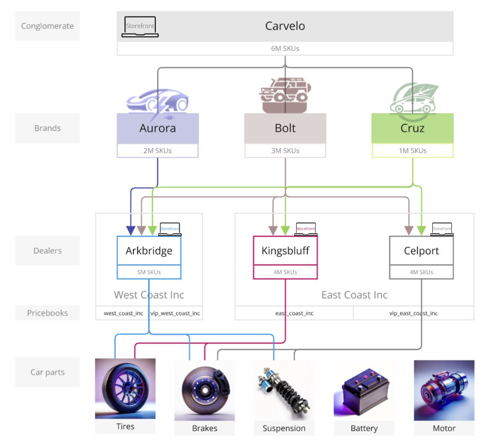
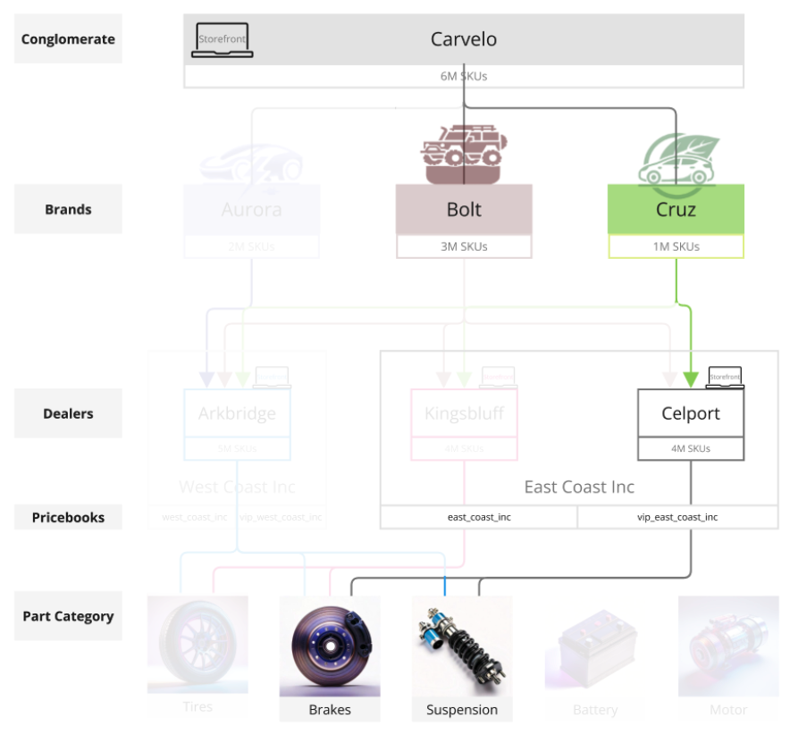
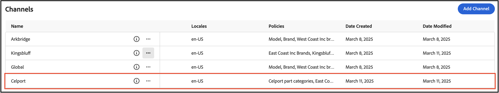
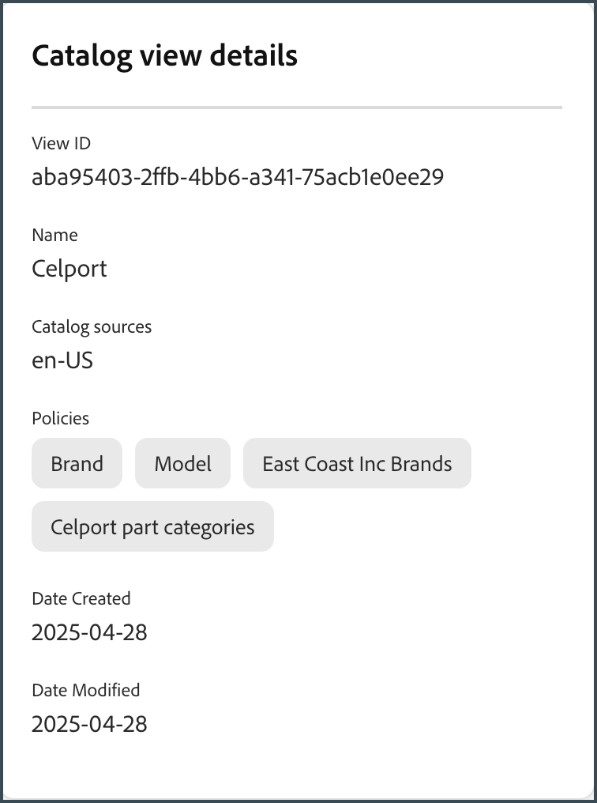
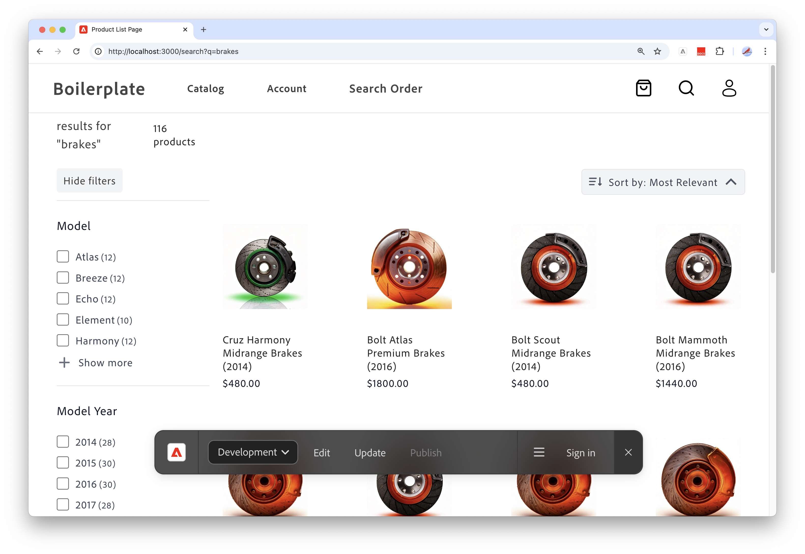
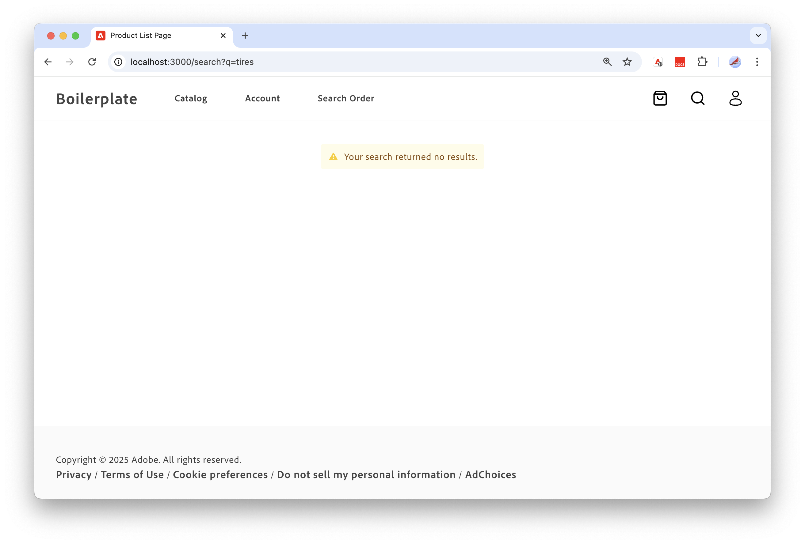

# Carvelo使用案例

>[!NOTE]
>
>本檔案說明提早存取開發中的產品，並未反映所有可供一般使用的功能。

下列使用案例示範如何使用[!DNL Adobe Commerce Optimizer]來組織您的目錄，以使用單一基底目錄來比對零售作業。 此外也示範了如何設定Edge Delivery Services支援的店面。

## 先決條件

在瀏覽此使用案例之前，請確定您已[設定您的店面](../storefront.md)。

## 讓我們開始吧

在此使用案例中，您將使用下列專案：

1. [!DNL Adobe Commerce Optimizer] UI — 設定必要的管道和原則，以管理複雜的目錄作業設定。

1. Commerce店面 — 使用[!DNL Adobe Commerce Optimizer] UI中設定的目錄資料以及Commerce店面組態檔`fstab.yaml`和`config.json`呈現店面。

### 關‌鍵要點

本文結束時，您將瞭解：

- 瞭解[!DNL Adobe Commerce Optimizer]的基礎知識，其獨特的效能和可擴充的目錄資料模型。
- 瞭解目錄資料模型如何與Adobe建立的平台無關店面元件緊密結合。
- 瞭解如何使用Adobe Commerce Optimizer管道和原則來建立自訂目錄檢視和資料存取篩選器，並將資料傳送到Edge Delivery支援的Adobe Commerce店面。

## 商業案例 — Carvelo Automobile

Carvelo Automobile是一個虛擬的汽車企業集團，擁有複雜的營運設定。



在此圖表中，您會看到Carvelo銷售三個品牌的汽車產品。 每個品牌都是不同的子公司：

- Aurora （電動汽車）
- Bolt (SUV)
- Cruz （混合）

該公司透過三家經銷商銷售這些品牌：

- Arkbridge
- Kingsbluff
- Celport

這些經銷商屬於兩家不同的母公司經銷公司：

- 西海岸公司(Arkbridge)
- 東海岸公司(Kingsbluff， Celport)

每間公司都有兩個價格簿，用於以特定價格向不同購物者(基礎客戶、VIP)銷售產品。

- `west_coast_inc`和`vip_west_coast_inc`
- `east_coast_inc`和`vip_east_coast_inc`

如您所見，這是一個非常複雜的業務使用案例。 透過[!DNL Adobe Commerce Optimizer]，商家可以使用單一基本目錄支援複雜的業務結構，以聯合處理資料而不需要目錄重複、調整價格簿（30k以上價格簿），並將所有這些資料傳送到Edge Delivery Services店面。

現在您已大致瞭解業務使用案例，以下是您在本教學課程中的目標：

>[!BEGINSHADEBOX]

Carvelo想要透過不同的經銷商（Akbridge、Kingsbluff和Celport），在三個品牌（Aurora、Bolt和Cruz）之間銷售零件。 Carvelo希望確保經銷商在各自的授權合約中，只能取得正確的零件與價格。

最後，Carvelo有兩個主要目標：

1. 維護「全球」網站，該網站具有涵蓋所有三個品牌的所有SKU。
1. 為經銷商提供路徑，根據各經銷商的獨特SKU可見度和每份SKU價格，設定自己的店面。 同時使用單一基本型錄，可消除型錄重複。

>[!ENDSHADEBOX]

現在，存取您的[!DNL Adobe Commerce Optimizer]執行個體。

## 1.存取[!DNL Adobe Commerce Optimizer]例項

在您加入Early Access計畫後，Adobe會傳送一封電子郵件，提供存取為您布建的l[!DNL Adobe Commerce Optimizer]執行個體的URL。 此執行個體已預先設定您成功完成本教學課程中概述之步驟所需的一切，包括支援Carvelo Automobile使用案例的目錄資料。

當您啟動[!DNL Adobe Commerce Optimizer]時，您會看到下列內容：

![[!DNL Adobe Commerce Optimizer] UI](../assets/user-interface.png)

>[!NOTE]
>
>請參閱[概觀](../overview.md)文章以進一步瞭解構成[!DNL Adobe Commerce Optimizer] UI的不同部分。

在左側導覽列中，展開&#x200B;**[!UICONTROL Catalog]**&#x200B;區段並按一下&#x200B;**[!UICONTROL Channels]**。 請注意，Arkbridge和Kingsbluff經銷商已建立管道：


>[!NOTE]
>
>您可以暫時忽略&#x200B;**全域**&#x200B;頻道。

按一下資訊圖示可檢閱管道詳細資料。

Arkbridge有以下原則：

- 品牌
- 模型
- 西海岸公司品牌
- Arkbridge零件類別

Kingsbluff有以下原則：

- 品牌
- 模型
- East Coast公司品牌
- Kingsbluff零件類別

在下一節中，您將建立Celport經銷的管道和原則。

## 2.建立原則和管道

Carvelo的商務經理需要為隸屬於&#x200B;*East Coast Inc*&#x200B;公司的經銷商設定新店面，該經銷商名為&#x200B;*Celport*。 Celport將為Bolt和Cruz品牌銷售剎車和懸架產品。



使用[!DNL Adobe Commerce Optimizer]時，Commerce管理員將：

1. 為Celport建立名為&#x200B;*Celport零件類別*&#x200B;的新原則，以只銷售剎車與懸架零件。
1. 為Celport店面建立新的管道。

   此管道使用您新建立的原則&#x200B;*Celport零件類別*&#x200B;和現有的&#x200B;*East Coast Inc品牌*，以確保Celport在與East Coast Inc的合約中只能銷售Bolt和Cruz品牌。Celport管道將使用`east_coast_inc`價格簿支援符合品牌授權合約的產品定價排程。
1. 更新Commerce Storefront設定，以使用您所建立之Celport頻道的資料。

在本節結束時，Celport將啟動並準備銷售Carvelo的產品。

### 建立原則

讓我們建立名為&#x200B;*Celport零件類別*&#x200B;的新原則，以篩選Celport經銷商銷售的SKU，包括剎車和暫停零件。

1. 在左側導覽列中，展開&#x200B;**[!UICONTROL Catalog]**&#x200B;區段並按一下&#x200B;**[!UICONTROL Policies]**。

1. 按一下&#x200B;**[!UICONTROL Add Policy]**。

   將顯示新頁面以新增原則詳細資訊。

1. 新增必要的詳細資料：

   **名稱** = *Celport元件類別*

1. 按一下&#x200B;**[!UICONTROL Add Filter]**。

   顯示對話方塊以新增篩選器詳細資訊。

1. 新增篩選器詳細資料：

   - **屬性** = *part_category*
   - **運運算元** = **IN**
   - **值Source** = **靜態**
   - **值** = *剎車*，*暫停*

   >[!IMPORTANT]
   >
   >請確定您指定的屬性名稱完全符合目錄中的SKU屬性名稱。

   若要深入瞭解STATIC和TRIGGER值來源之間的差異，請參閱[值來源型別](../catalog/policies.md#value-source-types)。

1. 在&#x200B;**[!UICONTROL Filter details]**&#x200B;對話方塊中，按一下&#x200B;**[!UICONTROL Save]**。

1. 若要啟用您剛建立的篩選器，請按一下動作點(...)，然後選取&#x200B;**啟用**。

1. 按一下&#x200B;**[!UICONTROL Save]**。

   >[!NOTE]
   >
   >如果&#x200B;**[!UICONTROL Save]**&#x200B;按鈕未啟用（藍色），您可能會遺失原則名稱。 按一下&#x200B;*新原則*&#x200B;旁的鉛筆圖示以將其新增。

1. 按一下上一頁箭頭，返回原則清單。

   您的新&#x200B;*Celport元件類別*&#x200B;原則會出現在清單中。

### 建立管道

為&#x200B;*Celport*&#x200B;經銷商建立新的管道，並連結下列原則： *East Coast Inc品牌*&#x200B;和&#x200B;*Celport零件類別*。

1. 在左側導覽列中，展開&#x200B;**[!UICONTROL Catalog]**&#x200B;區段並按一下&#x200B;**[!UICONTROL Channels]**。

   

   請注意現有的管道： *Arkbridge*、*Kingsbluff*&#x200B;和&#x200B;*全域*。

   

1. 按一下&#x200B;**[!UICONTROL Add Channel]**。

1. 填寫管道詳細資料：

   - **名稱** = *Celport*
   - **領域** = *en-US* （按下Enter）
   - **原則** （使用下拉式清單） = *East Coast Inc品牌*；*Celport零件類別*；*品牌*；*模型*                          

1. 按一下&#x200B;**[!UICONTROL Add]**&#x200B;以建立頻道。

   「頻道」頁面會更新以顯示新頻道。

   

   >[!NOTE]
   >
   >如果&#x200B;**[!UICONTROL Add]**&#x200B;按鈕不是藍色的，請將游標置於&#x200B;**[!UICONTROL Scopes]**&#x200B;區段並按&#x200B;**Enter**，確定已選取範圍。

1. 取得Celport頻道ID。

   按一下&#x200B;**管道**&#x200B;頁面上之Celport管道的資訊圖示。

   

   複製並儲存管道ID。 當您更新店面設定以將資料傳送到新Celport目錄時，需要此ID。

建立Celport通道和相關原則之後，下一步就是設定店面以建立新的Celport目錄。

## 3.更新您的店面

本教學課程的最後一個部分涉及更新[您已建立](#prerequisite)的店面，以將資料傳送至新的Celport目錄。 在本節中，您會以Celport的管道ID取代店面設定檔案中的管道ID。

1. 在本機開發環境中，開啟您複製GitHub存放庫及店面樣板設定檔案的資料夾。

1. 在資料夾的根目錄中，開啟`config.json`檔案。

   +++config.json程式碼

   ```json
   {
    "public": {
      "default": {
      "commerce-core-endpoint": "https://www.aemshop.net/graphql",
      "commerce-endpoint": "https://na1-sandbox.api.commerce.adobe.com/Fwus6kdpvYCmeEdcCX7PZg/graphql",
      "headers": {
         "cs": {
            "ac-channel-id": "9ced53d7-35a6-40c5-830e-8288c00985ad",
            "ac-environment-id": "Fwus6kdpvYCmeEdcCX7PZg",
            "ac-price-book-id": "west_coast_inc",
            "ac-scope-locale": "en-US"
           }
         },
         "analytics": {
            "base-currency-code": "USD",
            "environment": "Production",
            "store-id": 1,
            "store-name": "ACO Demo",
            "store-url": "https://www.aemshop.net",
            "store-view-id": 1,
            "store-view-name": "Default Store View",
            "website-id": 1,
            "website-name": "Main Website"
          }
       }
      }
   }
   ```

   請注意，頻道標頭包含下列各行：

   - `ac-channel-id`：`"9ced53d7-35a6-40c5-830e-8288c00985ad"`
   - `ac-environment-id`： `"Fwus6kdpvYCmeEdcCX7PZg"`
   - `ac-price-book-id`： `"west_coast_inc"`

   +++

1. 將`ac-channel-id`值取代為您先前複製的Celport管道ID。
1. 將`ac-environment-id`值取代為您[!DNL Adobe Commerce Optimizer]執行個體的租使用者識別碼。 您可以在搶先體驗計畫的入門電子郵件中找到ID，或連絡您的Adobe客戶代表以取得。

   >[!IMPORTANT]
   >
   >確定`commerce-endpoint`值與您[!DNL Adobe Commerce Optimizer]執行個體的GraphQL端點相符。 此資訊會顯示在您的歡迎電子郵件中。

1. 將`ac-price-book-id`值取代為`"east_coast_inc"`。
1. 儲存檔案。

當您儲存變更時，您會更新目錄組態以使用已設定為僅銷售剎車和懸架零件的Carvelo通道。

1. 啟動店面以檢視您的店面設定所建立的Celport特定目錄體驗。

   1. 從IDE的終端機視窗中，開始您本機店面預覽。

      ```shell
      npm start
      ```

   瀏覽器會在`http://localhost:3000`開啟本機開發預覽。

   如果命令失敗或瀏覽器未開啟，請檢閱Storefront設定主題中本機開發的[指示](../storefront.md)。

   1. 在瀏覽器中搜尋`brakes`，然後按&#x200B;**Enter**。

      店面會更新，以顯示顯示剎車零件的產品清單頁面。

   

   按一下剎車零件影像，即可檢視含有價格資訊的產品詳細資訊，並記下產品價格資訊。

1. 現在搜尋`tires`，這是您[!DNL Adobe Commerce Optimizer]執行個體上使用案例資料中可用的另一個零件類別。

   

   請注意，不會傳回任何結果。 這是因為Celport通道已設定為只銷售剎車和懸架零件。

1. 嘗試更新您的店面組態檔(`config.json`)。

   1. 變更`ac-channel-id`和`ac-price-book`值。

      例如，您可以將管道ID變更為Kingsbluff管道，將價格簿ID變更為`east_coast_inc`。 您可以檢閱&#x200B;*Kingsbluff零件類別*&#x200B;原則來檢視Kingsbluff可用的零件類別。

   1. 儲存檔案。

      儲存檔案時，本機店面預覽會自動更新。

   1. 使用「搜尋」功能在瀏覽器中預覽變更，以尋找輪胎零件。

      請注意可用的不同零件型別，並注意指定給Kingsbluff頻道的價格。

      透過變更店面設定檔案中的標題值並探索更新的店面，您可以看到更新目錄檢視和資料篩選器以自訂店面體驗是多麼容易。

## 完成了！

在本教學課程中，您已瞭解[!DNL Adobe Commerce Optimizer]如何使用單一基底目錄來協助您組織目錄，以符合您的零售業務。 您也學習了如何設定由Edge Delivery Services提供支援的店面。

## 從這裡前往何處

若要瞭解如何使用產品探索與建議來個人化客戶的購物體驗，請參閱[銷售概觀](../merchandising/overview.md)。
