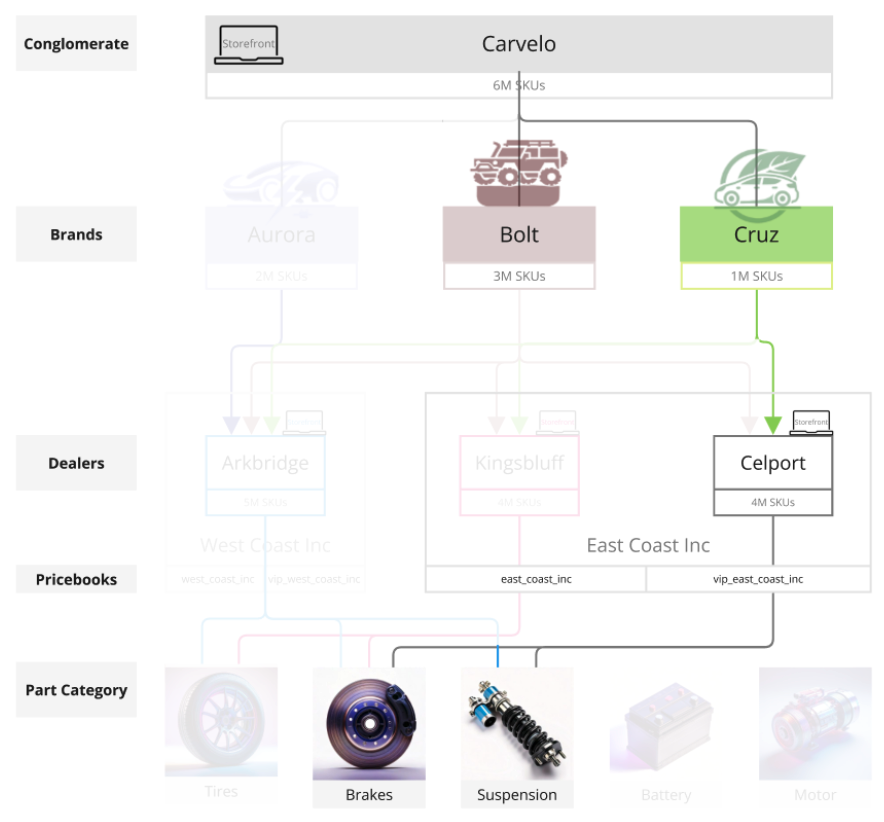
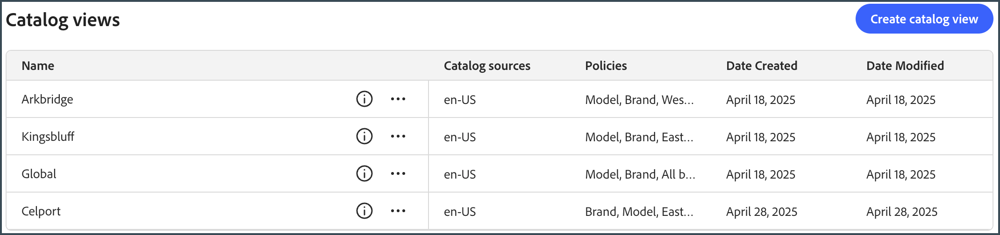
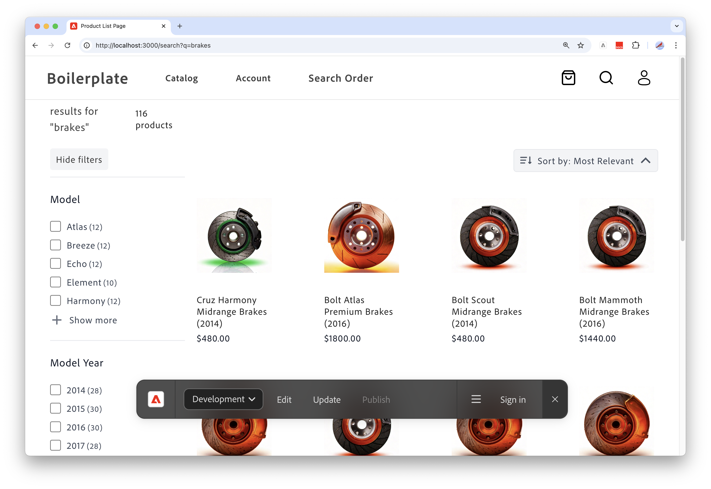

# 店面和目錄管理員端對端使用案例

此使用案例是根據名為Carvelo Automobile的虛構汽車企業集團，其運作設定複雜。 它示範如何使用[!DNL Adobe Commerce Optimizer]來管理支援多個品牌、經銷商和價格手冊的目錄，同時提供自訂的店面體驗。

## 先決條件

此使用案例是專為想要瞭解如何使用[!DNL Adobe Commerce Optimizer]設定店面及管理目錄的管理員與開發人員所設計。 它假設您對[!DNL Adobe Commerce Optimizer]及其功能有基本的瞭解。

**預計完成時間：** 45-60分鐘

### 必要設定

開始進行本教學課程之前，請確定您已具備下列必要條件：

- **[!DNL Adobe Commerce Optimizer]執行個體**
   - 存取Cloud Manager中的測試執行個體
   - 如需安裝指示，請參閱[開始使用](../get-started.md)

- **使用者許可權**
   - 管理員存取Adobe Admin Console
   - 如需帳戶設定，請參閱[使用者管理](../user-management.md)
   - 如果您沒有存取權，請聯絡您的Adobe客戶代表。

- **範例資料**
   - Carvelo汽車目錄資料已載入您的執行個體
   - 遵循[範例目錄資料擷取存放庫](https://github.com/adobe-commerce/aco-sample-catalog-data-ingestion)中的指示
   - 您可以使用包含的`reset.js`指令碼在完成之後刪除範例資料

- **店面環境**
   - 使用Node.js的本機開發環境
   - 複製並設定店面樣板專案
   - 如需詳細指示，請參閱[店面設定](../storefront.md)

## 讓我們開始吧

在此使用案例中，您正在使用下列專案：

1. [!DNL Adobe Commerce Optimizer] UI — 設定目錄檢視和原則，以管理Carvelo使用案例的複雜目錄作業設定。

1. Commerce店面 — 使用載入到您[!DNL Adobe Commerce Optimizer]執行個體和Commerce店面組態檔`fstab.yaml`和`config.json`的範例目錄資料來轉譯店面。

>[!NOTE]
>
> 檢閱Adobe Commerce店面檔案中的[探索樣板](https://experienceleague.adobe.com/developer/commerce/storefront/get-started/boilerplate-project/)主題，瞭解店面設定檔案。

### 關‌鍵要點

本文結束時，您將瞭解：

- 瞭解[!DNL Adobe Commerce Optimizer]的基礎及其效能和可擴充的目錄資料模型。
- 瞭解目錄資料模型如何與Adobe建立的平台無關店面元件整合。
- 瞭解如何使用[!DNL Adobe Commerce Optimizer]目錄檢視和原則來建立自訂目錄檢視和資料存取篩選器，並將資料傳送至由Edge Delivery支援的Adobe Commerce店面。

## 商業案例 — Carvelo Automobile

Carvelo Automobile是一個虛擬的汽車企業集團，擁有複雜的營運設定。


在此圖表中，您會看到Carvelo銷售三個品牌的汽車產品。 每個品牌都是不同的子公司：

- Aurora （電動汽車）
- Bolt (SUV)
- Cruz （混合）

該公司透過三家經銷商銷售這些品牌：

- Arkbridge
- Kingsbluff
- Celport

這些經銷商屬於兩家不同的母公司經銷公司：

- 西海岸公司(Arkbridge)
- 東海岸公司(Kingsbluff， Celport)

每間公司都有兩個價格簿，用於以特定價格向不同購物者（基礎客戶、VIP）銷售產品。

- `west_coast_inc`和`vip_west_coast_inc`
- `east_coast_inc`和`vip_east_coast_inc`

如您所見，這是一個非常複雜的業務使用案例。 透過[!DNL Adobe Commerce Optimizer]，商家可以使用單一基本目錄支援複雜的業務結構，以聯合處理資料而不需要目錄重複、調整價格簿（30k以上價格簿），並將所有這些資料傳送到Edge Delivery Services店面。

現在您已大致瞭解業務使用案例，以下是您在本教學課程中的目標：

>[!BEGINSHADEBOX]

Carvelo想要透過不同的經銷商（Arkbridge、Kingsbluff和Celport），在三個品牌（Aurora、Bolt和Cruz）之間銷售零件。 Carvelo希望確保經銷商在各自的授權合約中，只能取得正確的零件與價格。

最後，Carvelo有兩個主要目標：

1. 維護「全球」網站，該網站具有涵蓋所有三個品牌的所有SKU。
1. 為經銷商提供路徑，根據各經銷商的獨特SKU可見度和每份SKU價格，設定自己的店面。 同時使用單一基本型錄，可消除型錄重複。

>[!ENDSHADEBOX]

## &#x200B;1. 存取[!DNL Adobe Commerce Optimizer]例項

導覽至已預先設定範例資料的Commerce Optimizer應用程式URL。 您可以從Commerce Cloud專案的執行個體詳細資料中，在Commerce Optimizer管理員中找到URL，或從系統管理員取得。 （請參閱[存取執行個體](../get-started.md#access-the-adobe-commerce-optimizer-application)。）

當您啟動[!DNL Adobe Commerce Optimizer]時，您會看到下列內容：

![[!DNL Adobe Commerce Optimizer] UI](../assets/user-interface.png)

>[!NOTE]
>
>請參閱[總覽](../overview.md)文章以瞭解[!DNL Adobe Commerce Optimizer] UI的關鍵元件。

在左側導覽列中，展開&#x200B;_存放區設定_&#x200B;區段，然後按一下&#x200B;**[!UICONTROL Catalog views]**。 請注意，Arkbridge和Kingsbluff經銷商已建立目錄檢視：


>[!NOTE]
>
>您可以暫時忽略&#x200B;**所有檢視**&#x200B;目錄檢視。

按一下資訊圖示可檢閱目錄檢視詳細資料。

Arkbridge有以下原則：

- 品牌
- 模型
- 西海岸公司品牌
- Arkbridge零件類別

Kingsbluff有以下原則：

- 品牌
- 模型
- East Coast公司品牌
- Kingsbluff零件類別

在下一節中，您將建立Celport經銷的目錄檢視與原則。

## &#x200B;2. 建立原則和目錄檢視

Carvelo的商務經理需要為隸屬於&#x200B;*East Coast Inc*&#x200B;公司的經銷商設定新店面，該經銷商名為&#x200B;*Celport*。 Celport將為Bolt和Cruz品牌銷售剎車和懸架產品。



使用[!DNL Adobe Commerce Optimizer]時，Commerce管理員將：

1. 為Celport建立名為&#x200B;*Celport零件類別*&#x200B;的新原則，以只銷售剎車與懸架零件。
1. 為Celport店面建立新的目錄檢視。

   此目錄檢視使用您新建立的原則&#x200B;*Celport零件類別*&#x200B;和現有的&#x200B;*East Coast Inc品牌*，以確保Celport在與East Coast Inc的合約中只能銷售Bolt和Cruz品牌。Celport目錄檢視使用`east_coast_inc`價格手冊來支援符合品牌授權合約的產品定價排程。
1. 更新Commerce Storefront設定，以使用您建立的Celport目錄檢視中的資料。

在本節結束時，Celport將啟動並準備銷售Carvelo的產品。

### 建立原則

讓我們建立名為&#x200B;*Celport零件類別*&#x200B;的新原則，以篩選Celport經銷商銷售的SKU，包括剎車和暫停零件。

1. 在左側邊欄中，展開&#x200B;_存放區設定_&#x200B;區段，然後按一下&#x200B;**[!UICONTROL Policies]**。

1. 按一下&#x200B;**[!UICONTROL Create Policy]**。

   將顯示新頁面以新增原則詳細資訊。

1. 新增必要的詳細資料：

   **名稱** = *Celport元件類別*

1. 按一下&#x200B;**[!UICONTROL Add Filter]**。

   顯示對話方塊以新增篩選器詳細資訊。

1. 新增篩選器詳細資料：

   - **屬性** = *part_category*
   - **運運算元** = **IN**
   - **值Source** = **靜態**
   - **值** = *剎車*
   - **值** = *暫停*

   >[!IMPORTANT]
   >
   >每個屬性值必須單獨輸入。 輸入值後，按&#x200B;**Enter**&#x200B;以將其新增至篩選設定。 然後，輸入下一個值。 所有值都必須完全符合目錄中的SKU屬性名稱。

   若要深入瞭解STATIC和TRIGGER值來源之間的差異，請參閱[值來源型別](../setup/policies.md#value-source-types)。

1. 在&#x200B;**[!UICONTROL Filter details]**&#x200B;對話方塊中，按一下&#x200B;**[!UICONTROL Save]**。

1. 若要啟用您剛建立的篩選器，請按一下動作點(...) 並選取&#x200B;**啟用**。

1. 按一下&#x200B;**[!UICONTROL Save]**。

   >[!NOTE]
   >
   >如果&#x200B;**[!UICONTROL Save]**&#x200B;按鈕未啟用（藍色），您可能會遺失原則名稱。 按一下&#x200B;*新原則*&#x200B;旁的鉛筆圖示以將其新增。

1. 按一下上一頁箭頭，返回原則清單。

   您的新&#x200B;*Celport元件類別*&#x200B;原則會出現在清單中。

**驗證此步驟是否已正確完成：**

- 原則會出現在原則清單中
- 原則狀態顯示為已啟用（綠色指示器）
- 篩選器詳細資訊顯示「part_category IN （剎車、暫停）」
- 原則名稱為「Celport零件類別」

### 建立目錄檢視

建立&#x200B;*Celport*&#x200B;經銷商的新目錄檢視，並連結下列原則： *East Coast Inc品牌*&#x200B;和&#x200B;*Celport零件類別*。

1. 在左側邊欄中，展開&#x200B;_存放區設定_&#x200B;區段，然後按一下&#x200B;**[!UICONTROL Catalog views]**。

   注意現有的目錄檢視： *Arkbridge*、*Kingsbluff*&#x200B;和&#x200B;*所有檢視*。

   

1. 按一下&#x200B;**[!UICONTROL Add catalog view]**。

1. 填寫目錄檢視詳細資料：

   - **名稱** = *Celport*
   - **目錄來源** = *en-US*
   - **原則** （使用下拉式清單） = *East Coast Inc品牌*；*Celport零件類別*；*品牌*；*模型*
                         
1. 按一下&#x200B;**[!UICONTROL Add]**&#x200B;以建立目錄檢視。

   目錄檢視頁面會更新以顯示新的目錄檢視。

   

1. 取得Celport目錄檢視識別碼。

   按一下&#x200B;**目錄檢視**&#x200B;頁面上Celport目錄檢視的資訊圖示。

   

   複製並儲存目錄檢視識別碼。 當您更新店面設定以將資料傳送到新Celport目錄時，需要此ID。

   **驗證此步驟是否已正確完成：**
   - Catalog view name is &quot;Celport&quot;
   - Catalog view shows 4 associated policies
   - Catalog view ID is displayed and can be copied
   - Catalog source shows &quot;en-US&quot;

After you create the Celport catalog view and associated policies, the next step is to configure the storefront to use your new Celport catalog.

## 3. Update your storefront

The final piece of this tutorial involves updating the storefront that [you already created](#prerequisites) to deliver data to the new Celport catalog. In this section, you replace the catalog view ID in your storefront configuration file with the catalog view ID for Celport.

1. In your local development environment, open the folder where you cloned the GitHub repository with your storefront boilerplate configuration files.

1. In the root directory of the folder, open the `config.json` file.

   +++config.json code

   ```json
   {
    "public": {
      "default": {
      "commerce-core-endpoint": "https://www.aemshop.net/graphql",
      "commerce-endpoint": "https://na1-sandbox.api.commerce.adobe.com/Fwus6kdpvYCmeEdcCX7PZg/graphql",
      "headers": {
         "cs": {
            "ac-view-id": "9ced53d7-35a6-40c5-830e-8288c00985ad",
            "ac-price-book-id": "west_coast_inc",
            "ac-source-locale": "en-US"
           }
         },
         "analytics": {
            "base-currency-code": "USD",
            "environment": "Production",
            "store-id": 1,
            "store-name": "ACO Demo",
            "store-url": "https://www.aemshop.net",
            "store-view-id": 1,
            "store-view-name": "Default Store View",
            "website-id": 1,
            "website-name": "Main Website"
          }
       }
      }
   }
   ```

   +++

   Notice that the catalog view header includes the following values:

   - `commerce-endpoint`: `"https://na1-sandbox.api.commerce.adobe.com/Fwus6kdpvYCmeEdcCX7PZg/graphql"`
   - `ac-view-id`:`"9ced53d7-35a6-40c5-830e-8288c00985ad"`
   - `ac-price-book-id`: `"west_coast_inc"`
   - `ac-source-locale`: `"en-US"`

1. In the `commerce-endpoint` value, replace the tenant ID in the URL with the URL for your [!DNL Adobe Commerce Optimizer] instance.

   You can find the tenant ID in the URL for the Commerce Optimizer UI. For example, in the following URL, the tenant ID is `XDevkG9W6UbwgQmPn995r3`.

   ```text
   https://experience.adobe.com/#/@commerceprojectbeacon/in:XDevkG9W6UbwgQmPn995r3/commerce-optimizer-studio/catalog
   ```

1. Replace the `ac-view-id` value with Celport catalog view ID that you copied previously.

1. Replace the `ac-price-book-id` value with `"east_coast_inc"`.

   After you make these changes, your `config.json` file should look similar to the following, with the `ACO-tenant-id` and `celport-catalog-view-id` placeholders replaced with your values:

   ```json
   {
     "public": {
        "default": {
        "commerce-core-endpoint": "https://www.aemshop.net/graphql",
        "commerce-endpoint": "https://na1-sandbox.api.commerce.adobe.com/{{ACO-tenant-id}}/graphql",
        "headers": {
            "cs": {
                "ac-view-id": "{{celport-catalog-view-id}}",
                "ac-price-book-id": "east_coast_inc",
                "ac-source-locale": "en-US"
              }
            },
            "analytics": {
                "base-currency-code": "USD",
                "environment": "Production",
                "store-id": 1,
                "store-name": "ACO Demo",
                "store-url": "https://www.aemshop.net",
                "store-view-id": 1,
                "store-view-name": "Default Store View",
                "website-id": 1,
                "website-name": "Main Website"
             }
         }
     }
   }
   ```

1. Save the file.

   When you save the changes, you update the catalog configuration to use the Carvelo catalog view which has been configured to sell only brake and suspension parts.

## 4. Preview the storefront

Now that you have updated the storefront configuration to use the Celport catalog view, you can preview the storefront to see how it renders the catalog data.

1. Launch the storefront to view the Celport-specific catalog experience created by your storefront configuration.

   1. From the terminal window in your IDE, start your local storefront preview.

      ```shell
      npm start
      ```

      The browser opens to the local development preview at `http://localhost:3000`.

      If the command fails or the browser does not open, review the [instructions for local development](../storefront.md) in the Storefront setup topic.

1. In the browser, search for `brakes`, and press **Enter**.

   The storefront updates to display the product list page showing the brake parts.

   

   Click on a brake part image to view the product details with price information and note the product price information.

1. Search for `tires`, which is another part category available in the use case data on your [!DNL Adobe Commerce Optimizer] instance.

   

   Notice that no results are returned. This is because the Celport catalog view has been configured to sell only brake and suspension parts.

1. Experiment with updating your storefront configuration file (`config.json`).

   1. Change the `ac-view-id` and `ac-price-book` values.

   For example, you can change the catalog view ID to the Kingsbluff catalog view, and the price book ID to  `east_coast_inc`. You can see the parts categories available for Kingsbluff by reviewing the *Kingsbluff part categories* policy.

   1. Save the file.

      When you save the file, the local storefront preview updates automatically.

   1. Preview the changes in the browser by using the Search feature to find tire parts.

      Notice the different part types available and notice the prices assigned to the Kingsbluff catalog view.

   These experiments demonstrate the flexibility of [!DNL Adobe Commerce Optimizer]—you can quickly switch between different catalog views and price books to create customized shopping experiences for different audiences without duplicating your catalog data.

## 疑難排解

If you encounter issues during this tutorial, try the following solutions:

### Policy Creation Issues

**Problem:** Save button is not active

- **Solution:** Ensure that the policy name is entered and all required fields are completed

**Problem:** Filter not working as expected

- **Solution:** Verify that the attribute name exactly matches the SKU attribute in your catalog

### 目錄檢視問題

**問題：**&#x200B;目錄檢視未出現在清單中

- **解決方案：**&#x200B;請確認所有關聯原則皆已啟用且已正確設定

### 店面設定問題

**問題：**&#x200B;店面未載入

- **解決方案：**&#x200B;檢查您的租使用者ID和目錄檢視識別碼是否已在config.json檔案中正確輸入

**問題：**&#x200B;未顯示任何產品

- **解決方案：**&#x200B;確認價格手冊識別碼符合您[!DNL Adobe Commerce Optimizer]執行個體中可用的識別碼

**問題：**&#x200B;搜尋未傳回任何結果

- **解決方案：**&#x200B;確認目錄檢視原則允許搜尋的產品類別

如需其他說明，請參閱[[!DNL Adobe Commerce Optimizer] 檔案](../overview.md)或聯絡Adobe支援。

## 摘要

在本教學課程中，您已成功：

- 建立新原則，以篩選Celport代理商的產品類別
- 設定包含多個原則的目錄檢視，以控制產品可見性
- 設定店面以使用新目錄檢視
- 已透過測試產品可見度和定價驗證設定

## 後續步驟

若要繼續瞭解[!DNL Adobe Commerce Optimizer]：

- 探索[銷售功能](../merchandising/overview.md)以個人化購物體驗
- 瞭解[進階原則設定](../setup/policies.md)
- 為其他經銷商設定[額外的目錄檢視](../setup/catalog-view.md)
- 檢閱[API檔案](https://developer.adobe.com/commerce/services/optimizer/)，瞭解程式化目錄管理
- 瞭解如何為您的Edge Delivery Services店面設定下拉式元件，以針對產品探索、建議和其他店面功能建立自訂店面體驗。 請參閱[店面檔案](https://experienceleague.adobe.com/developer/commerce/storefront/dropins/all/introduction/)
