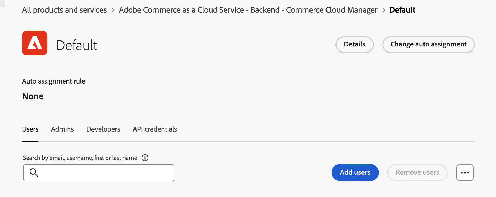

# 使用者管理

>[!NOTE]
>
>此使用者管理檔案適用於具有上線指示的早期存取參與者，以便管理和布建其Adobe組織中的[!DNL Adobe Commerce Optimizer]使用者。 如果您沒有這些指示，請聯絡您的帳戶代表，以取得使用者管理方面的協助。 在早期存取計畫期間，透過將使用者指派到&#x200B;**[!UICONTROL Adobe Commerce as a Cloud Service - backend]**&#x200B;產品解決方案，管理[!DNL Adobe Commerce Optimizer]的使用者布建。

若要啟用[!DNL Adobe Commerce Optimizer]的存取權，請從[Adobe Admin Console](https://adminconsole.adobe.com){target="_blank"}新增使用者，並確定他們有權存取Commerce產品。

您可以將使用者指派給下列任何角色：

* **使用者** — 使用者可以存取[!DNL Adobe Commerce Optimizer] UI，以檢視及管理目錄檢視與銷售規則，以及追蹤效能度量。

* [**開發人員**](https://helpx.adobe.com/enterprise/using/manage-developers.html#Adddevelopers){target="_blank"}開發人員擁有使用者許可權和存取Adobe Developer Console的許可權。 這表示他們可以建立專案並設定認證，以使用[!DNL Adobe Commerce Optimizer] API和SDK等開發人員工具，以及App Builder和API Mesh等Adobe擴充性工具。

* **管理員** — 有三種不同型別的管理員角色：
   * [系統管理員](https://helpx.adobe.com/enterprise/using/admin-roles.html){target="_blank"} — 系統管理員可以透過Adobe Admin Console存取組織中的所有產品和產品設定檔。
   * [產品管理員](#add-a-product-admin) — 產品管理員可以在[!DNL Adobe Admin Console]中[管理產品](#add-users-and-admins)的使用者、角色和許可權。
   * [產品設定檔管理員](#add-users-developers-and-product-profile-admins) — 產品設定檔管理員可以在[!DNL Adobe Admin Console]中管理產品的使用者。

## 新增產品管理員

1. 導覽至[Admin Console](https://adminconsole.adobe.com)，然後使用您的Adobe ID登入。

1. 選取您的組織。

1. 在「[!UICONTROL **產品**]」標籤的「[!UICONTROL **產品和服務**]」下，選取「[!UICONTROL **Adobe Commerce as a Cloud Service — 後端**]」產品。

   {width="600" zoomable="yes"}

1. 選取「[!UICONTROL **管理員**]」標籤。

1. 按一下&#x200B;[!UICONTROL **新增管理員**]。

1. 輸入您要新增為管理員的使用者使用者名稱或電子郵件地址，然後按一下[儲存]。[!UICONTROL **&#x200B;**]

## 新增使用者、開發人員和產品設定檔管理員

>[!BEGINSHADEBOX 「必要條件」]
* 為[!DNL Adobe Commerce Optimizer]布建的IMS組織
* 具有系統或產品管理員角色的相同IMS組織中的Adobe Experience Cloud帳戶
>[!ENDSHADEBOX]

使用下列指示將使用者和開發人員新增至[!DNL Commerce Cloud Manager]，您可在此處管理您的Commerce執行個體。

1. 導覽至https://adminconsole.adobe.com並使用您的Adobe ID登入。

1. 選取您的組織。

1. 在「[!UICONTROL **產品**]」標籤的「[!UICONTROL **產品和服務**]」下，選取「[!UICONTROL **Adobe Commerce as a Cloud Service — 後端**]」產品。

   {width="600" zoomable="yes"}

1. 按一下&#x200B;[!UICONTROL **預設 — Cloud Manager**]&#x200B;產品設定檔。

1. 選取「[!UICONTROL **使用者**]」、「[!UICONTROL **開發人員**]」或「[!UICONTROL **管理員**]」標籤，然後按一下「[!UICONTROL **新增使用者**]」、「[!UICONTROL **新增開發人員**]」或「[!UICONTROL **新增管理員**]」。

   從此畫面新增的管理員已指派給[產品設定檔管理員](#understanding-roles)群組。

   {width=600 zoomable="yes"}

1. 輸入您要新增為管理員的使用者使用者名稱或電子郵件地址，然後按一下[儲存]。[!UICONTROL **&#x200B;**]

## 大量使用者管理

您可以使用下列其中一種方法來更有效率地新增多個使用者：

* 使用Adobe Admin Console中的&#x200B;**透過CSV新增使用者**&#x200B;功能來執行[大量CSV上傳](https://helpx.adobe.com/enterprise/using/bulk-upload-users.html){target="_blank"}。
* 建立[使用者群組](https://helpx.adobe.com/enterprise/using/user-groups.html){target="_blank"}，將多位使用者新增至角色。 接著，將&#x200B;[!UICONTROL **Adobe Commerce as a Cloud Service — 後端**]&#x200B;產品新增至使用者群組。

