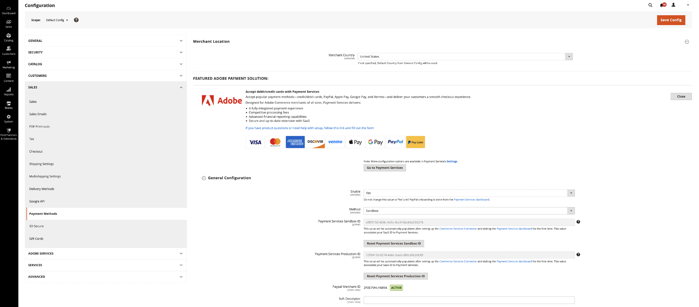

# 舊版[!DNL Payment Services]設定

您可以使用Admin中實用的組態選項自訂[!DNL Payment Services]以符合您的需求。

當您在Admin中為[!DNL Adobe Commerce]和[!DNL Magento Open Source]設定[!DNL Payment Services]時，這些設定僅適用於&#x200B;_[!UICONTROL General Configuration]_&#x200B;的_[!UICONTROL Method]_&#x200B;欄位中設定的環境。 您在設定欄位中所做的任何變更與切換&#x200B;_[!UICONTROL Method]_&#x200B;選取專案無關 — 如果您切換方法，您的選取專案不會重設。

## 一般設定

您可以為商店和&#x200B;_[!UICONTROL Merchant Location]_&#x200B;啟用[!DNL Payment Services]，並在&#x200B;_[!UICONTROL General Configuration]_&#x200B;區段中啟用沙箱測試或即時付款。

1. 在&#x200B;_管理員_&#x200B;側邊欄上，移至&#x200B;**[!UICONTROL Stores]** > _[!UICONTROL Settings]_>**[!UICONTROL Configuration]**。
1. 在左側面板中，展開&#x200B;**[!UICONTROL Sales]**&#x200B;並選擇&#x200B;**[!UICONTROL Payment Methods]**。
1. 設定&#x200B;_[!UICONTROL Merchant Location]_&#x200B;中的&#x200B;_[!UICONTROL Merchant Country]_&#x200B;欄位。 如果未指定&#x200B;_[!UICONTROL Merchant Country]_，則會使用一般設定的&#x200B;_[!UICONTROL Default Country]_。
1. 展開&#x200B;_[!UICONTROL FEATURED ADOBE PAYMENT SOLUTION]_&#x200B;區段以存取&#x200B;_[!UICONTROL [!DNL Payment Services]]_&#x200B;區段。
1. 在&#x200B;_[!UICONTROL [!DNL Payment Services]]_&#x200B;區段中，展開&#x200B;_[!UICONTROL General Configuration]_&#x200B;區段。
1. 針對&#x200B;**啟用**，將其設定為`Yes`以啟用您商店的[!DNL Payment Services]。
1. 若為&#x200B;**方法**，若您仍在測試存放區的[!DNL Payment Services]，請將其設為`Sandbox`，或若您已準備啟用即時付款，請設為`Production`。
1. 一旦您設定[Commerce服務聯結器](https://experienceleague.adobe.com/en/docs/commerce/user-guides/integration-services/saas){target=_blank}並首次造訪[!DNL Payment Services]儀表板，系統就會自動填入您的&#x200B;**[!UICONTROL Payment Services Sandbox ID]**&#x200B;和&#x200B;**[!UICONTROL Payment Services Production ID]**&#x200B;值。 執行此動作以完成您的沙箱和/或生產環境的上線。 這些值會將您的SaaS ID與[!DNL Payment Services]建立關聯。

   >[!WARNING]
   >
   > 如果您需要在Commerce Services Connector中變更資料空間ID，需要重設您的[!DNL Payment Services] ID。 按一下&#x200B;**重設付款服務ID**&#x200B;以重設您的沙箱或生產ID。 如果您重設[!DNL Payment Services] ID，則必須重新上線。

1. 第一次造訪[!DNL Payment Services]儀表板時，PayPal會自動提供您的&#x200B;**[!UICONTROL PayPal Merchant ID]**&#x200B;和&#x200B;**[!UICONTROL PayPal Merchant Status]**&#x200B;值。
1. 對於&#x200B;**軟性描述項** （自訂值，顯示在客戶交易銀行對帳單上，以描述商店/品牌/目錄之間），請在文字欄位中新增自訂文字（最多22個字元），取代`Soft descriptor`或現有值。
1. 按一下&#x200B;**[!UICONTROL Save Config]**&#x200B;以儲存變更。
1. 導覽至&#x200B;**[!UICONTROL System]** > **[!UICONTROL Cache Management]**，然後按一下&#x200B;**[!UICONTROL Flush Cache]**&#x200B;以重新整理所有無效的快取。

{width="700" zoomable="yes"}

### 設定選項

| 欄位 | 範圍 | 說明 |
|---|---|---|
| [!UICONTROL Enable] | 網站 | 啟用或停用您網站的[!DNL Payment Services]。 選項： `[!UICONTROL Yes]` / `[!UICONTROL No]` |
| [!UICONTROL Method] | 存放區檢視 | 設定商店的方法或環境。 選項： [!UICONTROL Sandbox] / [!UICONTROL Production] |
| [!UICONTROL Payment Services Sandbox ID] | 存放區檢視 | 您的沙箱商家ID，會在沙箱上線期間自動產生。 |
| [!UICONTROL Payment Services Production ID] | 存放區檢視 | 您的生產廠商ID，會在生產（即時）上線期間自動產生。 |
| [!UICONTROL PayPal Merchant ID] | 存放區檢視 | 您在建立PayPal帳戶時產生的唯一PayPal商家帳戶ID。 |
| [!UICONTROL PayPal Merchant Status] | 存放區檢視 | 您的PayPal商家ID的狀態。 |
| [!UICONTROL Soft Descriptor] | 網站或商店檢視 | 在您的網站和商店檢視中新增軟性描述項，以將資訊新增到客戶交易，其中會描述品牌、商店或產品線。 |

## [!UICONTROL Credit Card Fields]

[!UICONTROL Credit Card Fields]付款選項提供簡易且安全的信用卡或扣帳卡付款方式結帳。

如需詳細資訊，請參閱[付款選項](payments-options.md#paypal-smart-buttons)。

1. 在&#x200B;_管理員_&#x200B;側邊欄上，移至&#x200B;**[!UICONTROL Stores]** > _[!UICONTROL Settings]_>**[!UICONTROL Configuration]**。
1. 在左側面板中，展開&#x200B;**[!UICONTROL Sales]**&#x200B;並選擇&#x200B;**[!UICONTROL Payment Methods]**。
1. 展開&#x200B;_[!UICONTROL FEATURED ADOBE PAYMENT SOLUTION]_&#x200B;區段。
1. 在&#x200B;_[!UICONTROL Payment Services]_&#x200B;區段中，展開&#x200B;_[!UICONTROL Credit Card Fields]_&#x200B;區段。
1. 針對&#x200B;**[!UICONTROL Title]**，輸入文字（如有需要）以變更結帳時顯示的付款方式名稱。
1. 若要[設定付款動作](production.md#set-payment-services-as-payment-method)，請選取&#x200B;**[!UICONTROL Authorize]**&#x200B;或&#x200B;**授權並擷取**。
1. 若要優先處理結帳頁面上的付款方法，請在&#x200B;**[!UICONTROL Sort order]**&#x200B;欄位中提供`Numeric Only`值。
1. 對於&#x200B;**[!UICONTROL Show on checkout page]**，請選擇`Yes`以啟用結帳頁面上的信用卡欄位。
1. 針對&#x200B;**[!UICONTROL Vault Enabled]**，選擇`Yes`以啟用信用卡存放區以進行簽出。
1. 針對&#x200B;**[!UICONTROL Vault Enabled in Admin]**，選擇`Yes`以讓商家使用客戶的保管卡建立訂單。
1. 若要啟用&#x200B;**[!UICONTROL 3D Secure authentication]** （預設為`Off`），請選擇`Always`或`When required`。
1. 針對&#x200B;**[!UICONTROL Debug Mode]**，選擇`Yes`以啟用偵錯模式，或選擇`No`以停用偵錯模式。
1. 按一下&#x200B;**[!UICONTROL Save Config]**&#x200B;以儲存變更。
1. 導覽至&#x200B;**[!UICONTROL System]** > **[!UICONTROL Cache Management]**，然後按一下&#x200B;**[!UICONTROL Flush Cache]**&#x200B;以重新整理所有無效的快取。

### 設定選項

| 欄位 | 範圍 | 說明 |
|---|---|---|
| [!UICONTROL Title] | 存放區檢視 | 在結帳期間，新增文字以在「付款方式」檢視中顯示為此付款選項的標題。 選項： [!UICONTROL text field] |
| [!UICONTROL Payment Action] | 網站 | 指定的付款方式的[付款動作](https://experienceleague.adobe.com/docs/commerce-admin/config/sales/payment-methods/payment-methods.html)。 選項： [!UICONTROL Authorize] / [!UICONTROL Authorize and Capture] |
| [!UICONTROL Sort order] | 存放區檢視 | 結帳頁面上指定付款方式的排序順序。 `Numeric Only`值 |
| [!UICONTROL Show on checkout page] | 網站 | 啟用或停用結帳頁面上的信用卡欄位。 選項： [!UICONTROL Yes] / [!UICONTROL No] |
| [!UICONTROL Vault enabled] | 存放區檢視 | 啟用或停用[信用卡存放區](vaulting.md)。 選項： [!UICONTROL Yes] / [!UICONTROL No] |
| [!UICONTROL Vault enabled in Admin] | 存放區檢視 | 啟用或停用[商家使用保管庫付款方式完成管理員](vaulting.md)中客戶訂單的功能。 選項： [!UICONTROL Yes] / [!UICONTROL No] |
| [!UICONTROL 3D Secure authentication] | 網站 | 啟用或停用[3DS安全驗證](security.md#3ds)。 選項： [!UICONTROL Always] / [!UICONTROL When Required] / [!UICONTROL Off] |
| [!UICONTROL Debug Mode] | 網站 | 啟用或停用偵錯模式。 選項： `[!UICONTROL Yes]` / `[!UICONTROL No]` |

## [!UICONTROL Apple Pay]

[!UICONTROL Apple Pay]付款選項可讓商家為其購物者提供可透過Safari瀏覽器在裝置上使用Touch ID進行購買的Apple Pay。 商家每個商家帳戶最多可新增99個網域。

如需詳細資訊，請參閱[付款選項](payments-options.md#apple-pay-button)。

1. 在&#x200B;_管理員_&#x200B;側邊欄上，移至&#x200B;**[!UICONTROL Stores]** > _[!UICONTROL Settings]_>**[!UICONTROL Configuration]**。
1. 在左側面板中，展開&#x200B;**[!UICONTROL Sales]**&#x200B;並選擇&#x200B;**[!UICONTROL Payment Methods]**。
1. 展開&#x200B;_[!UICONTROL FEATURED ADOBE PAYMENT SOLUTION]_&#x200B;區段。
1. 在&#x200B;_[!UICONTROL Payment Services]_&#x200B;區段中，展開&#x200B;_[!UICONTROL Apple Pay]_&#x200B;區段。
1. 針對&#x200B;**[!UICONTROL Title]**，輸入文字（如有需要）以變更結帳時顯示的付款方式名稱。
1. 若要[設定付款動作](production.md#set-payment-services-as-payment-method)，請選取&#x200B;**[!UICONTROL Authorize]**&#x200B;或&#x200B;**[!UICONTROL Authorize and Capture]**。
1. 視需要選取下列選項中的`Yes`，指定在Adobe Commerce中啟用[!DNL Apple Pay]選項的位置：
   * **[!UICONTROL Show Apple Pay on checkout page]**
   * **[!UICONTROL Show Apple Pay on product detail page]**
   * **[!UICONTROL Show Apple Pay in mini cart preview]**
   * **[!UICONTROL Show Apple Pay on cart page]**
1. 若要啟用偵錯模式，請為&#x200B;**[!UICONTROL Debug Mode]**&#x200B;選取`Yes` （`No`停用它）。
1. 若要儲存變更，請按一下「**[!UICONTROL Save Config]**」。
1. 導覽至&#x200B;**[!UICONTROL System]** > **[!UICONTROL Cache Management]**，然後按一下&#x200B;**[!UICONTROL Flush Cache]**&#x200B;以重新整理所有無效的快取。

### 設定選項

| 欄位 | 範圍 | 說明 |
|---|---|---|
| [!UICONTROL Title] | 存放區檢視 | 在結帳期間，新增文字以在「付款方式」檢視中顯示為此付款選項的標題。 選項： [!UICONTROL text field] |
| [!UICONTROL Payment Action] | 網站 | 指定的付款方式的[付款動作](https://experienceleague.adobe.com/docs/commerce-admin/config/sales/payment-methods/payment-methods.html)。 選項： [!UICONTROL Authorize] / [!UICONTROL Authorize and Capture] |
| [!UICONTROL Show on checkout page] | 網站 | 啟用或停用結帳頁面上的[!DNL Apple Pay]。 選項： `[!UICONTROL Yes]` / `[!UICONTROL No]` |
| [!UICONTROL Sort order] | 存放區檢視 | 結帳頁面上指定付款方式的排序順序。 `Numeric Only`值 |
| [!UICONTROL Show buttons on product detail page] | 存放區檢視 | 啟用或停用產品詳細資料頁面上的[!DNL Apple Pay]。 選項： `[!UICONTROL Yes]` / `[!UICONTROL No]` |
| [!UICONTROL Show buttons in mini-cart preview] | 存放區檢視 | 啟用或停用迷你購物車預覽中的[!DNL Apple Pay]。 選項： `[!UICONTROL Yes]` / `[!UICONTROL No]` |
| [!UICONTROL Show buttons on cart page] | 存放區檢視 | 啟用或停用購物車頁面上的[!DNL Apple Pay]。 選項： `[!UICONTROL Yes]` / `[!UICONTROL No]` |
| [!UICONTROL Debug Mode] | 網站 | 啟用或停用偵錯模式。 選項： `[!UICONTROL Yes]` / `[!UICONTROL No]` |

## [!UICONTROL Google Pay]

[!UICONTROL Google Pay]付款選項可讓商家為購物者提供使用Google Wallet在裝置上進行購買的Google Pay。

如需詳細資訊，請參閱[付款選項](payments-options.md#google-pay-button)。

1. 在&#x200B;_管理員_&#x200B;側邊欄上，移至&#x200B;**[!UICONTROL Stores]** > _[!UICONTROL Settings]_>**[!UICONTROL Configuration]**。
1. 在左側面板中，展開&#x200B;**[!UICONTROL Sales]**&#x200B;並選擇&#x200B;**[!UICONTROL Payment Methods]**。
1. 展開&#x200B;_[!UICONTROL FEATURED ADOBE PAYMENT SOLUTION]_&#x200B;區段。
1. 在&#x200B;_[!UICONTROL Payment Services]_&#x200B;區段中，展開&#x200B;_[!UICONTROL Google Pay]_&#x200B;區段。
1. （選擇性）在&#x200B;**[!UICONTROL Title]**&#x200B;欄位中輸入新名稱，變更結帳時顯示的付款方式名稱。
1. [選取&#x200B;**[!UICONTROL Authorize]**&#x200B;或&#x200B;**[!UICONTROL Authorize and Capture]**&#x200B;以設定付款動作](production.md#set-payment-services-as-payment-method)。
1. 視需要選取下列選項中的`Yes`，指定在Adobe Commerce中啟用[!DNL Google Pay]選項的位置：
   * **[!UICONTROL Show Google Pay on checkout page]**
   * **[!UICONTROL Show Google Pay on product detail page]**
   * **[!UICONTROL Show Google Pay in mini cart preview]**
   * **[!UICONTROL Show Google Pay on cart page]**
1. 若要啟用&#x200B;**[!UICONTROL 3D Secure authentication]** （預設為`Off`），請選擇`Always`或`When required`。
1. 若要啟用偵錯模式，請為&#x200B;**[!UICONTROL Debug Mode]**&#x200B;選取`Yes` （`No`停用它）。
1. 視需要選取&#x200B;**[!UICONTROL Button Color]**、**[!UICONTROL Button Type]**&#x200B;和&#x200B;**[!UICONTROL Button Style]**，以設定&#x200B;_[!UICONTROL Google Pay]_&#x200B;按鈕的外觀。
1. 若要設定高度，請使用&#x200B;**[!UICONTROL Button Style]**&#x200B;中定義之高度的預設值。
1. 若要儲存變更，請按一下「**[!UICONTROL Save Config]**」。
1. 導覽至&#x200B;**[!UICONTROL System]** > **[!UICONTROL Cache Management]**，然後按一下&#x200B;**[!UICONTROL Flush Cache]**&#x200B;以重新整理所有無效的快取。

### 設定選項

| 欄位 | 範圍 | 說明 |
|---|---|---|
| [!UICONTROL Title] | 存放區檢視 | 指定結帳時，在「付款方式」檢視中，為此付款選項顯示的文字標籤。 選項： `[!UICONTROL text field]` |
| [!UICONTROL Payment Action] | 網站 | 指定的付款方式的[付款動作](https://experienceleague.adobe.com/docs/commerce-admin/config/sales/payment-methods/payment-methods.html)。 選項： `[!UICONTROL Authorize]` / `[!UICONTROL Authorize and Capture]` |
| [!UICONTROL Show on checkout page] | 網站 | 啟用或停用結帳頁面上的[!DNL Google Pay]。 選項： `[!UICONTROL Yes]` / `[!UICONTROL No]` |
| [!UICONTROL Sort order] | 存放區檢視 | 結帳頁面上指定付款方式的排序順序。 `Numeric Only`值 |
| [!UICONTROL Show buttons on product detail page] | 存放區檢視 | 啟用或停用產品詳細資料頁面上的[!DNL Google Pay]。 選項： `[!UICONTROL Yes]` / `[!UICONTROL No]` |
| [!UICONTROL Show buttons in mini-cart preview] | 存放區檢視 | 啟用或停用迷你購物車預覽中的[!DNL Google Pay]。 選項： `[!UICONTROL Yes]` / `[!UICONTROL No]` |
| [!UICONTROL Show buttons on cart page] | 存放區檢視 | 啟用或停用購物車頁面上的[!DNL Google Pay]。 選項： `[!UICONTROL Yes]` / `[!UICONTROL No]` |
| [!UICONTROL 3D Secure authentication] | 存放區檢視 | 啟用或停用[3D安全驗證](security.md#3ds)。 選項： [!UICONTROL Always] / [!UICONTROL When Required] / [!UICONTROL Off] |
| [!UICONTROL Debug Mode] | 網站 | 啟用或停用偵錯模式。 選項： `[!UICONTROL Yes]` / `[!UICONTROL No]` |
| [!UICONTROL Button Color] | 存放區檢視 | 定義[!DNL Google Pay]按鈕的顏色。 選項： `[!UICONTROL Default]` / `[!UICONTROL Black]` / `[!UICONTROL White]` |
| [!UICONTROL Button Type] | 存放區檢視 | 定義[!DNL Google Pay]按鈕的型別。 選項： `[!UICONTROL buy]` / `[!UICONTROL checkout]` / `[!UICONTROL order]` / `[!UICONTROL pay]` / `[!UICONTROL plain]` |

如需詳細資訊，請參閱[Google Pay API要求物件選項](https://developers.google.com/pay/api/web/reference/request-objects)檔案。

## [!DNL PayPal Payment Buttons]

[!DNL PayPal payment buttons]付款選項可為您的客戶提供簡單、快速且安全的結帳程式。

如需詳細資訊，請參閱[付款選項](payments-options.md#paypal-smart-buttons)。

設定[!DNL PayPal payment buttons]

您可以在「管理員」中啟用並設定PayPal付款按鈕付款選項：

1. 在&#x200B;_管理員_&#x200B;側邊欄上，移至&#x200B;**[!UICONTROL Stores]** > _[!UICONTROL Settings]_>**[!UICONTROL Configuration]**。
1. 在左側面板中，展開&#x200B;**[!UICONTROL Sales]**&#x200B;並選擇&#x200B;**[!UICONTROL Payment Methods]**。
1. 展開&#x200B;_[!UICONTROL FEATURED ADOBE PAYMENT SOLUTION]_&#x200B;區段。
1. 在&#x200B;_[!UICONTROL Payment Services]_&#x200B;區段中，展開&#x200B;_[!UICONTROL PayPal payment buttons]_&#x200B;區段。
1. 若要變更結帳時顯示的付款方式名稱，請編輯&#x200B;_[!UICONTROL Title]_&#x200B;欄位。
1. 若要[設定付款動作](production.md#set-payment-services-as-payment-method)，請選取&#x200B;**[!UICONTROL Authorize]**&#x200B;或&#x200B;**[!UICONTROL Authorize and Capture]**。
1. 若要優先處理結帳頁面上的付款方法，請在&#x200B;**[!UICONTROL Sort order]**&#x200B;欄位中提供`Numeric Only`值。
1. 若要啟用/停用[稍後付款訊息](payments-options.md#pay-later-button)，請為&#x200B;**[!UICONTROL Display Pay Later Message]**&#x200B;選取`Yes`/`No`。
1. 視需要選取下列選項中的`Yes`，指定在Adobe Commerce中啟用PayPal付款按鈕的位置：
   * **[!UICONTROL Show buttons on checkout page]**
   * **[!UICONTROL Show buttons on product detail page]**
   * **[!UICONTROL Show buttons in mini cart preview]**
   * **[!UICONTROL Show buttons on cart page]**
1. 若要啟用Venmo作為付款選項，請為&#x200B;**[!UICONTROL Venmo Enabled]**&#x200B;選取`Yes`。
1. 若要啟用信用卡和借記卡作為付款選項（PayPal智慧按鈕），請為&#x200B;**[!UICONTROL Credit and Debit Card Enabled]**&#x200B;選取`Yes`。
1. 若要啟用/停用[PayPal稍後付款](payments-options.md#pay-later-button)付款選項，請為&#x200B;**[!UICONTROL PayPal Pay Later Enabled]**&#x200B;選取`Yes`/`No`。
1. 若要啟用偵錯模式，請為&#x200B;**[!UICONTROL Debug Mode]**&#x200B;選取`Yes` （`No`停用它）。
1. 若要儲存變更，請按一下「**[!UICONTROL Save Config]**」。
1. 導覽至&#x200B;**[!UICONTROL System]** > **[!UICONTROL Cache Management]**，然後按一下&#x200B;**[!UICONTROL Flush Cache]**&#x200B;以重新整理所有無效的快取。

### 設定選項

| 欄位 | 範圍 | 說明 |
|---|---|---|
| [!UICONTROL Title] | 存放區檢視 | 在結帳期間，在「付款方式」檢視中，新增要顯示為此付款選項標題的文字。 選項：文字欄位 |
| [!UICONTROL Payment Action] | 網站 | 指定的付款方式的[付款動作](https://experienceleague.adobe.com/en/docs/commerce-admin/config/sales/payment-methods/payment-methods#payment-actions){target="_blank"}。 選項： [!UICONTROL Authorize] / [!UICONTROL Authorize and Capture] |
| [!UICONTROL Display Pay Later Message] | 網站 | 在購物車、產品頁面、迷你購物車和結帳流程中啟用或停用「稍後付款」訊息。 選項： `[!UICONTROL Yes]` / `[!UICONTROL No]` |
| [!UICONTROL Show buttons on checkout page] | 存放區檢視 | 啟用或停用結帳頁面上的[!DNL PayPal payment buttons]。 選項： `[!UICONTROL Yes]` / `[!UICONTROL No]` |
| [!UICONTROL Show buttons on product detail page] | 存放區檢視 | 啟用或停用產品詳細資料頁面上的[!DNL PayPal payment buttons]。 選項： `[!UICONTROL Yes]` / `[!UICONTROL No]` |
| [!UICONTROL Show buttons in mini-cart preview] | 存放區檢視 | 啟用或停用迷你購物車預覽中的[!DNL PayPal payment buttons]。 選項： `[!UICONTROL Yes]` / `[!UICONTROL No]` |
| [!UICONTROL Show buttons on cart page] | 存放區檢視 | 啟用或停用購物車頁面上的[!DNL PayPal payment buttons]。 選項： `[!UICONTROL Yes]` / `[!UICONTROL No]` |
| [!UICONTROL Venmo Enabled] | 存放區檢視 | 啟用或停用顯示付款按鈕的Venmo付款選項。 選項： `[!UICONTROL Yes]` / `[!UICONTROL No]` |
| [!UICONTROL Credit and Debit Card Enabled] | 存放區檢視 | 啟用或停用顯示付款按鈕的「信用卡」與「借記卡」選項。 選項： `[!UICONTROL Yes]` / `[!UICONTROL No]` |
| [!UICONTROL PayPal Pay Later Enabled] | 存放區檢視 | 啟用或停用顯示付款按鈕的PayPal Pay Later付款選項外觀。 選項： `[!UICONTROL Yes]` / `[!UICONTROL No]` |
| [!UICONTROL Debug Mode] | 網站 | 啟用或停用偵錯模式。 選項： `[!UICONTROL Yes]` / `[!UICONTROL No]` |

## 按鈕樣式

您也可以設定付款按鈕的&#x200B;_[!UICONTROL Button style]_&#x200B;選項：

1. 在&#x200B;_管理員_&#x200B;側邊欄上，移至&#x200B;**[!UICONTROL Stores]** > _[!UICONTROL Settings]_>**[!UICONTROL Configuration]**。
1. 在左側面板中，展開&#x200B;**[!UICONTROL Sales]**&#x200B;並選擇&#x200B;**[!UICONTROL Payment Methods]**。
1. 展開&#x200B;_[!UICONTROL FEATURED ADOBE PAYMENT SOLUTION]_&#x200B;區段。
1. 在&#x200B;_[!UICONTROL [!DNL Payment Services]]_&#x200B;區段中，展開&#x200B;_[!UICONTROL PayPal Smart Button Styling]_&#x200B;區段。
1. 若要設定配置，請為&#x200B;**[!UICONTROL Layout]**&#x200B;選取`Vertical`或`Horizontal`
1. 若要設定顏色，請在&#x200B;**[!UICONTROL Color]**&#x200B;中選取可用的顏色。
1. 若要設定圖案，請為&#x200B;**[!UICONTROL Shape]**&#x200B;選取`Rectangular`或`Pill`。
1. 若要使用預設高度，請為&#x200B;**[!UICONTROL Use Default Height]**&#x200B;選取`Yes`或`No`。
1. 若要設定自訂高度，請為&#x200B;**[!UICONTROL Height]**&#x200B;新增所需的畫素高度。
1. 若要設定標語，請為&#x200B;**[!UICONTROL Tagline]**&#x200B;選取`Yes`或`No`。
1. 若要儲存變更，請按一下「**[!UICONTROL Save Config]**」。
1. 導覽至&#x200B;**[!UICONTROL System]** > **[!UICONTROL Cache Management]**，然後按一下&#x200B;**[!UICONTROL Flush Cache]**&#x200B;以重新整理所有無效的快取。

您也可以在付款服務首頁的設定[&#128279;](settings.md#button-style)中設定付款按鈕樣式。

### 設定選項

| 欄位 | 範圍 | 說明 |
|--- |--- |--- |
| [!UICONTROL Layout] | 存放區檢視 | 定義Paypal付款按鈕的版面樣式。 選項： `[!UICONTROL Vertical]` / `[!UICONTROL Horizontal]` |
| [!UICONTROL Color] | 存放區檢視 | 定義Paypal付款按鈕的色彩。 選項： [!UICONTROL Blue] / `[!UICONTROL Gold]` / `[!UICONTROL Silver]` / `[!UICONTROL White]` / `[!UICONTROL Black]` |
| [!UICONTROL Shape] | 存放區檢視 | 定義Paypal付款按鈕的形狀。 選項： `[!UICONTROL Rectangular]` / `[!UICONTROL Pill]` |
| [!UICONTROL Use Default Height] | 存放區檢視 | 定義PayPal付款按鈕是否使用預設高度。 選項： `[!UICONTROL Yes]` / `[!UICONTROL No]` |
| [!UICONTROL Height] | 存放區檢視 | 定義PayPal付款按鈕的高度。 預設值：無 |
| [!UICONTROL Label] | 存放區檢視 | 定義出現在PayPal付款按鈕中的標籤。 選項： `[!UICONTROL PayPal]` / `[!UICONTROL Checkout]` / `[!UICONTROL Buynow]` / `[!UICONTROL Pay]` / `[!UICONTROL Installment]` |
| [!UICONTROL Tagline] | 存放區檢視 | 啟用標語。 選項： `[!UICONTROL Yes]` / `[!UICONTROL No]` |

## 排清快取

如果您變更組態，請[手動清除快取](/help/payment-services/settings.md#flush-the-cache)，讓您的存放區顯示最新的組態設定。
