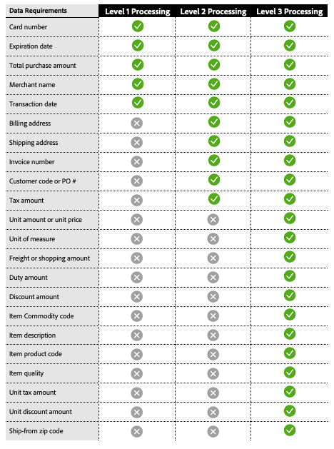
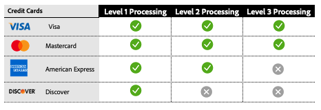

# 第2級和第3級處理

[!DNL Payment Services]提供進階卡片處理功能，協助商戶最佳化付款交易並降低交換費用。 可用的卡片處理有三個層級，每個層級都有不同的交易資料需求。

>[!CAUTION]
>
> [Fastlane](payments-options.md#fastlane-button)訂單不包含第2/第3層資料、明細專案和金額細目。

## 每個處理層級的資料需求

{width="500" zoomable="yes"}

[!DNL Payment Services]會收集這項資料，並提供付款交易的詳細報表。

## 依卡片網路區分的可用處理層級

{width="500" zoomable="yes"}

如需詳細資訊，請參閱PayPal開發人員檔案中的[付款處理](https://developer.paypal.com/docs/checkout/advanced/processing/){target=_blank}。

### 第1級

層級1是最常見的，需要較少的資訊，因此通常比使用層級2或層級3資料處理的交易產生較高的交換費用，這些資料通常與公司和購買信用卡有關。

### 第2級與第3級

如果Interchange Plus (IC++)上的[!DNL Payment Services]商戶向卡網路提供額外的交易詳細資料，並符合特定的資格條件，則可能符合第2/第3級處理的資格。 這些層級對於處理大量購買或公司卡流量的商戶特別有利，因為它們可以大幅節省成本。 提供詳細的層級2或層級3資料可以：

* 降低處理費用並最佳化整體成本
* 防止詐騙，降低處理器風險
* 增強交易安全性

檢視[什麼是IC++?PayPal開發人員檔案中的](https://www.paypal.com/us/brc/article/what-is-interchange-plus-plus){target=_blank}以取得詳細資訊。

## [!DNL Payment Services]中的第2級與第3級卡片付款交易

要符合第2級或第3級處理的資格，商家必須傳送先前的資訊，不過最終決定交易在處理時符合哪個層級的資訊是卡片網路。

如需詳細資訊，請參閱PayPal開發人員檔案中的[付款處理常見問題集](https://www.paypal.com/us/cshelp/article/ts2278?_ga=1.131773126.875104296.1712843492){target=_blank}。

[!DNL Payment Services]個商店層級的商家預設停用層級2與層級3處理。

如果您已使用IC++訂價，便可使用第2級與第3級處理。 若要啟用此功能，您可以透過[命令列介面(CLI](configure-cli.md))執行此操作。

>[!IMPORTANT]
>
>如有任何問題，請洽詢您的[!DNL Payment Services]帳戶管理員。
