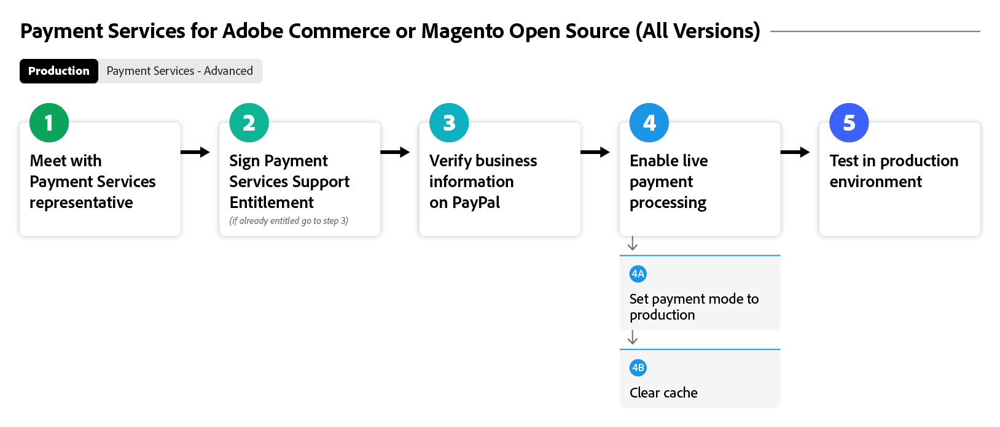
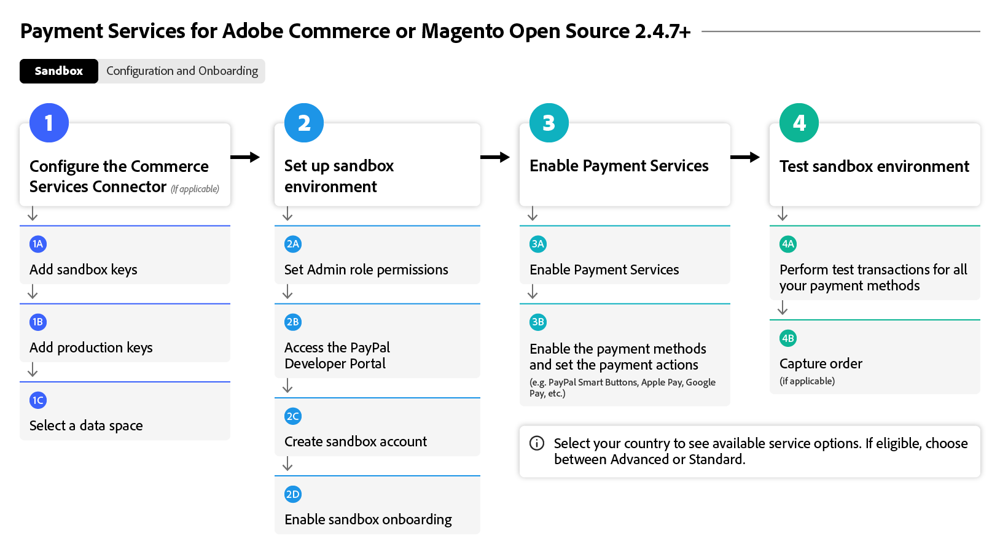
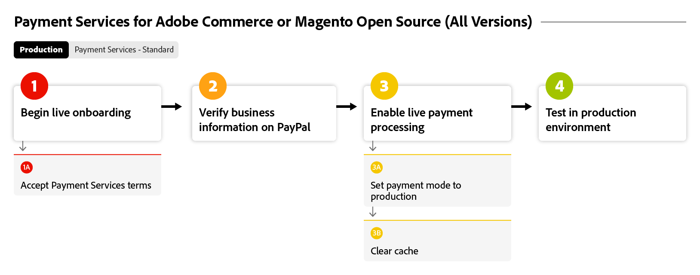
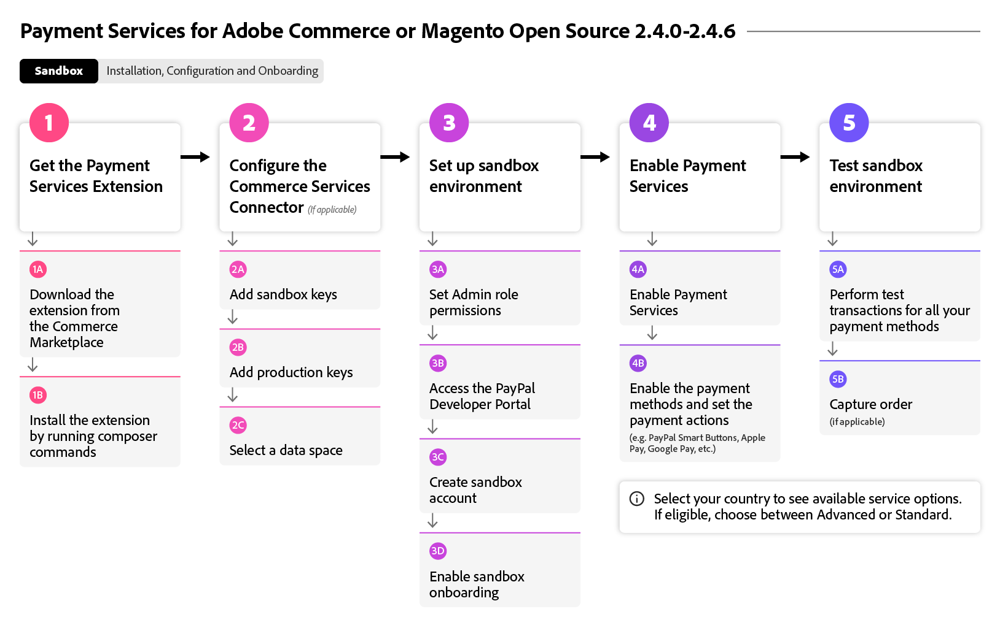

# 上線[!DNL Payment Services]流程

若要開始使用[!DNL Payment Services]，您必須完成一些入門步驟。 如需準確指引，請選取下方的Adobe Commerce選項，使其最符合您組織的例項和版本。

此流程圖顯示在所有版本中上線[!DNL Payment Services]的一般程式：

{width="700" zoomable="yes"}

請參閱下文，瞭解如何使用[!DNL Payment Services]將您特定的Adobe Commerce版本加入。

## 協助我尋找我的執行個體和版本

### Adobe Commerce或Magento Open Source | v2.4.7+

這些流程圖表顯示使用Adobe Commerce或Magento Open Source （比v2.4.7更新）上線[!DNL Payment Services]的一般程式。

>[!BEGINTABS]

>[!TAB 沙箱]

此流程圖顯示使用Adobe Commerce或Magento Open Source （高於v2.4.7）的入門沙箱程式，其中[!DNL Payment Services]現成可使用Adobe Commerce。

{width="700" zoomable="yes"}

**版本v2.4.7+第1部分：沙箱**&#x200B;的上線步驟

1. [將您的執行個體](connect.md#configure-commerce-services)連線至Commerce服務。 每個Commerce執行個體只能完成此連線一次。 僅[!BADGE 個PaaS]{type=Informative tooltip="僅適用於雲端專案上的Adobe Commerce (Adobe管理的PaaS基礎結構)。"}
1. [使用測試PayPal付款處理帳戶，設定沙箱服務](sandbox.md#enable-sandbox-testing) （或者，如果您已在其他環境中測試功能，請繼續[啟用即時付款](sandbox.md#enable-live-payments)）。
1. 在[沙箱](sandbox.md#test-in-sandbox-environment)環境中測試付款。

>[!TAB 生產]

此流程圖顯示啟用[!DNL Payment Services]所需的生產步驟。

{width="700" zoomable="yes"}

**版本v2.4.7+第2部分：生產**&#x200B;的上線步驟

1. [將 [!DNL Payment Services] 設定為您的付款方式](production.md#set-payment-services-as-payment-method) （在沙箱模式下），以開始處理測試付款。
1. [要求付款權益](production.md#request-payments-entitlement-from-adobe)以啟用即時上線。
1. [完成商家入門](production.md#complete-merchant-onboarding)以啟用您Commerce網站的即時付款。
1. [取得您的 [!DNL Payment Services] 商家識別碼](production.md#configure-pricing-tier)並交給銷售人員以設定正確的定價層級。
1. [啟用即時模式 [!DNL Payment Services] 中的](production.md#enable-live-payments)以開始處理即時付款。
1. 在[沙箱](sandbox.md#test-in-sandbox-environment)和[生產](production.md#test-in-production)環境中測試付款。

>[!ENDTABS]

### Adobe Commerce或Magento Open Source | v2.4.0-2.4.6 [!BADGE 僅限PaaS]{type=Informative tooltip="僅適用於雲端專案上的Adobe Commerce (Adobe管理的PaaS基礎結構)。"}

這些流程圖表顯示使用Adobe Commerce或Magento Open Source版本2.4.0到2.4.6上線[!DNL Payment Services]的一般程式。需要下載並安裝[!DNL Payment Services]才能開始上線。

>[!BEGINTABS]

>[!TAB 沙箱]

此流程圖顯示使用Adobe Commerce或Magento Open Source版本2.4.0到2.4.6上線[!DNL Payment Services]所需的沙箱步驟。

{width="700" zoomable="yes"}

**版本v2.4.0-2.4.6入門步驟第1部分：沙箱**

1. [如有必要，請安裝 [!DNL Payment Services] 擴充功能](install.md#get-payment-services)。
1. [取得API認證](connect.md#obtain-api-credentials)。
1. [將您的執行個體](connect.md#configure-commerce-services)連線至Commerce服務。 每個Commerce執行個體只能完成此連線一次。
1. [使用測試PayPal付款處理帳戶，設定沙箱服務](sandbox.md#enable-sandbox-testing) （或者，如果您已在其他環境中測試功能，請繼續[啟用即時付款](sandbox.md#enable-live-payments)）。
1. 在[沙箱](sandbox.md#test-in-sandbox-environment)環境中測試付款。

>[!TAB 生產]

此流程圖顯示使用Adobe Commerce或Magento Open Source版本2.4.0到2.4.6在生產環境中啟用[!DNL Payment Services]的一般程式。

{width="700" zoomable="yes"}

**版本v2.4.0-2.4.6入門步驟第2部分：生產**

1. [將 [!DNL Payment Services] 設定為您的付款方式](production.md#set-payment-services-as-payment-method) （在沙箱模式下），以開始處理測試付款。
1. [要求付款權益](production.md#request-payments-entitlement-from-adobe)以啟用即時上線。
1. [完成商家入門](production.md#complete-merchant-onboarding)以啟用您Commerce網站的即時付款。
1. [取得您的 [!DNL Payment Services] 商家識別碼](production.md#configure-pricing-tier)並交給銷售人員以設定正確的定價層級。
1. [啟用即時模式 [!DNL Payment Services] 中的](production.md#enable-live-payments)以開始處理即時付款。
1. 在[沙箱](sandbox.md#test-in-sandbox-environment)和[生產](production.md#test-in-production)環境中測試付款。

>[!ENDTABS]

>[!NOTE]
>
>如果您未在管理員（第一部分）中設定Commerce服務，便無法設定沙箱或即時付款。

>[!MORELIKETHIS]
>
> * [疑難排解 [!DNL Payment Services] 安裝](https://experienceleague.adobe.com/docs/commerce-knowledge-base/kb/troubleshooting/payments/payservices-install.html?lang=zh-Hant)
> * [未驗證PayPal沙箱帳戶](https://experienceleague.adobe.com/docs/commerce-knowledge-base/kb/troubleshooting/payments/payservices-paypal-acct.html?lang=zh-Hant)
> * [延遲 [!DNL Payment Services] 報告資料](https://experienceleague.adobe.com/docs/commerce-knowledge-base/kb/troubleshooting/payments/payservices-report-info-delayed.html?lang=zh-Hant)
> * 在沙箱環境中處理付款時，[測試信用卡無法透過PayPal](https://experienceleague.adobe.com/docs/commerce-knowledge-base/kb/troubleshooting/payments/payservices-cc-sandbox-failure.html?lang=zh-Hant)
> * [停用 [!DNL Payment Services] 擴充功能](https://experienceleague.adobe.com/zh-hant/docs/commerce-on-cloud/user-guide/configure-store/extensions#manage-extensions-1)