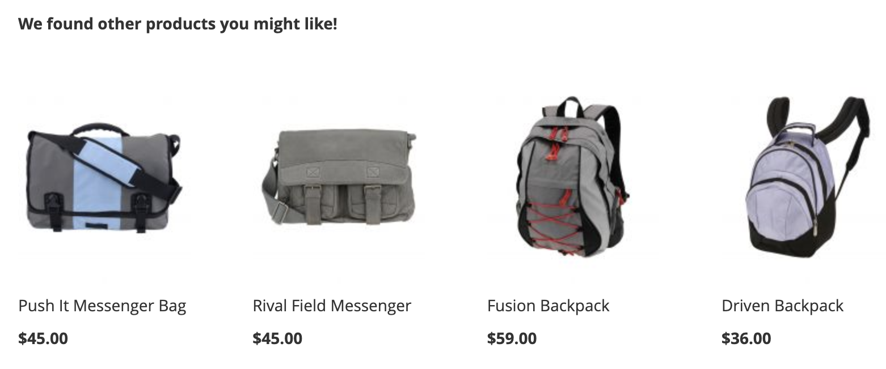
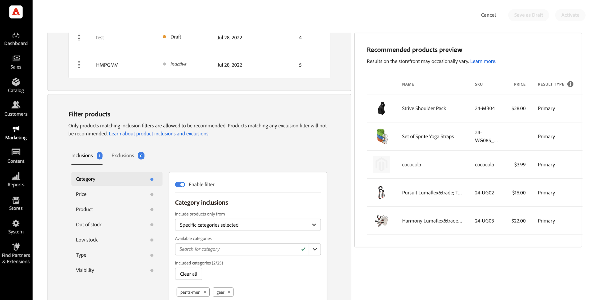

# 建立新建議

當您建立建議時，您會建立包含建議產品&#x200B;_專案_&#x200B;的&#x200B;_建議單位_&#x200B;或Widget。

_建議單位_

當您啟用建議單位時，Adobe Commerce會開始[收集資料](workspace.md)以測量曝光數、檢視數、點按數等。 [!DNL Product Recommendations]表格會顯示每個建議單位的量度，以協助您做出明智的業務決策。

>[!NOTE]
>
>已針對Luma店面最佳化產品推薦量度。 如果您的店面不是Luma型，量度追蹤資料的方式取決於您[實作事件集合](events.md)的方式。

1. 在&#x200B;_管理員_&#x200B;側邊欄上，前往&#x200B;**行銷** > _促銷活動_ > **產品建議**&#x200B;以顯示&#x200B;_產品建議_&#x200B;工作區。

1. 指定要顯示建議的[存放區檢視](https://experienceleague.adobe.com/zh-hant/docs/commerce-admin/start/setup/websites-stores-views)。

   >[!NOTE]
   >
   > 頁面產生器建議單位必須在預設商店檢視中建立，然後才可以在任何地方使用。 若要進一步瞭解如何使用頁面產生器建立產品建議，請參閱[新增內容 — 產品建議](https://experienceleague.adobe.com/zh-hant/docs/commerce-admin/page-builder/add-content/recommendations)。

1. 按一下&#x200B;**建立建議**。

1. 在&#x200B;_為您的建議命名_&#x200B;區段中，輸入描述性名稱以供內部參考，例如`Home page most popular`。

1. 在&#x200B;_選取頁面型別_&#x200B;區段中，從下列選項中選取您要顯示建議的頁面：

   >[!NOTE]
   >
   > 當您的商店設定為在將產品加入購物車後立即[顯示購物車頁面時，「購物車」頁面上不支援產品建議](https://experienceleague.adobe.com/zh-hant/docs/commerce-admin/stores-sales/point-of-purchase/cart/cart-configuration)。

   * 首頁
   * 類別
   * 產品詳細資料
   * 購物車
   * 確認
   * [頁面產生器](https://experienceleague.adobe.com/zh-hant/docs/commerce-admin/page-builder/add-content/recommendations)

   您最多可以為每種頁面型別建立50個使用中的建議單位。 當達到限制時，頁面型別會變灰。

   
   _建議名稱和頁面位置_

1. 在&#x200B;_選取建議型別_&#x200B;區段中，指定您要顯示在所選頁面上的[建議型別](type.md)。 對於某些頁面，建議的[位置](placement.md)僅限於某些型別。

1. 在&#x200B;_店面顯示標籤_&#x200B;區段中，輸入購物者可見的[標籤](placement.md#recommendation-labels)，例如「最暢銷商品」。

1. 在&#x200B;_選擇產品數目_&#x200B;區段中，使用滑桿來指定您要顯示在建議單位中的產品數目。

   預設值為`5`，最大值為`20`。

1. 在&#x200B;_選取位置_&#x200B;區段中，指定建議單位在頁面上出現的位置。

   * 在主要內容底部
   * 在主要內容的頂端

1. （選擇性）若要變更建議的順序，請選取並移動&#x200B;_選擇位置_&#x200B;表格中的列。

   _選擇位置_&#x200B;區段會顯示針對您選取的頁面型別建立的所有建議（如果有的話）。

   
   _頁面_&#x200B;上的建議順序

1. （選擇性）若要控制哪些產品出現在建議單位中，請在&#x200B;_篩選器_&#x200B;區段中[套用篩選器](filters.md)。

   
   _推薦產品篩選器_

1. 完成後，按一下下列其中一項：

   * **儲存為草稿**&#x200B;以便稍後編輯建議單位。 您無法修改處於草稿狀態的建議單位的頁面型別或建議型別。

   * **啟動**&#x200B;以啟用店面上的推薦單位。

>[!IMPORTANT]
>
>有些瀏覽器可能會封鎖導致「產品建議」無法如預期運作的重要指令碼。

## 整備程度指標

整備程度指標會顯示哪些建議型別對您的可用目錄和行為資料執行時效果最佳。 使用這些欄位來識別事件問題或流量不足，無法填入建議型別。

整備程度指標分為兩個類別： [靜態型](#static-based)和[動態型](#dynamic-based)。 靜態式建議僅使用目錄資料。 動態建議會使用購物者的行為資料來訓練機器學習模型、產生個人化建議，並計算每個建議的整備分數。

### 如何計算整備程度指標

整備程度指示器會指出接受多少模型訓練。 指標取決於收集的事件型別、互動的產品廣度以及目錄大小。

整備程度指標百分比會估計可能針對指定建議型別建議的產品比例。 使用目錄大小、互動音量以及在定義的時間範圍內記錄相關事件的SKU百分比進行計算。 例如，尖峰假日流量期間的整備程度指標可能會高於正常流量期間。

由於這些變數，整備程度指標百分比可能會波動。 這解釋了為何建議型別在「準備部署」之間波動。

整備程度指標是根據兩個因素計算：

* 足夠的結果集大小：大多數案例中傳回的結果是否足夠避免使用[備份建議](events.md#backuprecs)？

* 傳回的產品是否代表目錄中的各種產品？ 此因素有助於確保網站上的建議不限於一小部分產品。

系統會根據上述因素計算整備度值，並顯示如下：

* 75%或以上表示為該建議型別建議的將高度相關。
* 至少50%表示為該建議型別建議的建議將較不相關。
* 少於50%表示為該建議型別建議的建議可能無關緊要。 在此情況下，會使用[備份建議](events.md#backuprecs)。

深入瞭解[為何整備程度指標可能較低](#what-to-do-if-the-readiness-indicator-percent-is-low)。

### 以靜態為基礎

下列建議型別是以靜態為基礎，因為它們只需要目錄資料。 未使用行為資料。

* _更多類似專案_
* _視覺相似度_

### 動態型

下列建議型別是以動態為基礎，因為它們使用店面行為資料。

過去六個月店面行為資料：

* _已檢視此專案，已檢視該專案_
* _已檢視此專案，已購買該專案_
* _已購買此專案，已購買該專案_
* _為您推薦_

過去七天的店面行為資料：

* _檢視次數最多_
* _購買次數最多_
* _最多新增到購物車_
* _趨勢_
* _檢視購買轉換_
* _檢視到購物車轉換_

最近購物者行為資料（僅限檢視）：

* _最近檢視的專案_

### 視覺化進度

為了協助您視覺化每個建議型別的訓練進度，_選取建議型別_&#x200B;區段會顯示每個型別的整備程度。

_建議型別_

>[!NOTE]
>
>指標可能永遠不會達到100%。

目錄型建議型別的整備百分比通常變化不大，因為目錄相對穩定。 相較之下，根據購物者行為資料的建議型別整備百分比會隨著每日購物者活動而經常變更。

#### 如果整備程度指標百分比很低，該怎麼辦

低整備百分比表示您的目錄中沒有許多產品符合納入此建議型別之建議中的資格。 這表示，如果仍要部署此建議型別，很可能傳回[備份建議](events.md#backup-recommendations)。

>[!IMPORTANT]
>
>不支援&#x200B;_套件_、_群組_&#x200B;和自訂產品型別。 如果您的目錄包含大量這類產品型別，可預期會有一個低整備分數。 此外，任何含有空格的SKU可能會降低建議的相關性，應加以避免。

以下列出常見低整備分數的可能原因和解決方案：

* **以靜態為基礎** — 可顯示產品缺少目錄資料會導致這些指示器的百分比偏低。 如果低於預期值，完整同步可以修正此問題。
* **以動態為基礎的指標** — 下列因素造成以動態為基礎的指標百分比偏低：

  * 個別建議型別（requestId、產品內容等）的必要[storefront事件](https://developer.adobe.com/commerce/services/shared-services/storefront-events/#product-recommendations)中缺少欄位。
  * 商店流量低，因此我們收到的行為事件數量低。
  * 商店中不同產品的店面行為事件多樣性很低。 例如，如果大部分時間都只檢視或購買您產品的10%，則各自的整備程度指標將會很低。

## 預覽建議 {#preview}

_建議產品預覽_&#x200B;面板一律可以和出現在建議單位中的產品範例選項一起使用，當建議單位部署至店面時。

若要在非生產環境中工作時測試建議，您可以從[不同的來源](settings.md)擷取建議資料。 這可讓商家在部署至生產環境之前，先體驗規則並預覽建議。

| 欄位 | 說明 |
|---|---|
| 名稱 | 產品的名稱。 |
| SKU | 指派給產品的庫存單位 |
| 價格 | 產品的價格。 |
| 結果型別 | 主要 — 表示收集到的訓練資料足夠顯示建議。 備份 — 表示未收集足夠的訓練資料，所以使用備份建議來填滿位置。 移至[行為資料](events.md)以進一步瞭解機器學習模型和備份建議。 |

若要檢視建議單位即時包含哪些產品，請在建立建議單位時實驗頁面型別、建議型別和篩選器。 接著，根據單位傳回的產品，設定單位以符合業務需求。

在同一頁面上部署多個建議單位時，Adobe Commerce會使用[篩選器](#filters.md)，從它顯示的建議中移除重複的產品。 因此，預覽面板可能會顯示與店面不同的產品集。

>[!NOTE]
>
> 您無法預覽`Recently viewed`建議型別，因為管理中無法取得資料。
