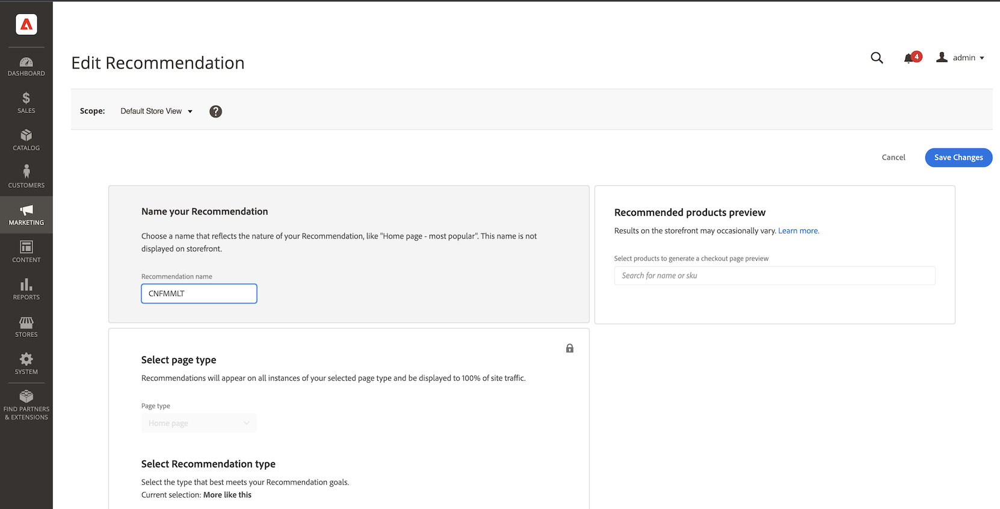
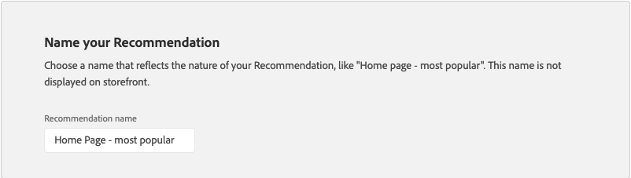

# 編輯建議

「編輯建議」頁面可讓您調整構成建議的個別設定。 除了頁面型別和建議型別之外，所有設定都可以編輯。 可以編輯下列設定：

- [建議名稱](#name)
- [店面標籤](#label)
- [產品數量](#number)
- [位置和位置](#placement)
- [篩選產品](#filters)

頁面右側的預覽會顯示具有目前設定的建議可能顯示在店面中。 向下捲動頁面時，_建議產品預覽_&#x200B;仍可看見以供參考。 預覽會顯示產品縮圖影像、產品名稱、SKU、價格以及每個傳回產品的結果型別。 結果型別會指出是否有足夠的主要行為資料產生建議，或是使用備份行為資料。

## 編輯建議

1. 在&#x200B;_管理員_&#x200B;側邊欄上，前往&#x200B;**行銷** > _促銷活動_ > **產品建議**。

1. 選取您要編輯的建議。

1. 按一下&#x200B;**編輯**。 然後依照下列指示進行您需要的變更。

1. 完成時，按一下&#x200B;**儲存變更**。

### 建議名稱 {#name}

選擇描述性名稱，以指出建議的用途。 此名稱僅供內部參考，不會出現在店面中。

### 店面標籤 {#label}

輸入您要在店面中作為推薦單位標籤的文字。

### 產品數量 {#number}

調整滑桿，在建議單位中顯示最多20個產品。

### 位置和位置 {#placement}

1. 選擇建議單位在店面中顯示的頁面位置。

   - 在主要內容底部
   - 在主要內容的頂端

   

1. 若要變更包含在單位中的建議順序，請使用&#x200B;**移動** 控制項將建議拖曳到適當位置。

   

### 篩選產品 {#filters}

對產品[篩選器](filters.md)所做的任何變更都會反映在&#x200B;_建議的產品預覽_&#x200B;中。 只允許建議符合包含篩選器的產品。 不建議使用符合任何排除篩選器的產品。

_包含專案_&#x200B;和&#x200B;_排除專案_&#x200B;索引標籤會列出每種型別的可用篩選器。 在清單中，每個使用中的篩選器都會標示為藍點。

- 若要顯示每個篩選的詳細資訊，請按一下篩選名稱。
- 若要變更篩選器狀態，請將&#x200B;**啟用篩選器**&#x200B;切換設定為`on`或`off`位置。

篩選設定說明要在建議單位中包含或排除的產品。 例如，_類別_&#x200B;篩選包含設定會告訴系統僅包含所選類別的產品。

