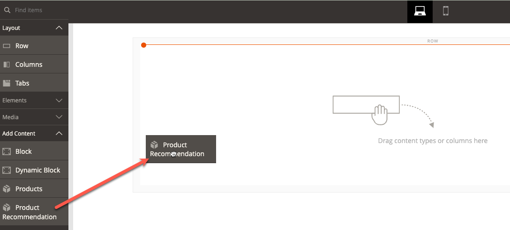

# [!DNL Page Builder]整合

「產品建議」可以整合至您在網站上部署的任何頁面產生器內容中。

>[!NOTE]
>
> 原生頁面產生器頁面最多可有25個建議單位。 非原生頁面產生器頁面最多可包含5個建議單位。 如需詳細資訊，請參閱[建立新建議](create.md)。

## 搭配使用產品建議與頁面產生器內容

1. 在網站的預設商店檢視中建立建議單位。 即使您打算在不同的存放區檢視中使用它們，也必須在預設存放區檢視中建立它們。

   >[!NOTE]
   >
   >Page Builder建議單位的量度只會出現在預設的存放區檢視[!DNL Product Recommendations]工作區。 即使您將頁面產生器建議單位放在非預設存放區檢視的存放區檢視上，與這些頁面產生器建議單位相關的量度也不會顯示在非預設存放區檢視[!DNL Product Recommendations]工作區上。 若要在非預設商店檢視[!DNL Product Recommendations]工作區上檢視頁面產生器量度，請開啟並在非預設商店檢視中[編輯](edit.md)頁面產生器建議單位，然後按一下&#x200B;[!UICONTROL **儲存**]。 頁面產生器量度現在出現在[!DNL Product Recommendations]工作區非預設的storeview下。

1. 在「頁面產生器」中，選取「產品建議」內容Widget並放置在您的網站上。

1. 按一下&#x200B;**編輯產品推薦**
1. 按一下&#x200B;**選取**
1. 選取您先前建立的建議單位，然後按一下&#x200B;**新增選取的專案**

1. 對頁面產生器內容進行任何其他編輯並儲存您的變更。

在轉譯時，Recommendation單位會考量頁面產生器內容的內容和範圍。
