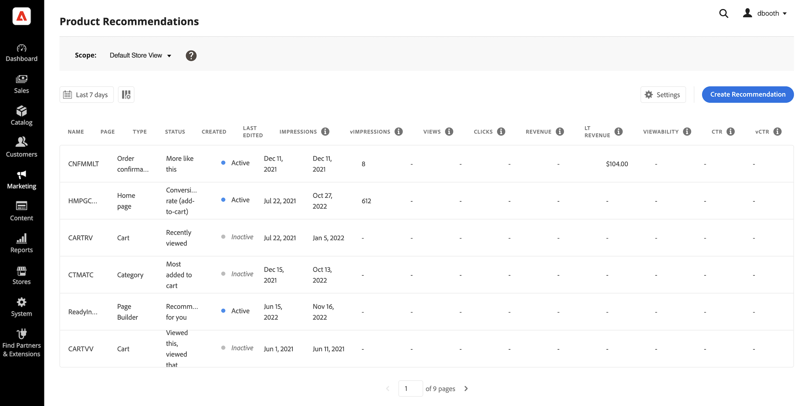

# [!DNL Product Recommendations] Workspace

[!DNL Product Recommendations]工作區會顯示先前設定之建議的清單，以及可協助您追蹤每個建議是否成功的量度。 清單可設定為計算最後一天、一週或當月的量度。 您可以使用量度，根據檢視或點按建議單位的頻率來建立可行的深入分析，或分析建議的執行成效。

>[!INFO]
>
>建議單位是包含建議產品&#x200B;_專案_&#x200B;的Widget。

_建議Workspace_

## 資料彙集

為確保工作區上的每個功能區域都包含正確的資料，您需要根據所選的店面實作來設定資料收集：

1. Luma — 現成提供資料收集功能。
1. Headless — 視店面實作而定，必須手動設定資料收集。

如果您使用的是Headless店面，請參閱以下檔案以取得有關您需要新增的所需事件的詳細資訊：

- [產品建議控制面板的必要事件](events.md)。
- [需要新增為先決條件的Storefront事件收集器](https://developer.adobe.com/commerce/services/shared-services/storefront-events/collector/)。
- 事件結構的[範例](https://github.com/adobe/commerce-events/tree/main/examples)。

## 設定範圍

一開始所有建議設定的[範圍](https://experienceleague.adobe.com/docs/commerce-admin/start/setup/websites-stores-views.html)設定為`Default Store View`。 如果您的Commerce安裝包含多個商店檢視，請將&#x200B;**範圍**&#x200B;設定為套用您建議的[商店檢視](https://experienceleague.adobe.com/docs/commerce-admin/start/setup/websites-stores-views.html#scope-settings)。

## 設定量度日期範圍

1. 按一下&#x200B;**行事曆** 控制項。

1. 選擇下列其中一項：

   - 過去24小時
   - 過去7天
   - 過去30天

   量度欄中的計算值會變更，以反映目前的日期範圍。

   >[!NOTE]
   >
   >已針對Luma店面最佳化產品推薦量度。 如果您的店面不是Luma型，量度追蹤資料的方式取決於您[實作事件集合](events.md)的方式。

## 顯示/隱藏欄

1. 在左上角，按一下&#x200B;**顯示/隱藏** 欄。

   可見的欄有藍色勾號。

1. 在功能表中，執行下列任一項作業：

   - 若要顯示隱藏的欄，請按一下任何沒有核取記號的欄名稱。
   - 若要隱藏可見欄，請按一下帶有核取記號的欄名稱。

   表格會重新整理以僅包含所選欄。

   
   _顯示/隱藏欄_

## 設定

這些設定會決定提供建議行為資料的SaaS資料空間。

- 若要變更建議行為資料的來源位置，請選擇不同的SaaS資料空間。

- 若要設定新的SaaS資料空間，請按一下[編輯設定]。**** 若要深入瞭解，請參閱[設定](settings.md)。

_Recommendations設定_

## 檢視詳細資料

1. 在表格中，按一下您要檢查的建議。

   
   _首頁轉換率詳細資料_

1. 若要變更建議狀態，請按一下[啟用] ****&#x200B;或[停用] ****。

## 編輯建議

從建議詳細資訊頁面，按一下&#x200B;**編輯**。 若要深入瞭解，請移至[編輯建議](edit.md)。

## 建立推薦

從建議詳細資訊頁面，按一下&#x200B;**建立**。 若要深入瞭解，請前往[建立建議](create.md)。

## Workspace控制項

| 控制 | 說明 |
|---|---|
|  | 決定用於量度計算的時間範圍。 選項：24小時/ 7天/ 30天 |
|  | 決定出現在[!DNL Product Recommendations]資料表中的資料行。 |
| 設定 | 決定擷取建議行為資料的SaaS資料空間，也會啟用視覺相似度建議型別。 |
| 建立建議 | 開啟[建立新建議](create.md)頁面。 |

## 欄說明

| 欄 | 說明 |
|---|---|
| 名稱 | 建議的名稱。 |
| 頁面 | 建議出現的頁面。 |
| 型別 | 建議型別。 |
| 狀態 | 建議狀態。 選項：非作用中/作用中/草稿 |
| 已建立 | 建立建議的日期。 |
| 上次編輯時間 | 上次編輯建議的日期。 |
| 曝光數 | 在頁面上載入及轉譯建議單位的次數。 位於瀏覽器檢視區摺頁下方的建議單位會呈現在頁面上，即使購物者並未檢視該單位亦然。 在此情況下，演算後的單位會計為曝光，但只有購物者將單位捲動進入檢視時，才會計入檢視。 |
| 曝光數 | （可檢視的曝光數）至少註冊一個檢視的建議單位數。 例如，如果推薦單位有兩行，每行有兩個產品，而購物者看不到最後兩個產品，但前兩個產品是，則活動仍會計為曝光。 |
| 檢視 | 顯示在購物者瀏覽器檢視區中的建議單位數量。 如果購物者向上或向下捲動頁面多次，事件會引發多次，而每次都可以檢視單位。 |
| 點按次數 | 購物者點按建議單位中專案的次數總和，以及購物者點按建議單位中&#x200B;**加入購物車**&#x200B;按鈕的次數 |
| 收入 | 目前時間範圍之建議所驅動的收入。 |
| Lt收入 | （期限收入）由建議驅動的期限收入。 |
| 可檢視度 | 註冊檢視的建議單位百分比。 |
| CTR | （點進率）註冊點按之建議的單位曝光次數百分比。 CTR會計算所有曝光數，即使單位未進入購物者的檢視。 如果未檢視建議單位，就不太可能被點按。 但是，這些看不見的曝光數會計入CTR分數，並減少整體CTR百分比。 |
| vCTR | （可檢視點進率）只會根據可檢視的曝光數（實際出現在購物者熒幕可見部分的建議）來測量點按，以更準確地衡量購物者參與度。 |
