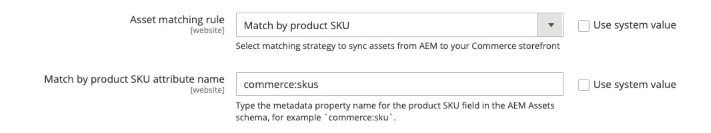

# 預設自動比對

[!DNL Product Visuals]整合提供以&#x200B;**AEM Assets**&#x200B;中繼資料組態為基礎的預設自動比對機制(**[!UICONTROL Match by product SKU]**)。 此規則可讓&#x200B;**Adobe Commerce**&#x200B;與&#x200B;**AEM Assets**&#x200B;之間無縫同步，確保產品視覺效果會自動連結至正確的銷售實體。

## 設定自動比對機制

1. 從Commerce管理員中，導覽至「**[!UICONTROL Store]** >設定> **[!UICONTROL ADOBE SERVICES]** > **[!UICONTROL AEM Assets Integration]**」。

1. 指定&#x200B;**[!UICONTROL Match by SKU]**&#x200B;作為比對規則。

   {width="600" zoomable="yes"}

1. 輸入在AEM Assets中用於資產識別的中繼資料欄位名稱。

   >[!NOTE]
   >
   > 如果遵循了標準上線流程，此值應設為`commerce:skus`。

## 自動比對機制的運作方式

在Commerce Admin中設定&#x200B;**[!UICONTROL Match by product SKU]**&#x200B;相符規則後，Commerce資產檔案會根據為每個檔案設定的資產中繼資料，自動從AEM Assets同步至您的Commerce專案。 您可在&#x200B;**AEM作者**&#x200B;環境中，從AEM Assets **Commerce**&#x200B;索引標籤設定中繼資料：

{width="600" zoomable="yes"}

1. 在AEM Assets中，更新影像中繼資料以新增Adobe Commerce關聯`Commerce=yes`。

1. 設定將資產連結至相關產品SKU的中繼資料（[!UICONTROL SKU]、[!UICONTROL position]和[!UICONTROL role]）。

   >[!NOTE]
   >
   > 如果資產用於多個產品，請為每個關聯的SKU設定中繼資料。

此方法可確保數位資產在Adobe Commerce中正確連結和顯示。 此外，影片也讓銷售商和行銷人員能夠直接在AEM Assets中管理角色和資產定位，針對所有參與管道的影像選擇和訂購，提供一致且集中的機制。
