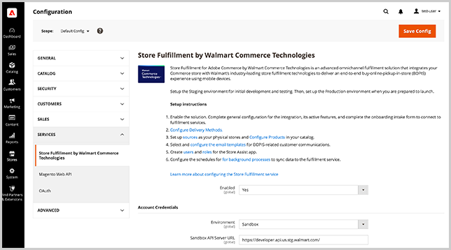

# 商店服務與銷售組態

透過設定擴充功能設定、Store Assist應用程式使用者的安全性設定及傳遞方式選項，啟用[!DNL Commerce]管理員的[!DNL Store Fulfillment]擴充功能。

>[!IMPORTANT]
>
>Store Fulfillment服務設定只會在您連線Adobe Commerce執行個體和[!DNL Store Fulfillment]應用程式之後才適用。 請參閱[連線存放區履行](connect-set-up-service.md)。

## 管理商店履行服務設定

從[!DNL Commerce Admin Store Configuration]功能表管理Store Fulfillment服務的設定。

- 啟用擴充功能、設定全域設定，並透過選取&#x200B;**[!UICONTROL Stores > Configuration > Services > Store Fulfillment by Walmart Commerce Technologies]**&#x200B;來指定Store Assist應用程式使用者連線和帳戶的安全性選項。

  

- 選取&#x200B;**[!UICONTROL Store > Configuration > Sales > Delivery Methods > In-Store Pickup]**&#x200B;以設定傳遞方法。

  

## 基本設定

<table>
<thead>
<tr>
<td><strong>欄位</strong></td>
<td><strong>說明</strong></td>
<td><strong>範圍</strong></td>
<td><strong>必填</strong></td>
</tr>
</thead>
<tbody>
<tr>
<td><strong>[!UICONTROL Price]</strong></td>
<td>您向客戶收取店內取貨的價格。 預設為零。</td>
<td>網站</td>
<td>否</td>
</tr>
<tr>
<td><strong>[!UICONTROL Search Radius]</strong></td>
<td>購物者在店面結帳中搜尋商店取貨位置時使用的半徑（以公里為單位）。 搜尋結果只會傳回位於指定搜尋半徑內的存放區。</td>
<td>網站</td>
<td>否</td>
</tr>
<tr>
<td><strong>[!UICONTROL Displayed error message]</strong></td>
<td>當客戶針對無法用於店內取貨的料號選擇店內取貨時顯示的訊息。 您可以視需要自訂預設文字。
</td>
<td>存放區檢視</td>
<td>否</td>
</tr>
</tbody>
</table>

>[!NOTE]
>
>[!UICONTROL Search Radius]設定只有在您已為Adobe Commerce設定[存放區位置和對應設定](store-location-map-provider-setup.md)時才使用。

## 啟用Store Fulfillment解決方案

啟用[!DNL Store Fulfillment]解決方案，將店內和路邊取貨功能新增至您Adobe Commerce店面的購物和結帳體驗。

<table>
<thead>
<tr>
<td><strong>欄位</strong></td>
<td><strong>說明</strong></td>
<td><strong>範圍</strong></td>
<td><strong>必填</strong></td>
</tr>
 </thead>
 <tbody>
<tr>
<td><strong>[!UICONTROL Enabled]</strong></td>
<td>啟用或停用解決方案。 啟用後，請設定並使用「商店履行」功能，並在Adobe Commerce商店與[!DNL Store Fulfillment]服務之間建立連線。 停用後，所有「商店履行」功能都會停用，並且Adobe Commerce和「商店履行」服務之間不會通訊。 無法處理或接收訂單資訊。</td>
<td>網站</td>
<td>是</td>
</tr>
</tbody>
</table>

## 新增帳戶認證

<table>
<tr>
<td><strong>欄位</strong></td>
<td><strong>說明</strong></td>
<td><strong>範圍</strong></td>
<td><strong>必填</strong></td>
</tr>
<tr>
<td><strong>[!UICONTROL Environment]</strong></td>
<td>選取<i>[!UICONTROL Sandbox]</i>或<i>[!UICONTROL Production]</i>  選取[!UICONTROL Sandbox]可在測試環境中啟用與履行服務的通訊。  選取[!UICONTROL Production]可啟用即時環境中與履行服務的通訊。  每個環境都有一組認證，您可以在同一個安裝中管理這兩組。   請先儲存認證，再驗證連線。</td>
<td>全域</td>
<td>是</td>
</tr>
<tr>
<td><strong>[!UICONTROL API Server URL]</strong></td>
<td>Walmart商店履行API端點的URL。 此值必須是上線流程期間提供的完全合格URL。 Store Fulfillment客戶會同時收到沙箱和生產URL。 新增值時，請務必複製並貼上完整URL，包括結尾斜線"/"。</td>
<td>全域</td>
<td>是</td>
</tr>
<tr>
<td><strong>[!UICONTROL Token Auth Server URL]</strong></td>
<td>Walmart Store Fulfillment驗證端點的URL。 此值必須是上線流程期間提供的完全合格URL。 您會同時收到沙箱和生產URL。 新增值時，請務必複製並貼上完整URL，包括結尾斜線"/"。</td>
<td>全域</td>
<td>是</td>
</tr>
<tr>
<td><strong>[!UICONTROL Merchant Id]</strong></td>
<td>您在上線流程中提供的唯一商人（租使用者） ID。 此ID可用來遞送訂單，以確保您的商家商店能收到訂單。</td>
<td>全域</td>
<td>是</td>
</tr>
<tr>
<td><strong>[!UICONTROL Consumer Id]</strong></td>
<td>在上線流程中提供的唯一整合ID。 此ID用於驗證Adobe Commerce與商店履行服務之間的所有通訊</td>
<td>全域</td>
<td>是</td>
</tr>
<tr>
<td><strong>[!UICONTROL Consumer Secret]</strong></td>
<td>在上線流程中提供的唯一整合金鑰。 此金鑰用於驗證Adobe Commerce與商店履行服務之間的所有通訊。</td>
<td>全域</td>
<td>是</td>
</tr>
</table>

設定[!UICONTROL Account Credentials]之後，請選取<strong>[!UICONTROL Validate Credentials]</strong>以驗證並初次建立與存放區履行服務的連線。

## 設定記錄

記錄檔`var/log/walmart-bopis.log`中有存放區履行服務的記錄檔。

要求系統管理員設定您的環境以允許例外處理，以便透過防火牆或快取擷取與API相關的例外。

因為應用程式記錄檔可以快速成長，所以只在需要時為應用程式啟用短時間記錄，例如在疑難排解[!DNL Commerce]訂單的存放區履行問題時。 此設定可防止因大型記錄檔而導致生產環境中的回應時間問題。

>[!TIP]
>
>若為Adobe Commerce內部部署安裝，請要求系統管理員設定`var/log/walmart-bopis.log`檔案的記錄輪換，以最小化大小。 如需Adobe Commerce內部部署安裝的資訊，請參閱&#x200B;_Adobe Commerce安裝指南_&#x200B;中的[記錄檔輪換](https://experienceleague.adobe.com/docs/commerce-operations/installation-guide/next-steps/configuration.html#server-settings)。 如需雲端基礎結構專案上的Adobe Commerce，請參閱[檢視及管理記錄檔](https://experienceleague.adobe.com/docs/commerce-cloud-service/user-guide/develop/test/log-locations.html)。

<table>
<thead>
<tr>
<td><strong>欄位</strong></td>
<td><strong>說明</strong></td>
<td><strong>範圍</strong></td>
<td><strong>必填</strong></td>
</tr>
</thead>
<tbody>
<tr>
<td><strong>[!UICONTROL Debug Mode]</strong></td>
<td>除錯模式用於增加整合內的記錄活動。 停用時，不會記錄任何偵錯資訊。 啟用時，會記錄所有偵錯資訊  所有記錄的資料都可在檔案中找到： <pre>var/log/walmart-bopis.log</pre>
<td>全域</td>
<td>否</td>
</tr>
</tbody>
</table>

## 管理訂單同步

設定設定以管理訂單同步處理的錯誤處理、在訂單撿料期間用於條碼掃描的目錄屬性，以及設定商店履行佇列的訂單批次大小。

您可以從「管理員」(
<strong>[!UICONTROL System > Tools > Store Fulfillment Queue]</strong>)。

### 同步處理錯誤管理

<table>
<tr>
<td><strong>欄位</strong></td>
<td><strong>說明</strong></td>
<td><strong>範圍</strong></td>
<td><strong>必填</strong></td>
</tr>
<tr>
<td><strong>[!UICONTROL Retry Critical Error]</strong></td>
<td>指定發生嚴重錯誤後，記錄同步化作業的重試嘗試。  當整合無法從履行服務取得正面回應時，就會發生嚴重錯誤。 當服務停用時，或傳送的訂單資料發生錯誤時，就會發生這些問題。  達到重試臨界值時，專案會保留在佇列中，但不會再次處理。 從Admin的<strong>[!UICONTROL System > Tools > Store Fulfillment Queue]</strong>管理檢視所有有錯誤的專案。 若要疑難排解持續失敗的專案，請聯絡您的客戶經理。</td>
<td>全域</td>
<td>否</td>
</tr>
<tr>
<td><strong>[!UICONTROL Enable Error Notification Email]</strong></td>
<td>啟用錯誤通知，以便在到達訂單的[!UICONTROL Retry Critical Error Threshold]時接收電子郵件。 通知包含有關錯誤的任何可用詳細資訊。</td>
<td>全域</td>
<td>否</td>
</tr>
<tr>
<td><strong>[!UICONTROL Send Error Notification Email To]</strong></td>
<td>錯誤通知的收件者電子郵件地址清單（以逗號分隔）。</td>
<td>全域</td>
<td>否</td>
</tr>
<tr>
<td><strong>[!UICONTROL Order Sync Exception Email Template]</strong></td>
<td>指定用來通知收件者有關訂單同步化錯誤的電子郵件範本。 會提供預設範本。 不支援自訂。</td>
<td>存放區檢視</td>
<td>否</td>
</tr>
</table>

### 訂單同步

<table>
<thead>
<tr>
<td><strong>欄位</strong></td>
<td><strong>說明</strong></td>
<td><strong>範圍</strong></td>
<td><strong>必填</strong></td>
</tr>
</thead>
<tbody>
<tr>
<td><strong>[!UICONTROL Barcode Source]</strong></td>
<td>將對應料號的可掃描程式碼儲存在商家地點的目錄屬性。  如果您只有一個現有的商家地點，您可能使用UPC代碼，而您的電子商務管道是透過SKU識別產品。 在此案例中，選取包含UPC代碼的目錄屬性。  此設定可確保傳送至您商店的訂單清單料號具有正確的識別碼，以便商店關聯者可以在撿料過程中準確地掃描料號。  如果您不確定，請洽詢送貨與撿料部門的履行夥伴，以決定應該傳送哪個屬性。 如果屬性目前未包含在資料庫中，您可以將屬性新增至Adobe Commerce產品屬性集。</td>
<td>網站</td>
<td>是</td>
</tr>
<tr>
<td><strong>[!UICONTROL Barcode Type]</strong></td>
<td>將對應料號的條碼來源儲存在商家地點的目錄屬性。  此設定可確保傳送至您商店的訂單清單料號具有正確的識別碼，以便商店關聯者在領料處理期間可以準確地掃描料號。 選項包括 — SKU、UPC、GTIN、UPCA、EAN13、UPCE0、DISA、UAB、CODABAR、價格內嵌UPC。  如果您不確定，請選取與[!UICONTROL Barcode Source]屬性中包含的值最相似的選項。 商店關聯者仍然可以從其挑選清單手動比對專案。</td>
<td>網站</td>
<td>是</td>
</tr>
<tr>
<td><strong>[!UICONTROL Max Number of Items]</strong></td>
<td>一次要從存放區履行佇列傳送的專案數上限。  BOPIS訂單會定期批次傳送至履行服務。 此設定可讓您控制批次的大小。  預設值為100個專案。 根據您的訂單數量與容量，您可以向上或向下調整最大值。</td>
<td>全域</td>
<td>否</td>
</tr>
</tbody>
</table>

## 啟用「商店履行」送貨選項

設定「商店履行」送貨選項，判斷Adobe Commerce商店的店內取貨與到家送貨選項是否可用。

### 送貨地點

<table>
<thead>
<tr>
<td><strong>欄位</strong></td>
<td><strong>說明</strong></td>
<td><strong>範圍</strong></td>
<td><strong>必填</strong></td>
</tr>
</thead>
<tbody>
<tr>
<td><strong>[!UICONTROL Enable Ship To Store]</strong></td>
<td>送貨到店設定是以您現有的送貨到店功能為基礎。 如果您使用Inventory management，或可透過從商店到商店的存貨移轉，接受並履行無存貨之商家地點的訂單，請將此選項設為「是」。  如果您不支援送貨至商店選項或不想提供該選項，請設為[否]。 當停用時，您目錄中某商戶商店存貨為零的專案，或低於該地點[!DNL Out of Stock Threshold]的專案，將不會提供店內取貨選項。  您可以根據商家地點調整此設定的值。</td>
<td>全域</td>
<td>否</td>
</tr>
</tbody>
</table>

### 出貨地點商店

<table>
<thead>
<tr>
<td><strong>欄位</strong></td>
<td><strong>說明</strong></td>
<td><strong>範圍</strong></td>
<td><strong>必填</strong></td>
</tr>
</thead>
<tbody>
<tr>
<td><strong>[!UICONTROL Enable Ship From Store]</strong></td>
<td>啟用或停用商戶商店中的「首頁遞送」選項。 啟用後，您的商家商店位置會與您網站相關庫存中的其他指派來源一起列入彙總考量。  在標準Inventory management服務中，[!DNL Ship from Store]是固有選項，無法停用。 使用Store Fulfillment解決方案，您可以開啟或關閉它。  您可以根據商家地點和產品調整此設定。</td>
<td>全域</td>
<td>否</td>
</tr>
</tbody>
</table>

## 管理Store Fulfillment App使用帳戶和許可權

設定Store Fulfillment App使用者帳戶和密碼安全性以及雙因素驗證的設定。

### 應用程式安全性

<table>
<thead>
<tr>
<td><strong>欄位</strong></td>
<td><strong>說明</strong></td>
<td><strong>範圍</strong></td>
<td><strong>必填</strong></td>
</tr>
 </thead>
 <tbody>
<tr>
<td><strong>[!UICONTROL User Session Lifetime]</strong></td>
<td>存放區關聯使用者工作階段在自動登出前保持作用中狀態的時間範圍（以秒為單位）。 有效值的範圍介於60到31536000之間。</td>
<td>全域</td>
<td>否</td>
</tr>
<tr>
<td><strong>[!UICONTROL Maximum Login Failures to Lockout Account]</strong></td>
<td>指定將存放區關聯鎖定在其帳戶之外之前，允許的登入嘗試失敗次數。  若要停用帳戶鎖定，請將值設為0。</td>
<td>全域</td>
<td>否</td>
</tr>
<tr>
<td><strong>[!UICONTROL Lockout Time (minutes)]</strong></td>
<td>登入失敗後鎖定帳戶的分鐘數。</td>
<td>全域</td>
<td>否</td>
</tr>
<tr>
<td><strong>[!UICONTROL Force Password Change]</strong></td>
<td><em>[!UICONTROL Yes]</em>：要求使用者在帳戶設定後變更密碼。  <em>[!UICONTROL No]</em>：建議使用者在設定帳戶後變更密碼。</td>
<td>全域</td>
<td>否</td>
</tr>
<tr>
<td><strong>[!UICONTROL Password Lifetime]</strong></td>
<td>在必要密碼變更前，密碼保持有效的天數。 留空將停用此選項。</td>
<td>全域</td>
<td>否</td>
</tr>
</tbody>
</table>

## 傳遞方法

Store Fulfillment可藉由擴充原生Adobe Commerce [!DNL In-Store Delivery]功能來運作。 安裝擴充功能後，您可以使用新增至管理員的下列擴充設定，設定店內傳送方法。

- **店內取貨** — 結帳程式期間店內傳遞的優惠方案選項
這些設定會設定BOPIS訂單最常見的傳送案例。

- **[!UICONTROL Curbside pick up]**&#x200B;優惠方案選項，可供客戶暫留在商店位置，並由商店關聯將訂單傳送給他們。

選取<strong>[!UICONTROL Stores > Configuration > Sales > Delivery Methods > In-Store Pickup]</strong>，從管理員設定這些設定。

>[!NOTE]
>
>如需設定店內傳遞選項的詳細資訊，請參閱&#x200B;_Adobe Commerce使用手冊_&#x200B;中的[店內傳遞](https://experienceleague.adobe.com/en/docs/commerce-admin/stores-sales/delivery/basic-methods/shipping-in-store-delivery)。

### 傳遞方法設定

使用店內送貨方式時，客戶可選取在結帳期間作為取貨地點的來源。

<table>
<thead>
<tr>
<td><strong>欄位</strong></td>
<td><strong>說明</strong></td>
<td><strong>範圍</strong></td>
<td><strong>必填</strong></td>
</tr>
 </thead>
 <tbody>
<tr>
<td><strong>[!UICONTROL Enable In-Store Pickup]</strong></td>
<td>啟用或停用結帳時可供選擇店內取貨的客戶使用的店內取貨選項。 停用店內見面交收時，不會顯示選項。  此全域設定適用於所有零售商店位置。 啟用後，您可以選擇性地在零售商店位置將其停用。</td>
<td>網站</td>
<td>否</td>
</tr>
<tr>
<td><strong>[!UICONTROL Enable Curbside Pickup]</strong></td>
<td>在選擇商店取貨的客戶進行結帳程式時，啟用或停用路邊取貨選項。  此全域設定適用於所有零售商店位置。 啟用後，您可以選擇性地在零售商店位置將其停用。</td>
<td>網站</td>
<td>否</td>
</tr>
</tbody>
</table>

### 傳遞方法標題設定

<table>
<thead>
<tr>
<th><strong>欄位</strong></th>
<th><strong>說明</strong></th>
<th><strong>範圍</strong></th>
<th><strong>必填</strong></th>
</tr>
</thead>
<tbody><tr>
<td><strong>首頁傳遞標題</strong></td>
<td>指定在產品、購物車和結帳區域中為「首頁傳送」選項顯示的標題。 住家交貨是指Adobe Commerce的標準出貨功能，從倉儲、由承運商提供，或直接寄至客戶提供的送貨地址。   此標籤不會影響所選出貨承運人的出貨方式標籤。</td>
<td>存放區檢視</td>
<td>否</td>
</tr>
<tr>
<td><strong>首頁傳遞說明</strong></td>
<td>選擇性的說明，每當向客戶顯示首頁傳送標題時都會顯示。 大多數情況下，說明會是靜態訊息，以傳達您的傳送承諾。 部分範例： <code>Same-day shipping on orders by 4</code>  <code>Ships within 2 business days</code></td>
<td>存放區檢視</td>
<td>否</td>
</tr>
<tr>
<td><strong>商店取貨標題</strong></td>
<td>當客戶看到遞送選項並且店內取貨可用時，則會顯示此標籤。   您可以自訂此標籤，此標籤會顯示在產品、購物車及結帳區域中。</td>
<td>存放區檢視</td>
<td>否</td>
</tr>
<td><strong>商店取貨說明</strong></td>
<td>無論在哪裡顯示「商店見面交收標題」，您都可以選擇加入說明。 此靜態訊息有助於改善與商店取貨體驗相關的客戶通訊。 部分範例：  <code>Get it today for free!</code>  <code>Ready for pickup in an hour!</code></td>
<td>存放區檢視</td>
<td>否</td>
</tr>
<tr>
<td><strong>店內取貨標題</strong></td>
<td>啟用店內取貨後，此標題會顯示為「店內取貨」交貨選項。 您可以自訂其標籤。</td>
<td>存放區檢視</td>
<td>否</td>
</tr>
<tr>
<tr>
<td><strong>路邊取車標題</strong></td>
<td>如果已啟用「路邊取貨」，則選項會以「商店取貨」交貨選項型別顯示給客戶。 您可以在這裡自訂其標籤。</td>
<td>存放區檢視</td>
<td>否</td>
</tr>
<tr>
<td><strong>店內取貨指示</strong></td>
<td>當訂單已準備好到您的零售商店取貨時，客戶會收到電子郵件通知。 如果客戶在結帳時選取[!DNL In-Store Pickup]，您可以在這裡自訂取車指示。   這些指示是全域設定，適用於所有零售商店位置。 您也可以自訂零售商店地點層級的指示。</td>
<td>存放區檢視</td>
<td>否</td>
</tr>
<tr>
<td><strong>路邊取車指示</strong></td>
<td>指定自訂的訂單取貨指示，以包含在路邊取貨訂單的客戶電子郵件通知中。   這些指示是全域設定，適用於所有零售商店位置。 您也可以自訂零售商店地點層級的指示。</td>
<td>存放區檢視</td>
<td>否</td>
</tr>
<tr>
<td><strong>預估取車前置時間</strong></td>
<td>訂單接收、履行及準備提取之前所需的分鐘數。 選擇商店取貨配送選項的零售商店地點時，此資訊會顯示給客戶。 此設定適用於所有零售商店位置。 您也可以在零售商店地點層級自訂前置時間。</td>
<td>存放區檢視</td>
<td>否</td>
</tr>
<tr>
<td><strong>預估取車時間標籤</strong></td>
<td>顯示訂單可用於客戶取貨前的預估時間。 當客戶為[!DNL In-Store Pickup]傳遞選項選取零售商店地點時，就會向客戶提供這項資訊。   自訂此標籤時，您可以使用代碼<code>%1</code>插入您的<strong>預估取車前置時間</strong>。 例如：  <code>Ready for Pickup in %1 minutes.</code>  此設定適用於所有零售商店位置。 您也可以在零售商店地點層級自訂前置時間。</td>
<td>存放區檢視</td>
<td>否</td>
<tr>
<td><strong>取車時間免責宣告</strong></td>
<td>工具提示中產品頁面上顯示的內容，其中列出商店時間、假日、意外關閉等</td>
<td>存放區檢視
</td>
<td>否
</td>
</tr>
</tbody></table>

### Stock可用性標題設定

<table>
<thead>
<tr>
<th><strong>欄位</strong></th>
<th><strong>說明</strong></th>
<th><strong>範圍</strong></th>
<th><strong>必填</strong></th>
</tr>
</thead>
<tbody><tr>
<td><strong>有貨</strong></td>
<td>當客戶使用零售商店儲位時，會顯示每個地點目前料號的庫存可用性。   您可以在這裡自訂<em>[!UICONTROL in-stock]</em>狀態標籤。</td>
<td>存放區檢視</td>
<td>否</td>
</tr>
<tr>
<td><strong>無庫存</strong></td>
<td>當客戶使用零售商店儲位時，目前任何料號的存貨可用性會顯示在每個地點。</td>
<td>存放區檢視</td>
<td>否</td>
</tr>
<tr>
<td><strong>部分有貨</strong></td>
<td>當客戶使用零售商店儲位時，目前任何料號的庫存可用性會針對每個地點顯示。   您可以在這裡自訂<em>[!UICONTROL partially in-stock]</em>狀態標籤。</td>
<td>存放區檢視</td>
<td>否</td>
</tr>
</tbody></table>

