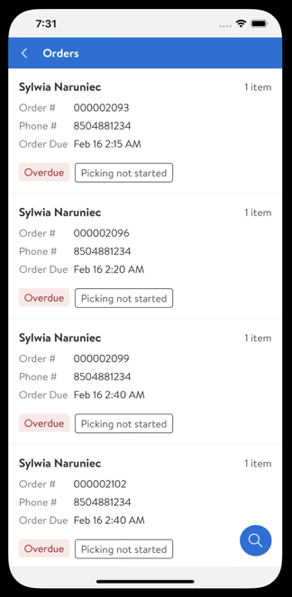

# Store Fulfillment入門概述

透過設定、設定和啟用下列元件開始使用[!DNL Store Fulfillment for Adobe Commerce by Walmart Commerce Technologies]：

- **Store Fulfillment擴充功能** — 在您的Adobe Commerce執行個體上安裝並設定此協力廠商擴充功能。 安裝後，您可以從管理員設定和管理Store Fulfillment解決方案，以支援Commerce店面中的[!DNL buys online, pickup in store] (BOPIS)案例。

  管理檢視中的![[!DNL Store Fulfillment Service]設定](assets/store-fulfillment-admin-home.png)

- **Store Fulfillment帳戶** — 在啟用程式期間，帳戶管理員會建立您的Store Fulfillment帳戶，並提供您帳戶資訊和認證。 若要啟用Adobe Commerce與Store Fulfillment解決方案之間的連線，需使用這些憑證。

- **商店協助應用程式** — 提供商店關聯與端對端商店履行工作流程，以管理行動裝置的BOPIS訂單。 Store Associates可以下載並安裝沃爾瑪的[!DNL Store Assist]用於iOS和Android™裝置。 應用程式上線程式是由Walmart Commerce Technologies客戶中心以個別程式管理。 不過，[部分應用程式組態設定](user-setup.md)已經從Adobe Commerce管理員完成。

  | 商店協助應用程式 — 開始使用檢視 | 商店協助應用程式 — 模組檢視 |
  |-------------------------------------------------------------------------------------------------------------|-----------------------------------------------------------------------------------------------|
  | 行動裝置上的![[!DNL Store Assist App Getting Started]檢視](assets/store-assist-get-started-small.png) | 行動裝置上的[!DNL Store Assist App Orders view] |

## 布建步驟

- **註冊[!DNL Store Fulfillment for Adobe Commerce by Walmart Commerce Technologies]** — 完成[business.adobe.com](https://business.adobe.com/resources/store-fulfillment.html)上的登錄檔單，或連絡您的Adobe Commerce客戶經理以尋求協助。

- **啟動Store Fulfillment的布建請求** — 完成您的客戶經理提供的錄取表單，以提供開始布建程式所需的資訊。

- **取得您的Store Fulfillment帳戶認證** — 在您建立Store Fulfillment帳戶後，您會收到整合Store Fulfillment解決方案與Adobe Commerce所需的認證。

- **[下載原始程式碼以安裝 [!DNL Store Fulfillment] 擴充功能](install.md)**

## 入門步驟

1. [安裝Adobe Commerce的Store Fulfillment擴充功能](install.md)。

1. 從管理員[啟用解決方案](enable-general.md)。

1. [從Adobe Commerce管理員設定Store Fulfillment擴充功能](service-config-settings-overview.md)。

1. [使用提供給您的Store Fulfillment認證，連線 [!DNL Store Fulfillment] 服務](connect-set-up-service.md)。

1. [建立Store Assist應用程式的使用者和角色](user-setup.md)。

1. [將Walmart的 [!DNL Store Assist] 應用程式下載到您想要的裝置。 此應用程式同時適用於Apple應用程式(iOS)和Google Play (Android™)](app-setup.md)商店。

在您成功安裝、設定、完成上線並存取[!DNL Store Assist]應用程式後，您可以[開始建立訂單和測試](test-and-deploy.md)。
